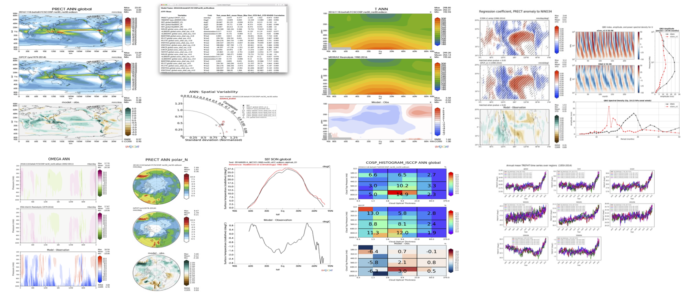

# E3SM Diagnostics Package

## Table of Contents

1. [Documentation](#doc)
2. [Overview](#overview)
3. [Current State](#current-state)

## Documentation 

- [Documentation Website](https://e3sm-project.github.io/e3sm_diags)
- [Sample Output, Model vs Observations](https://web.lcrc.anl.gov/public/e3sm/e3sm_diags_test_data/unit_test_complete_run/expected/all_sets/viewer/)
- Quick Start Guides:
  - [Quick Start Guide for NERSC Perlmutter CPU](https://e3sm-project.github.io/e3sm_diags/_build/html/master/quickguides/quick-guide-perlmutter.html)
  - [Quick Start Guide for COMPY](https://e3sm-project.github.io/e3sm_diags/_build/html/master/quickguides/quick-guide-compy.html)
  - [Quick Start Guide for LCRC-Anvil](https://e3sm-project.github.io/e3sm_diags/_build/html/master/quickguides/quick-guide-anvil.html)
  - [Quick Start Guide for LCRC-Chrysalis](https://e3sm-project.github.io/e3sm_diags/_build/html/master/quickguides/quick-guide-chrysalis.html)
- Example run scripts:
  - [Model Climo vs Observation Climo Comparison](https://github.com/E3SM-Project/e3sm_diags/blob/master/examples/ex5-model-vs-obs)
  - [Model Climo vs Model Climo Comparison](https://github.com/E3SM-Project/e3sm_diags/blob/master/examples/ex4-model-vs-model)
  - [Model Time-series vs Model Time-series](https://github.com/E3SM-Project/e3sm_diags/blob/master/examples/ex1-model_ts-vs-model_ts)
  - [Model Time-series vs Model Time-series with CMIP data](https://github.com/E3SM-Project/e3sm_diags/blob/master/examples/ex2-model_ts-vs-model_ts-cmip)
  - [Model Time-series vs Observation Time-series with CMIP data](https://github.com/E3SM-Project/e3sm_diags/blob/master/examples/ex3-model_ts-vs-obs_ts-cmip)
  - [Observation vs Observation Comparison](https://github.com/E3SM-Project/e3sm_diags/tree/master/examples/ex7-obs-vs-obs)

## Overview

This diagnostics package is constructed for supporting the diagnostics task of DOE's [Energy Exascale Earth System Model (E3SM) project](https://climatemodeling.science.energy.gov/projects/accelerated-climate-modeling-energy). The goal of this work is to develop a comprehensive diagnostics package that:

- fully integrates the functionality of NCAR's AMWG diagnostics package.
- utilizes most updated observational datasets, including remote sensing, reanalysis and in-situ datasets.
- interfaces with diagnostics developed from different E3SM science groups
- is flexible for user specified diagnostics and being configured for use by other climate models (i.e. in CMIP format).

## Current State 

E3SM Diags is modeled after the National Center for Atmospheric Research (NCAR) Atmosphere Model Working Group (AMWG) diagnostics package. In its version 1 release, E3SM Diags included a set of core essential diagnostics to evaluate the mean physical climate from model simulations. As of version 2, more process-oriented and phenomenon-based evaluation diagnostics have been implemented, as listed below:

### New Feature added during v2 development
| Feature name  (set name) | Brief Introduction                                                                                                                                                                                     | Developers Contributors*                                                                                                                    | Released version |
|--- | ---------------- | --- | --- |
| T5050 diagnostic /Mixed phase partition (mp_partition)        | Temperature at which cloud top is 50% ice, 50% liquid, following McCoy et al. (2015).                                                                                                                  | Yuying Zhang, Jill Zhang, Jiwen Fan, Yunpeng Shan                                                                                                                  | 2.9.0            |
| ARM diagnostics v3 (arm_diags)                               | Enhanced ARM diagnostics with new aerosol-cloud-interaction and aerosol activation metrics                                                                                                             | Xiaojian Zheng, Jill Zhang, Cheng Tao, Shaocheng Xie                                                                                                                              | 2.9.0            |
| Aerosol budget diagnostics (aerosol_budget)                  | Global mean burdens, source/sink budgets and lifetimes for aerosol species.                                                                                                                            | Jill Zhang, Susannah Burrows, Naser Mahfouz, Tom Vo, Kai Zhang, Taufiq Hassan Mozumder, Xue Zheng, Ziming Ke, Yan Feng, Manish Shrivastava, Hailong Wang, Mingxuan Wu | 2.8.0            |
| Aerosol evaluation with AERONET data (aerosol_aeronet)       | Scatter plots for comparing annual mean long-term Absorption Optical Depth (AOD) Aerosol Absorption Optical Depth (AAOD) at 550 nm from AERONET measurements.                                          | Jill Zhang, Yan Feng                                                                                                                                                  | 2.7.0            |
| CMIP6 comparison (with lat_lon)                              | Box whisker plot to compare with key fields from CMIP6 models                                                                                                                                          | Chris Golaz, Jill Zhang                                                                                                                                            | 2.7.0            |
| Zonal mean 2D over stratosphere (zonal_mean _2d_stratosphere) | Pressure–latitude zonal-mean contour plots of seasonal mean                                                                                                                                             | Jill Zhang                                                                                                                                                            | 2.6.0            |
| TC Analysis (tc_analysis)                                    | Bar plots for TC frequency and accumulated cyclone energy distributed by ocean basin; line plots for TC intensity and seasonality for each ocean basin; maps for TC density and African easterly waves | Karthik Balaguru, Jill Zhang, Paul Ullrich                                                                                                                         | 2.5.0            |
| Annual cycle zonal mean (annual _cycle_zonal_ mean)            | Latitude zonal-mean–month box plot (including Stratospheric and Tropospheric column Ozone)                                                                                                             | Jill Zhang, Qi Tang                                                                                                                                                | 2.5.0            |
| ARM diagnostics v2 (arm_diags)                               | Seasonal mean, annual cycle, diurnal cycle and convection onset metrics over DOE's ARM ground-based facilities                                                                                         | Jill Zhang, Tao Chen, Shaocheng Xie, Todd Emmenegger, David Neelin, Kathleen Schiro, Yi-Hung Kuo                                                                   | 2.4.0            |
| Streamflow diags (streamflow)                                | Seasonality map, annual-mean map/scatterplots based on gauge station data from GSIM                                                                                                                    | Ryan Forsyth, Tian Zhou                                                                                                                                            | 2.3.0            |
| Diurnal cycle (diurnal_cycle)                                | Amplitude and phase map of the seasonal-mean diurnal cycle of precipitation compare with TRMM 3hourly data.                                                                                            | Jill Zhang, Charlie Zender, Wuyin Lin, Shaocheng Xie                                                                                                               | 2.3.0            |
| Quasi-biennial oscillation analysis (qbo)                    | Quasi-biennial oscillation (QBO) analysis between 5S and 5N , including monthly mean zonal-mean zonal wind as a function of pressure and time and the power spectrum and amplitude                 | Chris Terai, Jack Chen, Jadwiga (Yaga) Richter, Sasha Glanville, Chris Golaz                                                                                       | 2.1.0            |

*: The code infrastructure and maintenance are supported by the core developer group including: Jill Zhang, Chris Golaz, Tom Vo, Ryan Forsyth, Xylar Asay-Davis.

### Core sets established in v1 development
Algorithm and visualization codes for lat-lon contour plots, polar contour plots, zonal mean 2d plots, zonal mean line plots, 2d joint histogram for COSP cloud simulator output, tables and Taylor Diagrams summarizing metrics for climatology seasonal means, are implemented as core sets of this diagnostics package. Example of a complete set of diagnostics can be found [here](https://web.lcrc.anl.gov/public/e3sm/e3sm_diags_test_data/unit_test_complete_run/expected/all_sets/viewer/), and as shown below.

The package features built-in user diagnostics, by specifying user desired diagnostics regions and pressure levels for variables with the vertical dimension.

In addition to default model versus observation comparison, the package also provide support for model versus model and obs versus obs comparisons.

<h5 align="center">Example plots including core sets from E3SM Diags v1 and process-oriented sets from v2</h5>

## Reference

Zhang, C., Golaz, J.-C., Forsyth, R., Vo, T., Xie, S., Shaheen, Z., Potter, G. L., Asay-Davis, X. S., Zender, C. S., Lin, W., Chen, C.-C., Terai, C. R., Mahajan, S., Zhou, T., Balaguru, K., Tang, Q., Tao, C., Zhang, Y., Emmenegger, T., Burrows, S., and Ullrich, P. A.: The E3SM Diagnostics Package (E3SM Diags v2.7): a Python-based diagnostics package for Earth system model evaluation, Geosci. Model Dev., 15, 9031–9056, https://doi.org/10.5194/gmd-15-9031-2022, 2022.

## Acknowledgement

The work is performed for the [E3SM](https://e3sm.org/) project, which is sponsored by Earth System Model Development ([ESMD](https://climatemodeling.science.energy.gov/program/earth-system-model-development)) program.  ESMD is a program area for the Earth and Environmental Systems Sciences Division ([EESSD](https://science.osti.gov/ber/Research/eessd)) in the Office of Biological and Environmental Research ([BER](https://science.osti.gov/ber)) within the [Department of Energy](https://www.energy.gov/)'s [Office of Science](https://science.osti.gov). Contributors' effort for this work are partially supported by the US DOE ARM program, RGMA program, EAGLES project, as well as by NSF.

## License

Copyright (c) 2018-2023, Energy Exascale Earth System Model Project
All rights reserved

SPDX-License-Identifier: (BSD-3-Clause)

See [LICENSE](./LICENSE) for details

Unlimited Open Source - BSD 3-clause Distribution
`LLNL-CODE-819717`
