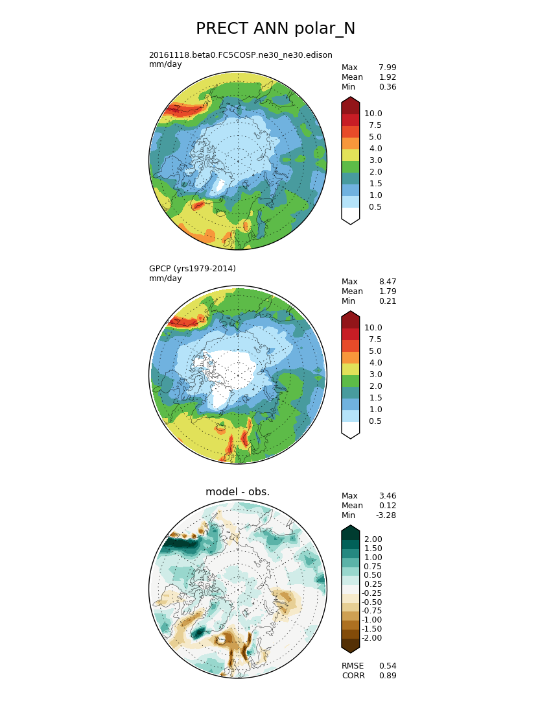
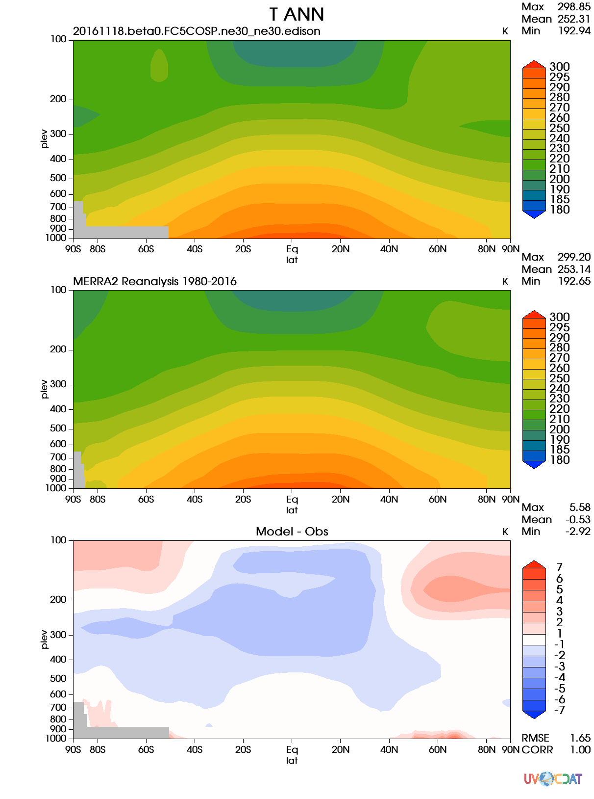
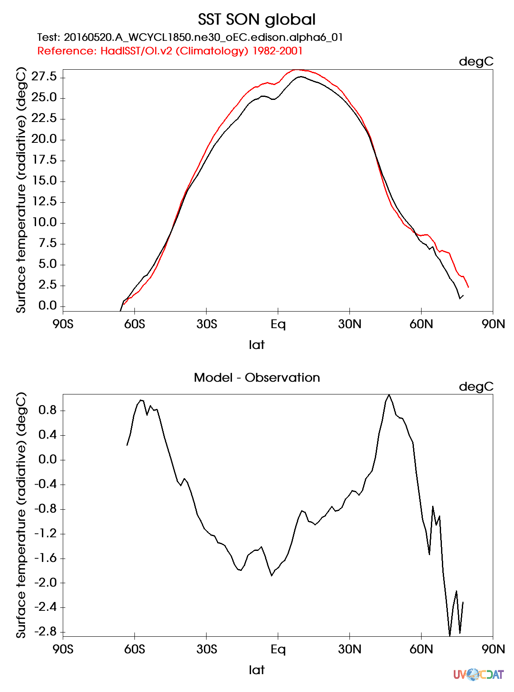
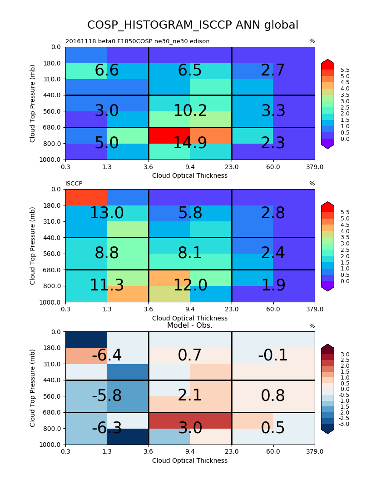
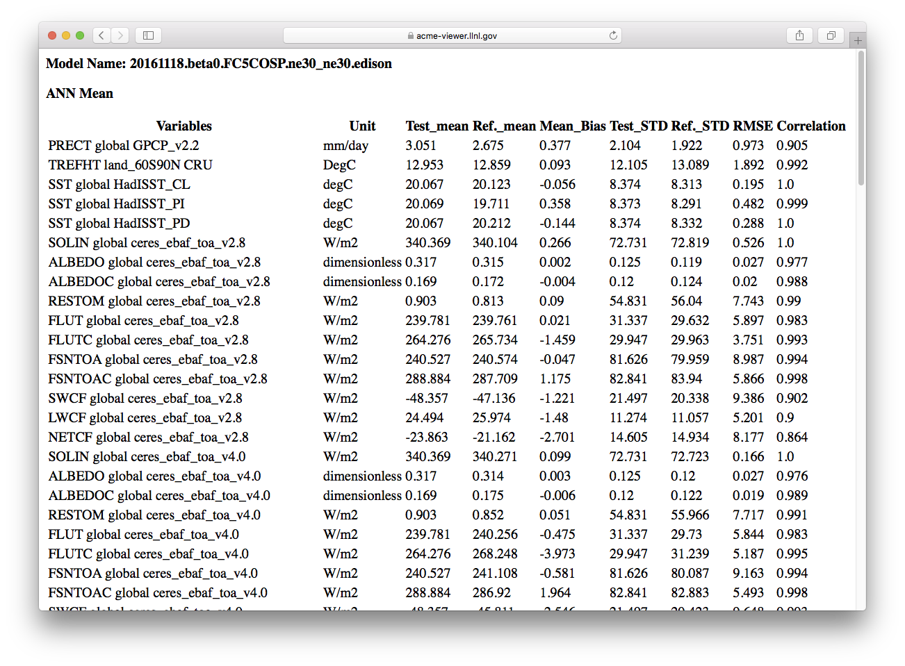
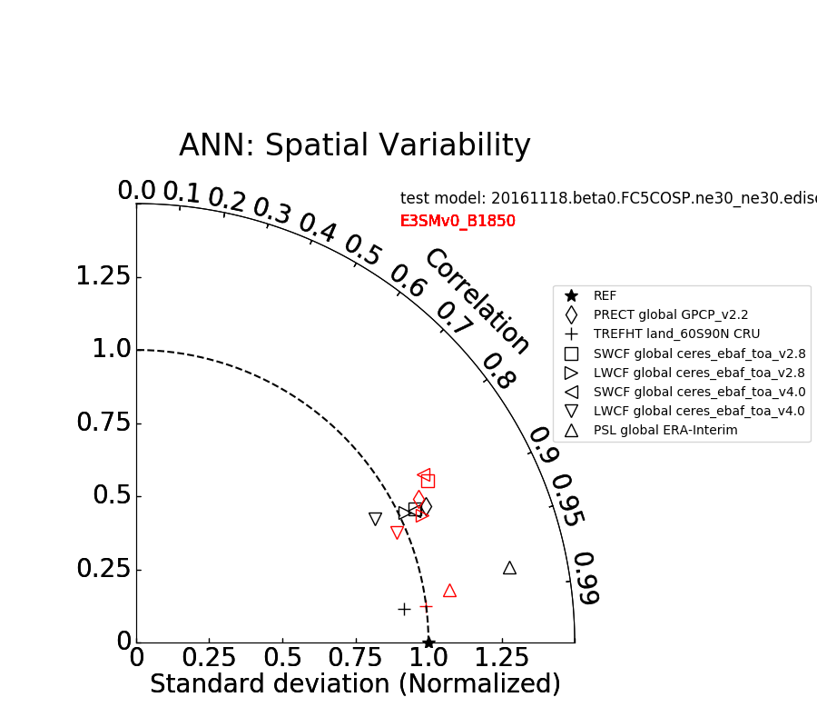

# E3SM Diagnostics Package

## Table of Contents
1. [Documentation](#doc)
2. [Overview](#overview)
3. [Current State](#current-state)

## Documentation 
* [Documentation Website](https://e3sm-project.github.io/e3sm_diags)
* [Sample Output, Historical H1 (2011-2013) vs Historical H1 (1850-1852)](https://e3sm-project.github.io/e3sm_diags/sample_output/modTS_vs_modTS_3years/viewer/index.html)
* Quick Start Guides:
  * [Quick Start Guide for NERSC Cori](https://e3sm-project.github.io/e3sm_diags/docs/html/quickguides/quick-guide-cori.html)
  * [Quick Start Guide for NERSC Edison](https://e3sm-project.github.io/e3sm_diags/docs/html/quickguides/quick-guide-edison-shifter.html)
  * [Quick Start Guide for AIMS4/ACME1](https://e3sm-project.github.io/e3sm_diags/docs/html/quickguides/quick-guide-aims4.html)
  * [Quick Start Guide for OLCF Rhea](https://e3sm-project.github.io/e3sm_diags/docs/html/quickguides/quick-guide-rhea.html)
* Examples:
  * [Model Time-series vs Model Time-series](https://e3sm-project.github.io/e3sm_diags/docs/html/examples/model_ts-vs-model_ts.html)
  * [Model Time-series vs Model Time-series with CMIP data](https://e3sm-project.github.io/e3sm_diags/docs/html/examples/model_ts-vs-model_ts-CMIP.html)
  * [Model Time-series vs Observation Time-series with CMIP data](https://e3sm-project.github.io/e3sm_diags/docs/html/examples/model_ts-vs-obs_ts-CMIP.html)
  * [Model Climo vs Model Climo Comparison](https://e3sm-project.github.io/e3sm_diags/docs/html/examples/model_climo-vs-model_climo.html)
  * [Model Climo vs Observation Climo Comparison](https://e3sm-project.github.io/e3sm_diags/docs/html/examples/model_climo-vs-obs_climo.html)
  * [Observation vs Observation Comparison](https://e3sm-project.github.io/e3sm_diags/docs/html/examples/obs_climo-vs-obs_climo.html)

## Overview
This diagnostics package is constructed for supporting the diagnostics task of DOE's [Energy Exascale Earth System Model (E3SM) project](https://climatemodeling.science.energy.gov/projects/accelerated-climate-modeling-energy). The goal of this work is to develop a comprehensive diagnostics package that:

* fully integrates the functionality of NCAR's AMWG diagnostics package.
* utilizes most updated observational datasets, including remote sensing, reanalysis and in-situ datasets. 
* interfaces with diagnostics developed from different E3SM focus groups: atmosphere group, coupled simulation group, land group.
* interacts effectively with the PCMDI's metrics package and the ARM diagnostics package through a unifying framework: [Community Diagnostics Package (CDP)](https://github.com/CDAT/cdp).
* is flexible for user specified diagnostics and being configured for use by other climate models.

## Current State 
Algorithm and visualization codes for the AMWG Set 5, 7, 4, 3, 13, 1, 14 diagnostics, namely lat-lon contour plots (Figure 1), polar contour plots (Figure 2), zonal mean 2d plots (Figure 3), zonal mean line plots (Figure 4), 2d joint histogram for COSP cloud simulator output (Figure 5), tables (Figure 6) and Taylor Diagrams (Figure 7) summarizing metrics, for climatology seasonal means, are implemented.

The package features built-in user diagnostics, by specifying user desired diagnostics regions and pressure levels for variables with the vertical dimension. 

In addition to default model versus observation comparison, the package also provide support for model versus model and obs versus obs comparisons. 

<h5 align="center">Figure 1: An example of the lat-lon contour plots for air temperature at 850 mb with tropical ocean region considered</h5> 

<h5 align="center">Figure 2: An example of the polar contour plots for precipitation rate</h5> 

<h5 align="center">Figure 3: An example of the pressure-lat contour plots for air temperature </h5> 

<h5 align="center">Figure 4: An example of the zonal mean surface air temperature line plot </h5> 

<h5 align="center">Figure 5: An example of 2d joint histogram plot using COSP simulator output</h5>

<h5 align="center">Figure 6: An example of table summarizing metrics calculated based on lat-lon contour plots diagnostics</h5>

<h5 align="center">Figure 7: An example of Taylor diagram summarizing metrics calculated based on lat-lon contour plots diagnostics of several key variables</h5>