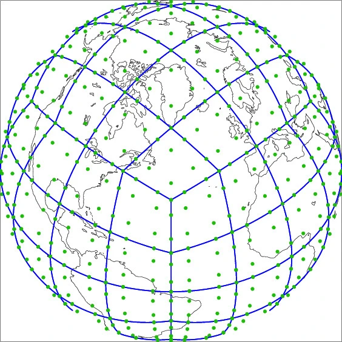
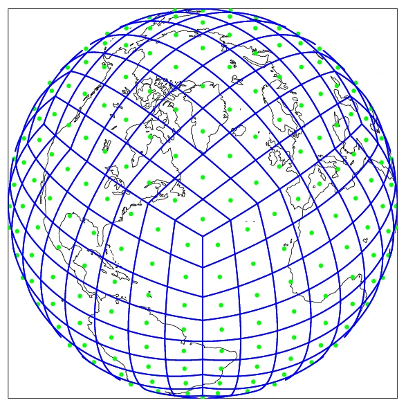

# Atmosphere Grid Overview

The E3SM atmosphere component uses a cube-sphere grid, partly to avoid the convergence of latitude lines at the poles. The grid is constructed by subdividing each cube face into NxN elements and then projecting these to a spherical geometry.

## The np4 GLL Grid

The atmospheric dycore is based on the spectral element (SE) method using the Gauss-Lobatto-Legendre (GLL) quadrature aproach. An irregular grid of 4x4 GLL nodes (i.e. np4) is used to represent the model state within each element of the cube-sphere grid. The illustration below indicates the GLL nodes of the ne4np4 grid with green dots, while the elements are outlined in blue. Notice the irregular spacing of the GLL nodes, which causes them to cluster at the element corners.

While the atmosphere history output is primarily on the physics grid (see below), it is possible to output on the np4 grid. The input topography and initial condition data must be on the np4 grid. When mapping between SE and FV grids TempestRemap should be used. SE GLL data does not naturally represent as FV type cell averages, and thus mapping tools which only work with cell centered data (ESMF, SCRIP) should be avoided.  

For a np4 grid with N elements per cube edge the total number of unique GLL nodes can be calculated as:  
`N*(np-1)^2 + 2`

## The pg2 "physgrid"

Starting in v2, physics calculations and history output in E3SM use a quasi-equal area finite volume (FV) grid, rather the GLL nodes of the spectral element grid. This FV grid is constructed byt dividing each spectral element of the cube-sphere into a grid of 2x2 subcells, referred to as "pg2" or "physgrid" (shown below). Finer divisions of the spectral element are possible, such as 3x3, but these grids do not seem to have any notable advantages (see [Hannah et al. 2021](https://agupubs.onlinelibrary.wiley.com/doi/full/10.1029/2020MS002419)). Quantities on the physgrid should be considered cell average values over each FV cell, rather than nodal values.

For a pg2 grid with N elements per cube edge the total number of physics columns can be calculated as:  
`ncol = N*N*6*(2*2)`

