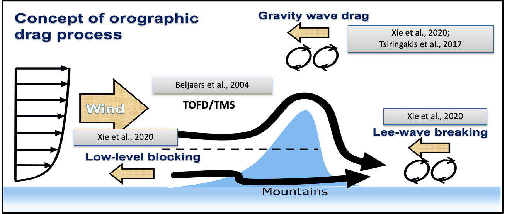

# Orographic drag scheme

## Overview

The orographic drag schemes includes two main options: the default Gravity Wave Drag schemeof McFarlane (1987) and a
new suite of orographic drag parameterization schemes. The new suite includes 4 components all
combined in one module (i.e. subroutine gwdo2d). The schemes include
orographic gravity wave drag (oGWD, Xie et al.,2020), flow-blocking drag (FBD, Xie et al.,2020), small-scale GWD (sGWD, Tsiringakis et al.,2017), and turbulent-scale orographic form drag (TOFD, Beljaars et al., 2004). The oGWD and TOFD schemes are used to replace the default oGWD (McFarlane, 1987) and Turbulent Mountain Stress (TMS, documented on Richter et al., 2010) module in EAM, while the FBD and sGWD are added enhanced drag schemes. Each of the schemes are used to predict and add enhanced drags from surface to high level that would help decelerate the wind especially over the mountainous regions among the globe. The oGWD, FBD, and sGWD are implemented in gw_drag.F90, while TOFD is implemented in clubb_intr.F90 to join the vertical diffusion process. There are also new topographic parameters (orographic asymmetry [OA], orographic convexity [OC], effective orographic length [OL]) are input into the model for the new oGWD and FBD scheme implmented. The conceptual location of each scheme is illustrate below.

### Default oGWD scheme

The current default oGWD scheme in E3SMv3 is from McFarlane (1987). It is a linear orographic gravity wave drag scheme that parameterizes the subgrid process of vertical propagation of gravity wave originated from orographic source. The output from this scheme is a vertical profile of drag (or deceleration terms) when gravity wave breaks at higher levels and deposit momemtum flux to that level. This scheme is shown to have impact on excessive westerly wind in the extratropics and the wind bias in the polar region.

### Default TMS scheme

The turbulent mountain stress (TMS) scheme parameterizes is documented on Richter et al.,(2010). It parameterizes the turbulent scale form drag (TOFD) through adding enhanced effective roughness length to the model. This method is justified by the observation that area-averaged wind sufficiently far above hilly terrain behave logarithmically. It leads to significant decrease of overspeed surface wind in the model. It is turned OFF in E3SMv3.0.

### New oGWD scheme

The Xie et al.,(2020) oGWD scheme is a nonlinear orographic gravity wave drag scheme that parameterizes the subgrid oGWD (>5km). It includes both the linear oGWD like that of McFarlane (1987) and nonlinear oGWD like low-level wave breaking (LLWB). The LLWB downstream often results in downslope windstorm that can enhance the drag by several times that of linear oGWD. The incorporation of the nonlinear drag is by adding an "enhancement factor" that is a function of the higher moments of the orography, e.g. orographic asymmetry (OA), orographic convexity (OC), effective orographic length (OL).

### FBD scheme

The Xie et al.,(2020) FBD scheme parameterizes the drag by flow blocked on the mountain flanks or flowing around the mountain under upstream stable conditions (>5km). It occurs when the mean flow does not have enough kinetic energy to traverse an obstacle and either stops upstream or diverges around the obstacle. This provides drag near the surface where the blocking occurs in addition to the oGWD.

### TOFD scheme

The TOFD scheme (Beljaars et al.,2004) parameterizes the drag generated by the shear stresses in the boundary layer when the flow encounters smaller obstacles (<5km). As airflow encounters an obstacle, it is disrupted, leading to the formation of eddies and vortices. These turbulent structures enhance mixing, allowing different layers of air to interact over a short distance. The intensity of the mixing is typically higher close to the obstacle, with rapid changes in velocity and direction of the airflow and can exhibit large control over the surface wind. It is an alternative scheme to the current TMS in E3SMv3. An important difference between the TOFD and TMS is that TOFD explicitly calculate the stress profile while TMS uses an enhanced effective roughtness length approach.

### sGWD scheme

The Tsiringakis et al.,(2017) sGWD scheme parameterizes the small-scale orographic gravity wave drag (sGWD) within the relatively shallow stable boundary layer. Models applying the form drag such as TOFD schemes usually lack sufficient cyclonic filling and do not accurately represent the development of cyclones over land (Louis, 1979; Holtslag, 2006). This caused significant temperature bias that occurs due to runaway cooling at the surface. To bridge the gap of this missing drag in the boundary layer, studies have hypothesized that the missing drag can be generated by sGWD. sGWD occurs under the relative stable boundary layer with low winds where the turbulence is significantly reduced.

## Namelist parameters

[orodrag Namelist Parameters](../user-guide/namelist_parameters.md#orographic-drag-schemes)
