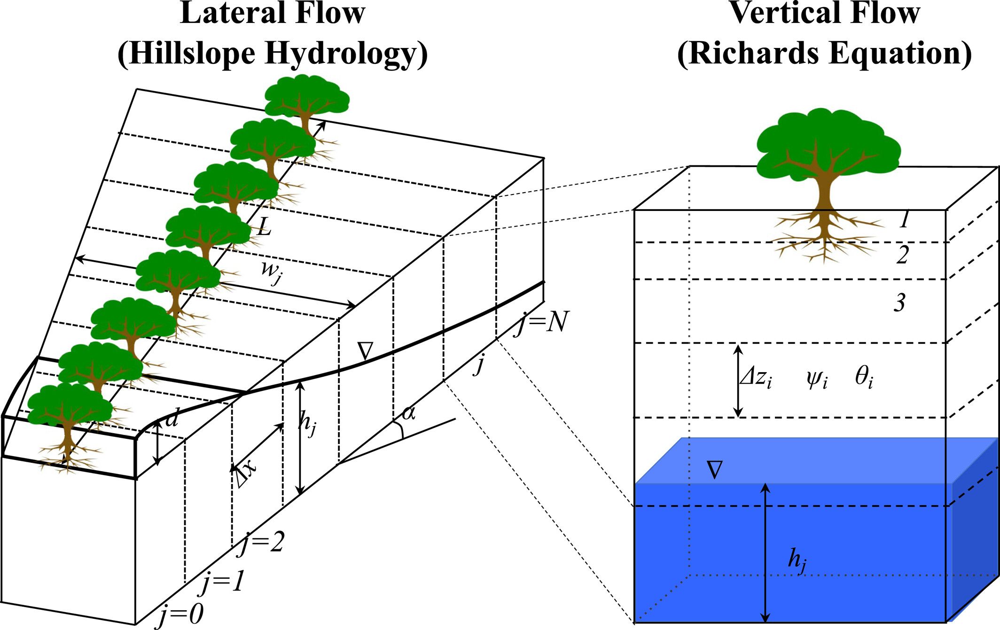

# Hybrid-3D hillslope hydrological model

## Overview
H3D represents subsurface lateral flow and groundwater dynamics within an idealized hillslope unit inside each land 
grid cell. Rather than treating each soil column as an isolated vertical profile, 
h3D connects multiple columns along a topographic gradient to explicitly simulate downslope drainage, 
water table redistribution, and interaction with the channel.

This approach is conceptually one-dimensional along the hillslope, 
but retains three-dimensional realism by including slope, width, and drainage area variation.
The model solves the Dupuit–Boussinesq groundwater flow equation for saturated thickness using an implicit finite-difference method.

In order to use this model, the following variables need to be added in the surface dataset:

hs_x(begg:endg, 1:nh3dc_per_lunit+1): x‐coordinates (m) of the node/edge positions along the hillslope for each grid cell g. There are N+1 nodes for N columns.

hs_w(begg:endg, 1:nh3dc_per_lunit+1): width function values (m) at those nodes (planform width vs. distance).

hs_area(1:nh3dc_per_lunit): Planform area between nodes k and k+1 is calculated using a trapezoid, area each column are then normalized to the total area and used later for area-weighted averages/sums across the set of hillslope columns 
within a land unit (e.g., to compute landunit-level means of fluxes or states).

## Conceptual Representation

Each land unit is subdivided into several h3D columns positioned along an idealized hillslope:

- Lower boundary corresponds to the stream outlet.
- Upper boundary represents the local topographic divide.
- Intermediate nodes represent soil columns along the slope.

Figure 1. The hybrid-3D hillslope hydrological model represents subsurface and surface flow along an idealized hillslope. Left panel (plan view):
A hillslope of total length $L$ is divided into $N$ vertical soil columns, each with an equal horizontal length $\Delta x$, underlain by bedrock with a topographic slope $\alpha$.
The width of the hillslope at a given position is denoted by $W(x)$, measured from the lower boundary of the lowest column (column 0).
The column index $j$ refers to the center of each hillslope column.
Land-surface properties such as bedrock depth, vegetation cover, and atmospheric forcing are assumed to be identical for all columns.
The variable $d$ represents the depth of overland flow above the surface. Right panel (vertical section):
Each hillslope column consists of multiple soil layers of variable thickness $\Delta z_i$.
Vertical flow through the unsaturated and saturated zones occurs across these layers with corresponding soil water potentials $\psi_i$.
The flow domain extends down to an impermeable bedrock boundary, which imposes a zero-flux condition at the bottom.
Vertical flow is solved using the $\alpha$-based form of the Richards equation (Zeng & Decker, 2009).
The layer index $i$ denotes vertical soil layers, $h$ is the height of the saturation zone, and $\nabla$ marks the position of the water table.

For each node, the state variable is the saturated thickness, $h_{sat}(x,t)$, measured from the bedrock to the water table. 
The model tracks how $h_{sat}(x,t)$ evolves in time due to:

- Local recharge (vertical infiltration)
- Downslope lateral flow driven by topographic gradients
- Variable transmissivity and drainable porosity along the slope

Each land unit represents a single hillslope, which has consistent topographic and geometric properties:
- **Overall slope angle:** $\alpha$ — mean hillslope angle (rad)
- **Width function:** $w(x)$ — lateral width distribution along the hillslope (m)
- **Distance function:** $x(i)$ — distance from the stream outlet to node $i$ (m)
- **Total hillslope area:** $A_{hs} = \displaystyle \int_0^L w(x)\ dx$ (m²)

Each column is a point along hillslope, representing a cross-section at distance x along the hillslope. Each has local properties, connected by lateral flow to adjacent columns:
- Soil hydraulic properties (K_sat, porosity, etc.)
- Local area contribution (hs_dA)
- Bedrock depth

Land unit captures the hillsclope-scale connectivity, while columns capture spatial variation along the flow path. Each column contributes proportionally to the area within the land unit, conserves water mass at hillslope scale, having realistic flow convergence/divergence. Column 1 = stream/outlet, column N = hillslope divide.

## Govergning Equation

The fundamental PDE is a Dupuit-style Boussinesq groundwater flow equation for saturated flow along the slope:

$$
f\frac{\partial h}{\partial t} = \frac{1}{w}\frac{\partial}{\partial x}\left(w\ k_{l}(h)\ h\left(\sin(\alpha) + \frac{\partial h}{\partial x}\cos(\alpha)\right)\right) + \cos(\alpha)\ R
$$

where $h(x,t)$ is the saturated thickness [m],
$f_{\text{drain}}$ is the drainable porosity [–],
$\alpha$ is the hillslope angle [rad],
w (m) is the width of the hillslope at a given distance x (m) from the outflow point, kl(h) (m/s) is the lateral saturated hydraulic conductivity at height h. $R$ is the recharge rate between the unsaturated and saturated zones (m/s). Note - recharge rate was not in the code.

## Boundary Conditions

| Boundary       | Condition                             |
| :------------- | :------------------------------------ |
| Lower (stream) | $\partial h/\partial x = 0$           |
| Upper (divide) | zero lateral flow                     |

## Constitutive Relationships (from the code)

### Transmissivity

The local transmissivity depends on saturated thickness and anisotropy:

$$
T(x,h)= \frac{K_{\text{aniso}}K_{\text{sat}}(z_{wt}) \ h \ w(x)}{1000}
$$

where $K_{\text{aniso}}=100$ is the horizontal/vertical anisotropy factor,
$K_{\text{sat}}(z_{wt})$ is the saturated hydraulic conductivity at the
water-table depth [mm s⁻¹], and $w(x)$ is the hillslope width [m].
Division by 1000 converts from mm s⁻¹ to m s⁻¹.

### Variable Drainable Porosity

The specific yield varies with depth following a Brooks–Corey relation:

$$
f_{\text{drain}}
= \alpha_{\text{sat}}
\left[
1 -
\left(
1 +
\frac{1000\ \max(0,z_{\text{bed}}-h)}{\psi_{\text{sat}}}
\right)^{-1/b}
\right],
\qquad
f_{\text{drain}}\ge0.02
$$

where $\alpha_{\text{sat}}$ is porosity [–],
$z_{\text{bed}}$ is bedrock depth [m],
$\psi_{\text{sat}}$ is air-entry suction [mm],
and $b$ is the Brooks–Corey pore-size index [–].

This function allows for a smooth transition between unsaturated and fully saturated conditions and ensures stability under variable soil thickness.

## Numerical Implementation

### Spatial Discretization

The PDE is solved implicitly in space and time using a tridiagonal
system for $h_i^{t}$ at each node $i$ at time t. Node is ordered from 1 to N:

$$
a_i h_{i-1}^{t,s+1} + b_i h_i^{t,s+1} + c_i h_{i+1}^{t,s+1} = r_i^{t,s}
$$

where t and t-1 are current and previous time step, s+1 and s are current and previous iteration.

#### Derivation

- Lower boundary ($i=1$, stream)

$$
\begin{aligned}
f\left(h_{1}^{t,s+1}-h_{1}^{t-1}\right)
&= \frac{\Delta t\ \sin(\alpha)}{w_{1}\ \Delta x_{1}}
\left(w_{\frac{3}{2}}\ k_{l_{\frac{3}{2}}}^{t,s}\ h_{\frac{3}{2}}^{t,s}\right) \\
&\quad + \frac{\Delta t\ \cos(\alpha)}{w_{1}\ \Delta x_{1}}
\left(
\frac{w_{\frac{3}{2}}\ k_{l_{\frac{3}{2}}}^{t,s}\ h_{\frac{3}{2}}^{t,s}}{\Delta x_{U_{1}}}
\left(h_{2}^{t,s+1}-h_{1}^{t,s+1}\right)
\right) \\
&\quad + \Delta t\ \cos(\alpha)\ R_{\mathrm{sat},1}^{t}\ .
\end{aligned}
$$

$$
a_1 h_0^{t,s+1} + b_1 h_1^{t,s+1} + c_1 h_2^{t,s+1} = r_1
$$

$$
\begin{aligned}
&\text{where:} \\
&a_1 = 0 \\
&b_1 = f + \frac{\Delta t\ \cos(\alpha)}{w_1\ \Delta x_1} \cdot \frac{w_{\frac{3}{2}}\ k_{l_{\frac{3}{2}}}^{t,s}\ h_{\frac{3}{2}}^{t,s}}{\Delta x_{U_1}} \\
&c_1 = -\frac{\Delta t\ \cos(\alpha)}{w_1\ \Delta x_1} \cdot \frac{w_{\frac{3}{2}}\ k_{l_{\frac{3}{2}}}^{t,s}\ h_{\frac{3}{2}}^{t,s}}{\Delta x_{U_1}} \\
&r_1 = f h_1^{t-1} + \frac{\Delta t\ \sin(\alpha)}{w_1\ \Delta x_1}\left(w_{\frac{3}{2}}\ k_{l_{\frac{3}{2}}}^{t,s}\ h_{\frac{3}{2}}^{t,s}\right) + \Delta t\ \cos(\alpha)\ R_{\mathrm{sat},1}^{t}
\end{aligned}
$$

- Interior nodes ($i=2,\dots,N-1$)

$$
\begin{aligned}
f\left(h_{i}^{t,s+1}-h_{i}^{t-1}\right)
&= \frac{\Delta t\ \sin(\alpha)}{w_{i}\ \Delta x_{i}}
\left(w_{i+\frac{1}{2}}\ k_{l_{i+\frac{1}{2}}}^{t,s}\ h_{i+\frac{1}{2}}^{t,s}
     - w_{i-\frac{1}{2}}\ k_{l_{i-\frac{1}{2}}}^{t,s}\ h_{i-\frac{1}{2}}^{t,s}\right) \\
&\quad + \frac{\Delta t\ \cos(\alpha)}{w_{i}\ \Delta x_{i}}
\left(
\frac{w_{i+\frac{1}{2}}\ k_{l_{i+\frac{1}{2}}}^{t,s}\ h_{i+\frac{1}{2}}^{t,s}}{\Delta x_{U_{i}}}
\left(h_{i+1}^{t,s+1}-h_{i}^{t,s+1}\right) \right. \\
&\qquad \left. - \frac{w_{i-\frac{1}{2}}\ k_{l_{i-\frac{1}{2}}}^{t,s}\ h_{i-\frac{1}{2}}^{t,s}}{\Delta x_{L_{i}}}
\left(h_{i}^{t,s+1}-h_{i-1}^{t,s+1}\right)
\right) \\
&\quad + \Delta t\ \cos(\alpha)\ R_{\mathrm{sat},i}^{t}\ .
\end{aligned}
$$

$$
a_j h_{j-1}^{t,s+1} + b_j h_j^{t,s+1} + c_j h_{j+1}^{t,s+1} = r_j 
$$

$$
\begin{aligned}
&\text{where:} \\
&a_j = \frac{\Delta t\ \cos(\alpha)}{w_j\ \Delta x_j} \cdot \frac{w_{j-\frac{1}{2}}\ k_{l_{j-\frac{1}{2}}}^{t,s}\ h_{j-\frac{1}{2}}^{t,s}}{\Delta x_{L_j}} \\
&b_j = f + \frac{\Delta t\ \cos(\alpha)}{w_j\ \Delta x_j} \left( \frac{w_{j+\frac{1}{2}}\ k_{l_{j+\frac{1}{2}}}^{t,s}\ h_{j+\frac{1}{2}}^{t,s}}{\Delta x_{U_j}} + \frac{w_{j-\frac{1}{2}}\ k_{l_{j-\frac{1}{2}}}^{t,s}\ h_{j-\frac{1}{2}}^{t,s}}{\Delta x_{L_j}} \right) \\
&c_j = -\frac{\Delta t\ \cos(\alpha)}{w_j\ \Delta x_j} \cdot \frac{w_{j+\frac{1}{2}}\ k_{l_{j+\frac{1}{2}}}^{t,s}\ h_{j+\frac{1}{2}}^{t,s}}{\Delta x_{U_j}} \\
&r_j = f h_j^{t-1} + \frac{\Delta t\ \sin(\alpha)}{w_j\ \Delta x_j} \left(w_{j+\frac{1}{2}}\ k_{l_{j+\frac{1}{2}}}^{t,s}\ h_{j+\frac{1}{2}}^{t,s} - w_{j-\frac{1}{2}}\ k_{l_{j-\frac{1}{2}}}^{t,s}\ h_{j-\frac{1}{2}}^{t,s}\right) \\
&\quad + \Delta t\ \cos(\alpha)\ R_{\mathrm{sat},j}^{t}
\end{aligned}
$$

- Upper boundary ($i=N$, divide)

$$
\begin{aligned}
f\left(h_{N}^{t,s+1}-h_{N}^{t-1}\right)
&= -\frac{\Delta t\ \sin(\alpha)}{w_{N}\ \Delta x_{N}}
\left(w_{N-\frac{1}{2}}\ k_{l_{N-\frac{1}{2}}}^{t,s}\ h_{N-\frac{1}{2}}^{t,s}\right) \\
&\quad -\frac{\Delta t\ \cos(\alpha)}{w_{N}\ \Delta x_{N}}
\left(
\frac{w_{N-\frac{1}{2}}\ k_{l_{N-\frac{1}{2}}}^{t,s}\ h_{N-\frac{1}{2}}^{t,s}}{\Delta x_{L_{N}}}
\left(h_{N}^{t,s+1}-h_{N-1}^{t,s+1}\right)
\right) \\
&\quad + \Delta t\ \cos(\alpha)\ R_{\mathrm{sat},N}^{t}\ .
\end{aligned}
$$

$$
a_N h_{N-1}^{t,s+1} + b_N h_N^{t,s+1} + c_N h_{N+1}^{t,s+1} = r_N 
$$

$$
\begin{aligned}
&\text{where:} \\
&a_N = -\frac{\Delta t\ \cos(\alpha)}{w_N\ \Delta x_N} \cdot \frac{w_{N-\frac{1}{2}}\ k_{l_{N-\frac{1}{2}}}^{t,s}\ h_{N-\frac{1}{2}}^{t,s}}{\Delta x_{L_N}} \\
&b_N = f + \frac{\Delta t\ \cos(\alpha)}{w_N\ \Delta x_N} \cdot \frac{w_{N-\frac{1}{2}}\ k_{l_{N-\frac{1}{2}}}^{t,s}\ h_{N-\frac{1}{2}}^{t,s}}{\Delta x_{L_N}} \\
&c_N = 0 \\
&r_N = f h_N^{t-1} - \frac{\Delta t\ \sin(\alpha)}{w_N\ \Delta x_N}\left(w_{N-\frac{1}{2}}\ k_{l_{N-\frac{1}{2}}}^{t,s}\ h_{N-\frac{1}{2}}^{t,s}\right) + \Delta t\ \cos(\alpha)\ R_{\mathrm{sat},N}^{t}
\end{aligned}
$$

Where $\Delta t$ (seconds) is the h3d time step, i is the lateral node number.  $\Delta x_{U_i}$ and ${\Delta x_{L_i}}$ are the distance (m) relative to the center of upper i + 1 
and lower i − 1 node. ${w_i}$ is the width on the center of node i. $i − {\frac{1}{2}}$ and $i + {\frac{1}{2}}$ represent the lower and upper bounds of node i.

## IMPLEMENTATION FROM THE CODE

Lower boundary ($i=1$, stream)  (NOT SURE HOW THE LAST TERM IN $r_1$ WAS DERIVED)

$$
\begin{aligned}
a_1 &= 0, \\
c_1 &= -\frac{T_{3/2}^{s-1} \cos\alpha \ \Delta t}
           {\Delta x_{U_i}\ \Delta x_1\ w_1}, \\
b_1 &= f_{\text{drain},1} - c_1, \\
r_1 &= f_{\text{drain},1} h_1^{s-1}
      + \frac{\Delta t}{w_1\Delta x_1}
        \left[
          \sin\alpha\ T_{3/2}^{s-1}
          - \frac{\cos\alpha}{\Delta x_1}
            w_1 K_{\text{aniso}}
            \frac{K_{\text{sat},1}}{1000}(h_1^{s-1})^2
        \right]
\end{aligned}
$$

Interior nodes ($i=2,\dots,N-1$)

$$
\begin{aligned}
a_i &= -\frac{T_{i-\frac12}^{s-1} \cos\alpha \ \Delta t}
           {\Delta x_{L_i}\ \Delta x_i\ w_i}, \\
c_i &= -\frac{T_{i+\frac12}^{s-1} \cos\alpha \ \Delta t}
           {\Delta x_{U_i}\ \Delta x_i\ w_i}, \\
b_i &= f_{\text{drain},i} - (a_i + c_i), \\
r_i &= f_{\text{drain},i} h_i^{s-1}
      + \frac{\Delta t\sin\alpha}{w_i\Delta x_i}
        (T_{i+\frac12}^{s-1} - T_{i-\frac12}^{s-1})
\end{aligned}
$$

Upper boundary ($i=N$, divide)

$$
\begin{aligned}
a_N &= -\frac{T_{N-\frac12}^{s-1} \cos\alpha \ \Delta t}
            {\Delta x_{L_N}\ \Delta x_N\ w_N}, \\
c_N &= 0, \\
b_N &= f_{\text{drain},N} - a_N, \\
r_N &= f_{\text{drain},N} h_N^{s-1}
      - \frac{\Delta t\sin\alpha}{w_N\Delta x_N} T_{N-\frac12}^{s-1}
\end{aligned}
$$

### Temporal Discretization

A backward-Euler time step is used for stability. Nonlinear terms in transmissivity and porosity are treated by Picard iteration, updating T and $f_{drain}$ until:

$$
\max_i |h_i^{k+1} - h_i^{k}| < 10^{-4}\ \mathrm{m}
$$

If convergence fails, the time step is halved adaptively. 

$$
\Delta t_{h3d}^{new} = 0.5\ \Delta t_{h3d}^{old}
$$

Sub-steps are accumulated until the total integration time equals the parent ELM time step:

$$
\sum \Delta t_{h3d} = \Delta t_{ELM}
$$

### Subsurface Runoff and Storage Change

$$
\Delta S_{\text{sat},i}
= f_{\text{drain},i}(h_i^{t}-h_i^{t-1}),
\qquad
R_{\text{sub},i} = -\Delta S_{\text{sat},i},
\qquad
Q_{\text{sub},i} = \frac{R_{\text{sub},i}}{\Delta t}\times1000
$$

Water-Table Depth

$$
z_{wt,i} = z_{\text{bed},i} - h_i
$$

## Subroutines and workflow

### DrainageH3D

Top-level routine for h3D hydrology.
Responsible for preparing column-level variables (layer thickness, water table index, slope, conductivity), 
computing area-weighted parameters, and calling the h3D solver (H3D_DRI).

### H3D_DRI

Performs the iterative time stepping of the hillslope system:

- Initializes the saturated thickness $h_{sat}$ for each h3D column.

- Computes area-weighted inputs (mean slope, width, transmissivity, decay factor).

- Advances $h_{sat}$ over sub-steps by calling LateralResponse.

- Converts changes in saturated storage to drainage flux:

$$
\Delta S_{sat} = f_{drain}\ (h^{t} - h^{t-1}),
\qquad
Q_{sub} = -\frac{\Delta S_{sat}}{\Delta t}
$$

Outputs updated water-table depth and drainage rates (qflx_drain_h3d).

### LateralResponse

Solves the implicit Dupuit–Boussinesq system for all h3D nodes in a landunit.
Constructs a tridiagonal matrix from the finite-difference discretization:

$$
a_i h_{i-1}^{t,s+1} + b_i h_i^{t,s+1} + c_i h_{i+1}^{t,s+1} = r_i^{t,s}
$$

Steps:
- Computes node-specific yield $f_{drain}(c)$ and transmissivity $wK!H(k)$.

- Applies slope-dependent flux terms and boundary conditions.

- Solves using the equation (Tridiagonal_h3D).

- Iterates until the solution converges.

## Outputs

After the h3D solve, the model provides:

- qflx_drain_h3d — subsurface (baseflow) drainage [mm s⁻¹]

- qflx_rsub_sat_h3d — saturation-excess runoff [mm s⁻¹]

- zwt_h3d — updated water-table depth [m]

- f_drain — variable specific yield [–]

- ΔS_sat — change in saturated storage [m]

These outputs replace or augment SIMTOP drainage for h3D-active columns and are fed into the land surface river-routing components of ELM.
