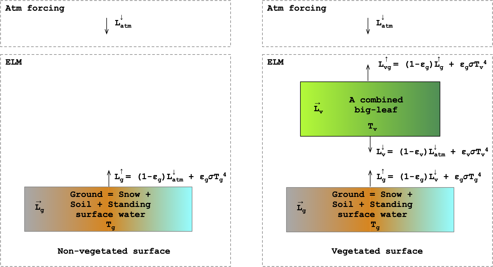

# Overview

The longwave radiation module in ELM solves the amount of longwave
radiation absorbed by the ground and the vegetation, and the
amount of outgoing radiation to the atmosphere (Figure 1).
The model represents the ground surface as a mixture of snow,
soil, and standing surface water. The shaded and sunlit leaves
are combined as a single leaf within the model. The incoming
longwave atmosphere radiation, $L^\downarrow_{atm}$, is a
boundary condition for the model.

Fig 1. Two-stream longwave radiation model for
(a) non-vegetated and (b) vegetated surfaces.

## Governing Equations For Non-vegetated Surfaces

The emitted longwave radation from ground, $L^{\uparrow}_g$, is

$$
\begin{equation}
L^{\uparrow}_{g} = (1 - \epsilon_g)L^\downarrow_{atm} + \epsilon_g \sigma T_{g}^4
\label{eq:lg_up_nonveg}
\end{equation}
$$

where $\epsilon_g$ is the emissivity of the ground,
$\sigma$ is the Stefan-Boltzmann constant, and
$T_g$ is the ground temperature. The first term on the
right-hand side represents the reflected atmospheric longwave
radiation, while the second term represents the emitted longwave
radiation by the ground. The emitted longwave radiation is computed as

$$
\begin{equation}
\epsilon_g \sigma T_g^4 = \epsilon_g \sigma \left[ f_{sno} T^4_{sno,top} + \left( 1 - f_{sno} - f_{h2osfc}\right) T^4_{soi,1} + f_{h2osfc} T^4_{h2osfc} \right]
\label{eqn:tg}
\end{equation}
$$

where $T_{sno,top}$, $T_{soi,1}$ and $T_{h2osfc}$
the temperature of the top snow layer, the first soil layer, and
the standing surface water, respectively, and
$f_{sno}$ and $f_{h2osfc}$ are fraction of snow and
standing surface water. The ground emissivity is computed as the weighted
average of soil and snow emissivity as

$$
\begin{equation}
\epsilon_g = \epsilon_{soi} (1 - f_{sno}) + \epsilon_{sno} f_{sno}
\end{equation}
$$

where $\epsilon_{soi}$ is 0.96 for soil, 0.97 for glacier, and
0.96 for wetland, while $\epsilon_{sno}$ is 0.97.

The radiation absorbed by the ground, $\overrightarrow{L}_g$, is

$$
\begin{equation}
\overrightarrow{L}_g = \epsilon_g \sigma T_g^4 + \epsilon_g L_{atm}^\downarrow
\label{eqn:lg_net_nonveg}
\end{equation}
$$

## Governing Equations For Vegetated Surfaces

The longwave radiation below the canopy, $L_v\downarrow$, is

$$
\begin{equation}
L_v^\downarrow = (1 - \epsilon_v)L_{atm}^\downarrow + \epsilon_v \sigma T_v^4
\end{equation}
$$

where $\epsilon_v$ is the emissivity of the vegetation
and $T_v$ is the temperature of the canopy. The model assumes
the sunlit and shaded leaves are at the same temperature.
The first term on the right-hand side of the equation represents
the transmitted atmospheric longwave radiation through the
canopy and the second term represents the emitted longwave
radiation by the canopy. The emissivity of the vegetation is

$$
\begin{equation}
\epsilon_v = 1 - \exp\left( {-(L+S)/\bar{\mu}} \right)
\end{equation}
$$

The upwelling longwave radiation from the ground is

$$
\begin{eqnarray}
L_g^\uparrow &=& (1 - \epsilon_g) L_v^\downarrow + \epsilon_g \sigma T_g^4 \nonumber\\[0.5em]
&=& (1 - \epsilon_g)(1 - \epsilon_v)L_{atm}^\downarrow + (1 - \epsilon_g)\epsilon_v \sigma T_v^4 + \epsilon_g \sigma T_g^4
\end{eqnarray}
$$

where the $T_g$ is given by equation \eqref{eqn:tg}.

Lastly, the upwelling radiation from the top of the canopy to
the atmosphere is

$$
\begin{eqnarray}
L_{vg}^\uparrow &=& (1 - \epsilon_v) L_g^\uparrow + \epsilon_v \sigma T_v^4 \nonumber \\[0.5em]
&=& (1 - \epsilon_v) \left[ (1 - \epsilon_g) L_v^\downarrow + \epsilon_g \sigma T_g^4 \right] + \epsilon_v \sigma T_v^4 \nonumber \\[0.5em]
&=& (1 - \epsilon_v) (1 - \epsilon_g) L_v^\downarrow
+ (1 - \epsilon_v) \epsilon_g \sigma T_g^4 + \epsilon_v \sigma T_v^4 \nonumber \\[0.5em]
&=& (1 - \epsilon_v) (1 - \epsilon_g) \left[ (1 - \epsilon_v)L_{atm}^\downarrow + \epsilon_v \sigma T_v^4 \right] \nonumber\\[0.5em]
& & + \epsilon_v \sigma T_v^4 + (1 - \epsilon_v) \epsilon_g \sigma T_g^4 \nonumber\\[0.5em]
&=& (1 - \epsilon_v) (1 - \epsilon_g) (1 - \epsilon_v)L_{atm}^\downarrow \nonumber\\[0.5em]
& & +(1 - \epsilon_v) (1 - \epsilon_g) \epsilon_v \sigma T_v^4 \nonumber\\[0.5em]
& & + \epsilon_v \sigma T_v^4 + (1 - \epsilon_v) \epsilon_g \sigma T_g^4
\end{eqnarray}
$$

The radiation absorbed by the vegetation, $\overrightarrow{L}_{v}$, with
positive value towards the atmosphere, is

$$
\begin{eqnarray}
\overrightarrow{L}_v & = &  2 \epsilon_v T_v^4 - \epsilon_v L_g^\uparrow - \epsilon_v L_{atm}^\downarrow \nonumber\\[0.5em]
& = & 2 \epsilon_v T_v^4  - \epsilon_v \left[ (1 - \epsilon_g)(1 - \epsilon_v)L_{atm}^\downarrow + (1 - \epsilon_g)\epsilon_v \sigma T_v^4 + \epsilon_g \sigma T_g^4 \right] \nonumber\\[0.5em]
& & - \epsilon_v L_{atm}^\downarrow \nonumber\\[0.5em]
& = & \left[ 2 - \epsilon_v (1 - \epsilon_g)\right] \epsilon_v \sigma T_v^4 - \epsilon_v \epsilon_g \sigma T_g^4 - \epsilon_v \left[ 1 + (1 - \epsilon_g)(1 - \epsilon_v) \right] L_{atm}^\downarrow \label{eq:net_lv}
\end{eqnarray}
$$

The radiation absorbed by the ground with a positive value towards the atmosphere is

$$
\begin{equation}
\overrightarrow{L_g} = \epsilon_g \sigma T_g^4 - \epsilon_g L_{v}^\downarrow
\label{eq:net_lg_veg1}
\end{equation}
$$

## Temporal Discretization of Ground Temperature

The three components of ground temperature
(i.e. $T_{sno,1}$, $T_{soi,1}$ and $T_{h2osoi}$) that contribute
to the upward longwave radiation at the ground are coupled to the
temperature of deeper snow and soil layers. This *coupling* of
the temporally discretized equation of the surface energy
balance (that includes absorbed shortwave radiation, $\overrightarrow{S}_{soi}$,
absorbed longwave radiation, sensible heat flux, $H_{soi}$,
latent heat flux, $\lambda E_{soi}$, and ground heat flux, $G$)
with the spatio-temporally discretized equations
of the vertical heat diffusion model within the snow and soil layers
leads to complexity.
This complexity is discussed in Section 7.3 of Bonan (2019)[@bonan2019climate]
and briefly summarized below.

### Non-vegetated Surface

For simplicity, let's consider the non-vegetated case in which
snow and standing are absent. In such a case, the ground temperature is the
temperature of the first soil layer i.e. $T_g = T_{soi,1}$.
At the current time step $n+1$, the absorbed
longwave radiation given by equation \eqref{eqn:lg_net_nonveg} is a function
of soil temperature at time $n+1$, $T_{sol,1}^{n+1}$, which is unknown.
The ground heat flux at the top of the soil is given as

$$
\begin{eqnarray}
G_{soi} &=& \overrightarrow{S}_{soi} - \overrightarrow{L}_g - H_{soi} - \lambda E_{soi} \nonumber\\[0.5em]
& = & \overrightarrow{S}_{soi} - \epsilon_{soi} \sigma T_{soi,1}^4 - \epsilon_{soi}L_{atm}^\downarrow - H_{soi} - \lambda E_{soi}
\end{eqnarray}
$$

The vertical heat diffusion model in ELM uses the Crank-Nicholson temporal discretization
method in which the fluxes between cells are computed as an average of the flux
at $n$-th and $(n+1)$-th time step. The top boundary heat flux (i.e. $G$) in
ELM is computed only at $(n+1)$-th time step and is linearized as

$$
\begin{eqnarray}
G_{soi}^{n+1} &=& G_{soi}^{n} + \dfrac{\partial G}{\partial T_{soi,1}}
\left(T_{soi,1}^{n+1} - T_{soi,1}^n\right) \nonumber \\[0.5em]
& = & \overrightarrow{S}_{soi} - \left[ \epsilon_{soi} \sigma (T_{soi,1}^{n})^4 + 4 \epsilon_{soi} \sigma (T_{soi,1}^{n})^3 \Delta T_{soi}^{n+1} + \epsilon_{soi}L_{atm}^\downarrow \right] \nonumber \\[0.5em]
& & - \left[ H_{soi}^n + \dfrac{\partial H}{\partial T_{soi,1}} \Delta T_{soi}^{n+1} \right] \nonumber\\[0.5em]
& & - \left[ \lambda E_{soi}^n + \dfrac{\partial \lambda E}{\partial T_{soi,1}} \Delta T_{soi}^{n+1} \right] \nonumber \\[0.5em]
& = & \overrightarrow{S}_{soi} - \overrightarrow{L}_g^{n+1} - H_{soi}^{n+1} - \lambda E_{soi}^{n+1} \label{eqn:G_bc_discretized}
\end{eqnarray}
$$

Thus, the temporally discretized net absorbed longwave radiation in Equation \eqref{eqn:G_bc_discretized} is

$$
\begin{equation}
\overrightarrow{L}_g^{n+1} = \left[ \epsilon_{soi} \sigma (T_{soi,1}^{n})^4 + 4 \epsilon_{soi} \sigma (T_{soi,1}^{n})^3 \Delta T_{soi}^{n+1} + \epsilon_{soi}L_{atm}^\downarrow \right]
\label{eqn:lg_net_nonveg2}
\end{equation}
$$

Comparing Equation \eqref{eqn:lg_net_nonveg} and \eqref{eqn:lg_net_nonveg2}, one can
interpret the second term on the right hand side, $4\epsilon_{soi}\sigma$ ($T_{soi}^n)^3 \Delta T^{n+1}$,
as an additional source of emitted longwave radiation. However, this term can only
be computed after the vertical heat diffusion model is solved, i.e, after $\Delta T_{soi}^{n+1}$
is known. Furthermore, this additional longwave radiation source term is added to
the upward longwave radiation to the atmosphere given by $L_g^\uparrow$ in
equation \eqref{eq:lg_up_nonveg).

For the more general case, when snow and standing surface water are
present on the ground, the temporally discretized net absorbed longwave radiation is

$$
\begin{equation}
\overrightarrow{L}_g^{n+1} = \epsilon_{g} \sigma (T_{g}^{n})^4 + 4 \epsilon_{g} \sigma (T_{g}^{n})^3 \Delta T_{g}^{n+1} + \epsilon_{soi}L_{atm}^\downarrow
\label{eqn:lg_net_nonveg3}
\end{equation}
$$

### Vegetated Surface

The same coupling of the surface ground energy flux equations and vertical
heat diffusion model leads to a similar model complexity and the temporally
discretized net longwave radiation for vegetated given by equation \eqref{eq:net_lg_veg1}
is

$$
\begin{equation}
\overrightarrow{L_g}^{n+1} = \epsilon_g \sigma (T_g^n)^4 + 4 \epsilon_{g} \sigma (T_{g}^{n})^3 \Delta T_{g}^{n+1} - \epsilon_g L_{v}^\downarrow
\end{equation}
$$

The additional *apparent* emitted longwave radiation represented by the second term on the right
hand side of the above equation is not absorbed by the canopy and directly sent upwards to
the atmosphere by adding it in $L_{vg}^\uparrow$.

## Temporally Discretized Governing Equations

For the sake of completeness and clarity, we list below the temporally discretized
longwave equations used in ELM.

### Non-vegetated Surfaces

The temporally discretized upwelling longwave radiation to the atmosphere and
absorbed longwave radiation by the ground are

$$
\begin{eqnarray}
L^{\uparrow n+1}_{g} &=& (1 - \epsilon_g)L^{\downarrow n+1}_{atm} + \epsilon_g \sigma (T_{g}^{n})^4 + 4 \epsilon_{g} \sigma (T_{g}^{n})^3 \Delta T_{g}^{n+1} \\[0.5em]
\overrightarrow{L}_g^{n+1} &=& \epsilon_g \sigma (T_g^n)^4 + \epsilon_g L_{atm}^{\downarrow n+1} + 4 \epsilon_{g} \sigma (T_{g}^{n})^3 \Delta T_{g}^{n+1}
\end{eqnarray}
$$

### Vegetated Surfaces

When solving for $T_v^{n+1}$, ELM uses a diagnostic heat model in which leaves
have no heat capacity and the sum of net absorbed solar and longwave radiation
must balance the latent and sensible heat energy. This leads to a nonlinear
equation for the vegetation canopy temperature, which is solved iteratively.
When the solution for vegetation temperature has been found after $k$-th iteration,
$T_v^{n+1,k}$, ELM uses a linear approximation of the non-linear term related
to canopy temperature in the canopy emitted upward and downward longwave radiation
equations. The linear approximation is as follows.

$$
\begin{equation}
\epsilon_v \sigma_v (T_v^{n+1,k+1})^4 = \epsilon_v \sigma_v (T_v^{n+1,k})^4 + 4\epsilon_v \sigma_v (T_v^{n+1,k})^3 \Delta T_v^{n+1,k}
\end{equation}
$$

The temporally discretized downward longwave radiation by leaves is

$$
\begin{equation}
L_v^{\downarrow n+1} = (1 - \epsilon_v)L_{atm}^{\downarrow n+1} + \epsilon_v \sigma (T_v^{n+1,k})^4
+ 4 \epsilon_v \sigma (T_v^{n+1,k})^3 (\Delta T_v^{n+1,k+1})
\end{equation}
$$

The temporally discretized upward longwave from the canopy

$$
\begin{eqnarray}
L_{vg}^{\uparrow n+1}
&=& (1 - \epsilon_v) (1 - \epsilon_g) (1 - \epsilon_v)L_{atm}^{\downarrow n+1} \nonumber \\[0.5em]
& & + (1 - \epsilon_v) (1 - \epsilon_g) \epsilon_v \sigma (T_v^{n+1,k})^4 \nonumber\\[0.5em]
& & + 4 (1 - \epsilon_v) (1 - \epsilon_g) \epsilon_v \sigma (T_v^{n+1,k})^3 (\Delta T_v^{n+1,k+1}) \nonumber\\[0.5em]
& & + \epsilon_v \sigma (T_v^{n+1,k})^4 + 4 \epsilon_v \sigma (T_v^{n+1,k})^3 \Delta T_v^{n+1,k+1} \nonumber\\[0.5em]
& & + (1 - \epsilon_v) \epsilon_g \sigma (T_g^n)^4
\end{eqnarray}
$$

The temporally discretized upward longwave from the canopy and ground to the atmosphere is

$$
\begin{equation}
L^{\uparrow n + 1} = L_{vg}^{\uparrow n+1}  + 4 \epsilon_g \sigma (T_g^n)^3 (\Delta T_g^{n+1})
\end{equation}
$$

Note the $T_v$ used in computing the net longwave radiation absorbed by
the leaf given by equation \eqref{eq:net_lv} is $T_v^{n+1,k}$ and it is not
adjusted after the solution for vegetation temperature is found.
