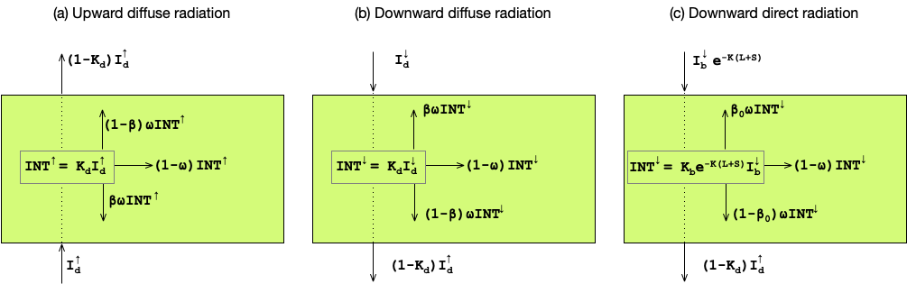
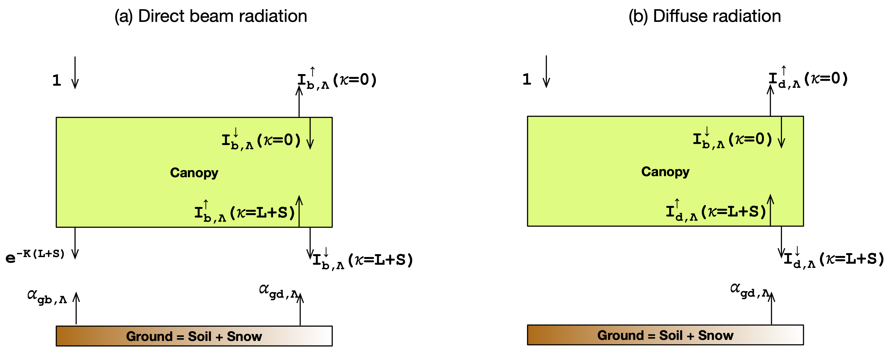

# Overview

The main features of ELM shortwave radiation model are as
follows:

- The shortwave radiation model in ELM computes the beam
  (or direct) and diffuse radiation absorbed by the canopy
  (i.e. sunlit and shaded leaves) and the ground,
  the radiation reflected to the atmosphere, and surface
  albedo.
- The model accounts for radiation in two bands: visible
  ($< 0.7\mu$m) and near-infrared ($\ge 0.7 \mu$m).
- The model uses the two-stream approximation of
  Dickenson 1983[@dickinson1983land] and
  Sellers 1985[@sellers1985canopy].
- The model is a single-layer canopy model.
- Sunlit leaf absorbs unscattered direct radiation,
  scattered direct radiation, and diffuse radiation.
- Shaded leaf absorbs scattered direct radiation and
  diffuse radiation.
- Snow albedo and the shortwave radiative heating of each snowpack layer
  is modeled using the hybrid SNICAR-AD model
  of Dang et al. 2019[@dang2019intercomparison].
- The sub-grid impacts of topography on solar radiation
  are parameterized using the approach of Hao et al. 2021
  [@hao2021parameterization].

ELM's shortwave radiation model is similar to
CLM4.5[@oleson2013clm45], and its new features include
the hybrid SNICAR-AD model for snow albedo and a
parameterization for the sub-grid effects of topography
on solar radiation.

The outline of this chapter is as follows. First, the
governing equations of the two-stream approximation of
the radiative transfer model are presented. Second, the analytical
solutions for the upward and downward diffuse radiation
using the two-stream approximation are given. Third, the
analytical solutions are used for the single-layer canopy
configuration to compute the radiation absorbed by the
canopy and ground and the radiation absorbed by the
canopy for sunlit and shaded leaves. Fourth, the
treatment of surface albedo is described. Fifth, the
equations describing the total amount of solar radiation
are presented.

## Two-Stream Approximation Radiative Transfer Model

At any level within the canopy, the upward/downward
direct/diffuse radiation is transmitted and intercepted
by the canopy. The intercepted radiation is scattered
backward, scattered forward, and absorbed by the canopy.
The diffuse radiative fluxes via the two-stream
approximation are given as

$$
\begin{eqnarray}
- \dfrac{dI^{\uparrow}}{d(L+S)} + [ 1 - (1 - \beta)\omega ]
\dfrac{1}{\bar{\mu}}I^{\uparrow} - \omega \beta \dfrac{1}{\bar{\mu}}
I^{\downarrow} = \omega K_b \beta_0 e^{-K(L+S)}
\label{eqn:dif_up} \\[0.5em]
 \dfrac{dI^{\downarrow}}{d(L+S)} + [ 1 - (1 - \beta)\omega ]
\dfrac{1}{\bar{\mu}} I^{\downarrow} - \omega \beta \dfrac{1}{\bar{\mu}}
I^{\uparrow} = \omega K_b (1 - \beta_0) e^{-K(L+S)}
\label{eqn:dif_dn}
\end{eqnarray}
$$

where $I^{\uparrow}$ is the upward diffuse radiative flux
per unit incident flux, $I^{\downarrow}$ is the downward
diffuse radiative flux per unit incident flux,
$K_b \left( = G(\mu)/\mu \right)$ is the optical depth of
direct radiation per unit leaf and stem area, $G(\mu)$ is
the relative projected area of leaf and stem in the
direction of $\cos^{-1}(\mu)$, $\mu$ is the cosine of the solar zenith
angle, $\bar{\mu} \left( = 1/K_d \right)$ is the inverse
of the optical depth of diffuse radiation per unit leaf
and stem area, $\omega$ is the scattering coefficient,
$\beta$ is the upscatter parameter for diffuse radiation,
$\beta_0$ is the upscatter parameter for direct radiation,
$L$ is leaf area index, and $S$ is stem area index.

The equations \eqref{eqn:dif_up}-\eqref{eqn:dif_dn}
includes the five optical parameters: $G(\mu)$,
$\bar{\mu}$, $\omega$, $\beta$, and $\beta_0$. The optical
parameters dependent on wavelength band ($\Lambda$) are
$\omega$, $\beta$, and $\beta_0$. Next, we describe the
computation of these optical parameters.

Fig 1. Two-stream approximation of (b) upward diffuse
radiation, (b) downward diffuse radiation, and (c)
downward direct radiation.

### Projected leaf and stem area

ELM uses the Ross-Gourdriaan[@ross1975radiative, @goudriaan1977crop]
function to compute the projection of leaf area in the direction of the solar
radiation as:

$$
\begin{equation}
G(\mu) = \phi_1 + \phi_2 \mu
\end{equation}
$$

with $\phi_1 = 0.5 - 0.633 \chi_\ell - 0.366 \chi^2_\ell$
and $\phi_2 = 0.877 (1 - 2 \phi_2)$. The $\chi_\ell$ is
the Ross index or leaf/stem orientation index that is
restricted to $-0.4 \lt \chi_\ell \lt 0.6$.
For vertical leaves, $\chi_\ell = -1$ and $\bar{\theta} = 90^0$.
For horizontal leaves, $\chi_\ell = 1$ and $\bar{\theta} = 0^0$.
For randomly spherically distributed leaves, $\chi_\ell = 0$
and $\bar{\theta} = 60^0$.

### Optical depths

The optical depth of direct radiation per unit leaf and
stem area is given by

$$
\begin{equation}
K_b = \dfrac{G(\mu)}{\mu}
\end{equation}
$$

The optical depth of diffuse radiation per unit leaf and
stem area is given by

$$
\begin{eqnarray}
\bar{\mu} = \int_0^1 \dfrac{\mu'}{G(\mu')} d\mu' =
\dfrac{1}{\phi_1} \left[ 1 - \dfrac{\phi_1}{\phi_2}\ln
\left( \dfrac{\phi_1 + \phi_2}{\phi_1} \right) \right]
\end{eqnarray}
$$

### Scattering coefficient

The scattering coefficient accounts for the presence or
absence of snow on vegetation as

$$
\begin{equation}
\omega_\Lambda =
\begin{cases}
\omega_\Lambda^{veg} \left( 1 - f_{wet}\right) +
\omega_\Lambda^{sno}f_{wet}, & \text{if snow is on the
canopy}\\[0.5em]
\omega_\Lambda^{veg}, & \text{otherwise}
\end{cases}
\end{equation}
$$

where the vegetation scattering coefficient,
$\omega_\Lambda^{veg}$, is the sum of reflectances and
transmittances, each of which is given as weighted
averages of leaf and stem values as

$$
\begin{eqnarray}
\omega_\Lambda^{veg} &=& \alpha_\Lambda + \tau_\Lambda
\\[0.5em]
                     &=& \alpha_\Lambda^{leaf} w_{leaf} +
                     \alpha_\Lambda^{stem} w_{stem}
                     + \tau_\Lambda^{leaf} w_{leaf} +
                     \tau_\Lambda^{stem} w_{stem}
                     \\[0.5em]
                     &=& \alpha_\Lambda^{leaf} \left(
                     \dfrac{L}{L+S} \right) +
                     \alpha_\Lambda^{stem} \left(
                     \dfrac{S}{L+S} \right) \nonumber\\
                     & &+ \tau_\Lambda^{leaf} \left(
                     \dfrac{L}{L+S} \right) +
                     \tau_\Lambda^{stem} \left(
                     \dfrac{S}{L+S} \right)
\end{eqnarray}
$$

### Upscatter for diffuse radiation

The upscatter for diffuse radiation also accounts for the
presence of snow on vegetation as

$$
\begin{equation}
\omega_\Lambda \beta_\Lambda =
\begin{cases}
\omega_\Lambda^{veg} \beta_\Lambda^{veg} \left( 1 -
f_{wet}\right) + \omega_\Lambda^{sno} \beta_\Lambda^{sno}
f_{wet}, & \text{if snow is on the canopy}\\[0.5em]
\omega_\Lambda^{veg} \beta_\Lambda^{veg}, &
\text{otherwise}
\end{cases}
\end{equation}
$$

where

$$
\begin{eqnarray}
\omega_\Lambda^{veg} \beta_\Lambda^{veg} &=& \dfrac{1}{2}
\left[ \alpha_\Lambda + \tau_\Lambda + (\alpha_\Lambda -
\tau_\Lambda) \cos^2\bar{\theta}\right] \nonumber
\\[0.5em]
&=& \dfrac{1}{2} \left[ \alpha_\Lambda + \tau_\Lambda +
(\alpha_\Lambda - \tau_\Lambda) \left( \dfrac{1 +
\chi_\ell}{2} \right)^2\right]
\end{eqnarray}
$$

### Upscatter for direct radiation

The upscatter for direct radiation accounts for the
presence of snow on vegetation as

$$
\begin{equation}
\omega_\Lambda \beta_{0,\Lambda} =
\begin{cases}
\omega_\Lambda^{veg} \beta_{0,\Lambda}^{veg} \left( 1 -
f_{wet}\right) + \omega_\Lambda^{sno}
\beta_{0,\Lambda}^{sno} f_{wet}, & \text{if snow is on the
canopy}\\[0.5em]
\omega_\Lambda^{veg} \beta_{0,\Lambda}^{veg}, &
\text{otherwise}
\end{cases}
\end{equation}
$$

where

$$
\begin{eqnarray}
\omega_\Lambda^{veg} \beta_{0,\Lambda}^{veg} &=&
\left(\dfrac{1 + \bar{\mu}K}{\bar{\mu}K} \right)
a_s(\mu)_\Lambda \nonumber \\[0.5em]
&=& \left(\dfrac{1 + \bar{\mu}K}{\bar{\mu}K}\right)
\dfrac{\omega_\Lambda^{veg}}{2} \dfrac{G(\mu)}{\mu \phi_2 +
G(\mu)}
\left[ 1 - \dfrac{\mu \phi_1}{\mu \phi2 + G(\mu)} \ln
\left( \dfrac{\mu \phi_1 + \mu \phi_2 + G(\mu)}{\mu \phi1}
\right) \right]
\end{eqnarray}
$$

## Analytical Solutions of the Two-Stream Approximation Radiative Transfer Model

The analytical solutions for upward and downward radiation
at a depth equal to the cumulative leaf and stem area
index, $\kappa$, were derived by Sellers (1985) for the
two-stream approximation model given by equations
\eqref{eqn:dif_up}-\eqref{eqn:dif_dn} under a set of
prescribed boundary conditions.

### Scattered Beam Radiation

The following boundary conditions are used for the values
of downward diffuse radiation per unit incident direct
radiation at the top of the canopy (i.e., $\kappa = 0$)
and upward diffuse per unit incident direct radiation at
the bottom of the canopy (i.e., $\kappa = L + S$):

$$
\begin{eqnarray}
I^{\downarrow}_{b,\Lambda}(\kappa = 0) &=& 0 \\[0.5em]
I^{\uparrow}_{b,\Lambda}(\kappa = L + S) &=&
\alpha_{gb,\Lambda} e^{-K(L+S)} +
\alpha_{gd}I^{\downarrow}_{b,\Lambda}
\end{eqnarray}
$$

with $\alpha_{gb,\Lambda}$  and $\alpha_{gd,\Lambda}$ are
the ground albedo for direct and diffuse radiation,
respectively. Under such boundary conditions, the
analytical solution of upward and downward diffuse
radiation per unit incident direct radiation is

$$
\begin{eqnarray}
I^{\uparrow}_{b,\Lambda}(\kappa) &=& \dfrac{h_1 e^{-K
\kappa}}{\sigma} + h_2 e^{ -h \kappa} + h_3 e^{h\kappa}
\label{two_str_dir_up_eqn} \\[0.5em]
I^{\downarrow}_{b,\Lambda}(\kappa) &=& \dfrac{h_4 e^{-K
\kappa}}{\sigma} + h_5 e^{-h \kappa} + h_6 e^{h\kappa}
\label{two_str_dir_dn_eqn}
\end{eqnarray}
$$

It should be noted that $I^{\uparrow}_{b,\Lambda}(\kappa =
0)$ can be interpreted as surface albedo for the diffuse
(or scattered) flux of beam radiation.

### Diffuse Radiation

The following boundary conditions are used for the values
of downward diffuse radiation per unit incident diffuse
radiation at the top of the canopy (i.e., $\kappa = 0$)
and upward diffuse per unit incident diffuse radiation at
the bottom of the canopy (i.e., $\kappa = L + S$):

$$
\begin{eqnarray}
I^{\downarrow}_{d,\Lambda}(\kappa = 0) &=& 1 \\[0.5em]
I^{\uparrow}_{d,\Lambda}(\kappa = L + S) &=&
\alpha_{gd}I^{\downarrow}_{d,\Lambda}
\end{eqnarray}
$$

Under such boundary conditions, the analytical solution of
upward and downward diffuse radiation per unit incident
diffuse radiation is

$$
\begin{eqnarray}
I^{\uparrow}_{d,\Lambda}(\kappa) &=& h_7 e^{ -h \kappa} +
h_8 e^{h\kappa} \label{two_str_dif_up_eqn} \\
I^{\downarrow}_{d,\Lambda}(\kappa) &=& h_9 e^{ -h \kappa} +
h_{10} e^{h\kappa} \label{two_str_dif_dn_eqn}
\end{eqnarray}
$$

It should be noted that $I^{\uparrow}_{d,\Lambda}(\kappa =
0)$ can be interpreted as surface albedo for the diffuse
(or scattered) flux of diffuse radiation.

### Parameters in the Analytical Solutions

The parameters for the analytical equations
\eqref{two_str_dir_up_eqn}, \eqref{two_str_dir_dn_eqn},
\eqref{two_str_dif_up_eqn}, and \eqref{two_str_dif_dn_eqn}
are presented here.

#### Common Parameters

The parameters common to both the beam and diffuse
radiation are:

$$
\begin{eqnarray}
b &=& 1 - \omega_\Lambda + \omega_\Lambda \beta_\Lambda
\\[0.5em]
c &=& \omega_\Lambda \beta_\Lambda \\[0.5em]
d &=& \omega_\Lambda \bar{\mu} K \beta_{0,\Lambda}
\\[0.5em]
f &=& \omega_\Lambda \bar{\mu} K (1 - \beta_{0,\Lambda})
\\[0.5em]
h &=& \dfrac{\sqrt{b^2 - c^2}}{\bar{\mu}} \\[0.5em]
\sigma &=& (\bar{\mu} K)^2 + c^2 - b^2 \\[0.5em]
s_1 &=& e^{-h(L+S)} \\[0.5em]
s_2 &=& e^{-K(L+S)} \\[0.5em]
\end{eqnarray}
$$

#### Parameters For Scattered Beam Radiation

The parameters for the beam radiation equations
\eqref{two_str_dir_up_eqn} - \eqref{two_str_dir_dn_eqn}
are:

$$
\begin{eqnarray}
u_1 &=& b - c/\alpha_{gb,\Lambda} \\[0.5em]
u_2 &=& b - c\alpha_{gb,\Lambda} \\[0.5em]
u_3 &=& f - c\alpha_{gb,\Lambda} \\[0.5em]
p_1 &=& b + \bar{\mu} h \\[0.5em]
p_2 &=& b - \bar{\mu} h \\[0.5em]
p_3 &=& b + \bar{\mu} K \\[0.5em]
p_4 &=& b - \bar{\mu} K \\[0.5em]
d_1 &=& \dfrac{p_1(u_1 - \bar{\mu}h)}{s_1} - p_2 (u_1 +
\bar{\mu}h)s_1 \\[0.5em]
d_2 &=& \dfrac{(u_2 + \bar{\mu}h)}{s_1} - (u_2 -
\bar{\mu}h)s_1 \\[0.5em]
h_1 &=& -d p_4 - c f \\[0.5em]
h_2 &=& \dfrac{1}{d_1} \left[ \left( d -
\dfrac{h_1}{\sigma}p_3 \right) \dfrac{(u_1 -
\bar{\mu}h)}{s_1} - p_2 \left( d - c - \dfrac{h_1}{\sigma}
(u_1 + \bar{\mu}K)\right)s _2\right] \\[0.5em]
h_3 &=& \dfrac{-1}{d_1} \left[ \left( d -
\dfrac{h_1}{\sigma}p_3 \right) \dfrac{(u_1 +
\bar{\mu}h)}{s_1} - p_1 \left( d - c - \dfrac{h_1}{\sigma}
(u_1 + \bar{\mu}K)\right)s _2\right] \\[0.5em]
h_4 &=& -f p_3 - c d \\[0.5em]
h_5 &=& \dfrac{-1}{d_2} \left[ \left(
\dfrac{h_4(u_2 + \bar{\mu}h)}{\sigma s_1} \right) + \left(
u_3 - \dfrac{h_4}{\sigma} (u_2 - \bar{\mu}K) \right)s_2
\right] \\[0.5em]
h_6 &=& \dfrac{1}{d_2} \left[ \dfrac{h_4(u_2 +
\bar{\mu}h)}{\sigma}s_1 + \left( u_3 - \dfrac{h_4}{\sigma}
(u_2 - \bar{\mu}K) \right)s_2 \right]
\end{eqnarray}
$$

#### Parameters For Diffuse Radiation

The parameters for the diffuse radiation equations
\eqref{two_str_dif_up_eqn} - \eqref{two_str_dif_dn_eqn}
are:

$$
\begin{eqnarray}
u_1 &=& b - c/\alpha_{gd,\Lambda} \\[0.5em]
u_2 &=& b - c\alpha_{gd,\Lambda} \\[0.5em]
h_7 &=& \dfrac{c(u_1 - \bar{\mu}h)}{d_1s_1} \\[0.5em]
h_8 &=& \dfrac{-c(u_1 - \bar{\mu}h)s_1}{d_1} \\[0.5em]
h_9 &=& \dfrac{(u_2 + \bar{\mu}h)}{d_2s_2} \\[0.5em]
h_{10} &=& \dfrac{-s_1(u_2 - \bar{\mu}h)}{d_2} \\[0.5em]
\end{eqnarray}
$$

### Radiation Absorbed by Sunlit and Shaded Leaves

It is assumed that the shaded leaves only receive diffuse
radiation, including scattered direct and diffuse
radiation. In contrast, the sunlit leaves receive
unscattered direct radiation, scattered direct radiation,
and diffuse radiation. Given these assumptions, the
radiation absorbed by shaded ($\overrightarrow{I}_{\ell}^{sha}$)
and sunlit ($\overrightarrow{I}_{\ell}^{sun}$) leaves per
unit shaded and sunlit leaf area at the cumulative leaf
area index $\kappa$ is given as:

$$
\begin{eqnarray}
\overrightarrow{I}_{\ell}^{sha} (\kappa) &=&
\overrightarrow{I}_{\ell b}(\kappa) + \overrightarrow{I}_{\ell
d}(\kappa) \label{eqn_sha_net_rad} \\[0.5em]
\overrightarrow{I}_{\ell}^{sun} (\kappa) &=& (1 - \omega)K_b
e^{-K_b\kappa}I_{atm,b}^{\downarrow} +  \overrightarrow{I}_{\ell
b}(\kappa) + \overrightarrow{I}_{\ell d}(\kappa)
\label{eqn_sun_net_rad}
\end{eqnarray}
$$

where $\overrightarrow{I}_{\ell b}(\kappa)$ is the net
absorbed beam radiation and $\overrightarrow{I}_{\ell
d}(\kappa)$ is the net absorbed diffuse radiation. These
net absorbed beam and diffuse radiation fluxes at the
cumulative leaf area index $\kappa$ are given as:

$$
\begin{eqnarray}
\overrightarrow{I}_{\ell b}(\kappa) &=& \left[ \omega K_b
e^{-K_b \kappa} + \dfrac{d(I_{b}^{\uparrow} -
I_b^{\downarrow})}{d\kappa} \right] I_{atm,b}^\downarrow
\\[0.5em]
\overrightarrow{I}_{\ell d}(\kappa) &=&
\dfrac{d(I_d^\uparrow - I_d^\downarrow)}{d\kappa}
I_{d0}^\downarrow
\end{eqnarray}
$$

The canopy level net absorbed beam and diffused fluxes
(per unit ground area) are obtained by integrating
equations \eqref{eqn_sha_net_rad} - \eqref{eqn_sun_net_rad}
over the canopy profile while accounting for sunlit and
shaded leaf fraction as

$$
\begin{eqnarray}
\overrightarrow{I}_c^{sha} &=& \int_0^{L+S}
\overrightarrow{I}_{\ell}^{sha}(\kappa) \left[ 1 -
f_{sun}(\kappa)\right] d\kappa = \overrightarrow{I}_{cb}^{sha}
+ \overrightarrow{I}_{cd}^{sha} \\[0.5em]
\overrightarrow{I}_c^{sun} &=& \int_0^{L+S}
\overrightarrow{I}_{\ell}^{sun}(\kappa) f_{sun}(\kappa)
d\kappa = \overrightarrow{I}_{cb}^{sun} +
\overrightarrow{I}_{cd}^{sun}
\end{eqnarray}
$$

where $\overrightarrow{I}_{cb}^{sha}$ is the canopy level
absorbed beam radiation by shaded leaves,
$\overrightarrow{I}_{cd}^{sha}$ is the canopy level
absorbed diffuse radiation by shaded leaves,
$\overrightarrow{I}_{cb}^{sun}$ is the canopy level
absorbed beam radiation by sunlit leaves, and
$\overrightarrow{I}_{cd}^{sun}$ is the canopy level
absorbed diffuse radiation by sunlit leaves. Furthermore,
the total absorbed beam (or diffuse) radiation by the
canopy must be the sum of absorbed beam (or diffuse)
radiation by sunlit and shaded leaves as:

$$
\begin{eqnarray}
\overrightarrow{I}_{cb} &=& \overrightarrow{I}_{cb}^{sha} +
\overrightarrow{I}_{cb}^{sun} \label{eqn_can_b_conservation}
\\[0.5em]
\overrightarrow{I}_{cd} &=& \overrightarrow{I}_{cd}^{sha} +
\overrightarrow{I}_{cd}^{sun} \label{eqn_can_d_conservation}
\end{eqnarray}
$$

The sunlit fraction of canopy, $f_{sun}$, is given by

$$
\begin{equation}
f_{sun}(\kappa) = e^{-K_b \kappa} \label{eqn_sun}
\end{equation}
$$

## Single-Layer Canopy Model With the Two-Stream Approximation

ELM represents the canopy as a single
layer with a sunlit and shaded leaf. The scattered beam
and diffuse upward (or downward) radiation fluxes at the
canopy top (or bottom) are given by substituting $\kappa
= 0$ (or $\kappa = L + S$) in equations
\eqref{two_str_dir_up_eqn} -- \eqref{two_str_dir_dn_eqn} as

$$
\begin{eqnarray}
I^{\uparrow}_{b,\Lambda}(\kappa = 0) &=& \dfrac{h_1
}{\sigma} + h_2 + h_3 \\[0.5em]
I^{\downarrow}_{b,\Lambda}(\kappa = L+S) &=& \dfrac{h_4
e^{-K (L+S)}}{\sigma} + h_5 e^{ -h (L+S)} + h_6 e^{h
(L+S)} \nonumber \\
&=& \dfrac{h_4 e^{-K (L+S)}}{\sigma} + h_5 s_1 +
\dfrac{h_6}{s_1} \\
I^{\uparrow}_{d,\Lambda}(\kappa = 0) &=& h_7 + h_8
\\[0.5em]
I^{\downarrow}_{d,\Lambda}(\kappa = L+S) &=& h_9 e^{ -h
(L+S)} + h_{10} e^{h (L+S)} \\[0.5em]
&=& h_9 s_1 + \dfrac{h_{10}}{s_1}
\end{eqnarray}
$$

Fig 2. Schematic representation of (a) direct beam
radiation and (b) diffuse solar radiation through ELM's
single-layer canopy and soil configuration.

### Radiation Absorbed By Canopy

The amount of beam and diffuse radiation absorbed per unit
incident flux by the canopy can be computed as the
difference between the incoming and outgoing radiation as

$$
\begin{eqnarray}
\overrightarrow{I}_{cb,\Lambda} &=& 1 - I_{b,\Lambda}^{\uparrow}
- \left( 1 - \alpha_{gd,\Lambda}\right)
I_{b,\Lambda}^{\downarrow} - (1 - \alpha_{gb,\Lambda})e^{-K(L+S)}
\label{eqn_can_b_absorb} \\[0.5em]
\overrightarrow{I}_{cd,\Lambda} &=& 1 - I_{d,\Lambda}^\uparrow
- \left( 1 - \alpha_{gd,\Lambda}\right) I_{d,\Lambda}^\downarrow
\label{eqn_can_d_absorb}
\end{eqnarray}
$$

The upward and downward fluxes in the above equations are
for $\kappa = 0$ and $\kappa = L + S$, respectively, and
to simplify the notation, $\kappa$ has been omitted from
the equations.

#### Radiation Absorbed By Sunlit and Shaded Leaves

Using analytical solutions of the two-stream
approximation, Dai et al. 2004[@dai2004two] provided
analytical solutions for the radiation absorbed by the sunlit
and shaded leaves presented below.

#### Sunlit leaves

The analytical solution of the beam radiation absorbed by
sunlit leaves is given as

$$
\begin{equation}
\overrightarrow{I}_{b, \Lambda}^{sun} = \left(1 -
\omega_\Lambda \right) \left[ 1 - s_2 + \dfrac{(a_1 +
a_2)}{\mu}\right]
\end{equation}
$$

where the parameters are given as follows

$$
\begin{eqnarray}
a_1 &=& \dfrac{h_1}{\sigma} \left[ \dfrac{1 - s_2^2}{2K}\right]
+ h_2 \left[ \dfrac{1 - s_1 s_2}{K + h} \right] + h_3 \left[
\dfrac{1 - s_2/s_1}{K - h} \right] \\[0.5em]
a_2 &=& \dfrac{h_4}{\sigma} \left[ \dfrac{1 - s_2^2}{2K}\right]
+ h_5 \left[ \dfrac{1 - s_1 s_2}{K + h} \right] + h_6 \left[
\dfrac{1 - s_2/s_1}{K - h} \right]
\end{eqnarray}
$$

Using equation \eqref{eqn_can_b_conservation}, the beam
radiation absorbed by shaded leaves is computed as

$$
\begin{equation}
\overrightarrow{I}_{b, \Lambda}^{sha} =
\overrightarrow{I}_{cb, \Lambda} - \overrightarrow{I}_{b,
\Lambda}^{sun}
\end{equation}
$$

where the first term on the right hand side is given by
equation \eqref{eqn_can_b_absorb}.

#### Shaded leaves

The analytical solution of the beam radiation absorbed by
shaded leaves are given as

$$
\begin{equation}
\overrightarrow{I}_{d, \Lambda}^{sun} = \left[ \dfrac{1 -
\omega_\Lambda}{\mu} \right] (a_1 + a_2)
\end{equation}
$$

where the parameters are given as follows

$$
\begin{eqnarray}
a_1 &=& h_7 \left[ \dfrac{1 - s_1 s_2}{K + h} \right] + h_8
\left[ \dfrac{1 - s_2/s_1}{K - h} \right] \\[0.5em]
a_2 &=& h_9 \left[ \dfrac{1 - s_1 s_2}{K + h} \right] +
h_{10} \left[ \dfrac{1 - s_2/s_1}{K - h} \right]
\end{eqnarray}
$$

Using equation \eqref{eqn_can_b_conservation}, the beam
radiation absorbed by shaded leaves is computed as

$$
\begin{equation}
\overrightarrow{I}_{d, \Lambda}^{sha} =
\overrightarrow{I}_{cd, \Lambda} - \overrightarrow{I}_{d,
\Lambda}^{sha}
\end{equation}
$$

where the first term on the right hand side is given by
equation \eqref{eqn_can_d_absorb}.

### Radiation Absorbed By Ground

The beam and diffuse radiation absorbed by the ground are
computed as the difference of the incoming and the outgoing
radiation.

$$
\begin{eqnarray}
\overrightarrow{I}_{gb,\Lambda} &=& \left( 1 -
\alpha_{gd,\Lambda}\right)I_{b,\Lambda}^\downarrow + \left( 1
- \alpha_{gb,\Lambda}\right)e^{-K(L+S)} \label{eqn_g_b_absorb}
\\[0.5em]
\overrightarrow{I}_{gd,\Lambda} &=& \left( 1 -
\alpha_{gd,\Lambda}\right)I_{d,\Lambda}^\downarrow \label{eqn_g_d_absorb}
\end{eqnarray}
$$

## Ground Albedos

The direct beam ground albedo, $\alpha_{gb,\Lambda}$, and
diffuse ground albedo, $\alpha_{gd,\Lambda}$, are weighted
combination of "soil" and snow albedo as

$$
\begin{eqnarray}
\alpha_{gb,\Lambda} &=& \alpha_{b,\Lambda}^{soi} (1 -
f_{sno})  + \alpha_{b,\Lambda}^{sno} f_{sno}
\label{eqn_g_dir} \\[0.5em]
\alpha_{gd,\Lambda} &=& \alpha_{d,\Lambda}^{soi} (1 -
f_{sno})  + \alpha_{d,\Lambda}^{sno} f_{sno}
\label{eqn_g_dif}
\end{eqnarray}
$$

where $f_{sno}$ is the snow fraction.

### Soil Albedo

The soil albedo for the various ELM landunits remains the
same as in CLM4.5[@oleson2013clm45] are:

#### Glacier Albedo

$$
\begin{eqnarray}
\alpha_{b,vis}^{soi} = \alpha_{d,vis}^{soi} = 0.6
\\[0.5em]
\alpha_{b,nir}^{soi} = \alpha_{d,nir}^{soi} = 0.4
\end{eqnarray}
$$

#### Lake and Wetland Albedo

Under frozen conditions, the albedos are a function of the
solar zenith angle $\mu$.

$$
\begin{equation}
\alpha_{b,\Lambda}^{soi} = \alpha_{d,\Lambda}^{soi} =
0.05(\mu + 0.15)^{-1}
\end{equation}
$$

Otherwise, the albedos are constant.

$$
\begin{eqnarray}
\alpha_{b,vis}^{soi} = \alpha_{d,vis}^{soi} = 0.6
\\[0.5em]
\alpha_{b,nir}^{soi} = \alpha_{d,nir}^{soi} = 0.4
\end{eqnarray}
$$

#### Bare Soil Albedo

Soil albedo varies with color class

$$
\begin{equation}
\alpha_{b,\Lambda}^{soi} = \alpha_{d,\Lambda}^{soi} =
(\alpha_{sat,\Lambda} + \Delta) \leq \alpha_{dry,\Lambda}
\end{equation}
$$

where $\Delta$ depends on the volumetric water content of
the first soil layer, $\theta_1$, as $\Delta = 0.11 -
0.4\theta_1$, and $\alpha_{sat,\Lambda}$ and
$\alpha_{dry,\Lambda}$ are albedos for saturated and dry
soil color classes.

### Snow Albedo

The hybrid SNICAR-AD model of Dang et al.
(2019)[@dang2019intercomparison] is used to compute snow
albedo and the contribution of solar absorption to the heating of each snow layer.

### Parameterization for Sub-Grid Effect of Topographic on Solar radiation

The surface abedos given by equation \eqref{eqn_g_dir} -
\eqn{eqn_g_dif} neglect topography by assuming a
plane-parallel Earth. Hao et al. (2021)[@hao2021parameterization]
developed a parameterization for sub-grid topographic
effects on solar radiation that essentially modify the
surface albedo by equation \eqref{eqn_g_dir} -
\eqn{eqn_g_dif}. The section on [TOP
Parameterization](top_solar_parameterization.md) presents a
detailed description of the parameterization.

## Solar Radiation Fluxes

Using the equations describing beam and diffuse radiation absorbed by the canopy
(equations \eqref{eqn_can_b_absorb} and \eqref{eqn_can_b_absorb}) and ground
(equations \eqref{eqn_g_b_absorb} - \eqref{eqn_g_d_absorb}) per unit incoming
flux, the total absorbed radiation by canopy and ground is given by

$$
\begin{eqnarray}
\overrightarrow{S}_{c} &=& \sum_\Lambda \left( S_{b,\Lambda}^{atm, \downarrow}
\overrightarrow{I}_{cb,\Lambda} + S_{d,\Lambda}^{atm\downarrow}
\overrightarrow{I}_{cd,\Lambda} \right) \\[0.5em]
\overrightarrow{S}_{g} &=& S_{b,\Lambda}^{atm, \downarrow} e^{-K(L+S)} \left( 1
- \alpha_{gd,\Lambda} \right) +  \sum_\Lambda \left( S_{b,\Lambda}^{atm,
\downarrow} {I}_{cb,\Lambda}^\downarrow + S_{d,\Lambda}^{atm\downarrow}
{I}_{cd,\Lambda}^{\downarrow} \right) \left(1 - \alpha_{g,\Lambda}\right)
\end{eqnarray}
$$

where $S_{b,\Lambda}^{atm, \downarrow}$ and $S_{d,\Lambda}^{atm, \downarrow}$
are the downward beam direct and downward diffuse atmospheric flux, respectively.

Additionally, the conservation of solar radiation in ELM is ensured by the
following equation:

$$
\begin{equation}
\sum_\Lambda \left( S_{b,\Lambda}^{sky,\downarrow} +
S_{b,\Lambda}^{sky,\downarrow}\right) =
\overrightarrow{S}_{c} + \overrightarrow{S}_{g}
+ \sum_\Lambda \left( S_{b,\Lambda}^{sky,\downarrow} I_{b,\Lambda}^\uparrow +
S_{d,\Lambda}^{sky,\downarrow} I_{d,\Lambda}^\uparrow \right)
\end{equation}
$$

where the third term on the right hand side represents the reflected solar
radiation to the atmosphere.

The photosynthesis and transpiration processes of sunlit and shaded leaves
depend on the solar radiation they absorbed in the visible waveband. The
absorbed photosynthetically active (visible waveband) radiation per unit leaf
area is given as:

$$
\begin{eqnarray}
\phi^{sun} &=& \dfrac{S_{b,vis}^{atm, \downarrow}
\overrightarrow{I}_{b,vis}^{sun} + S_{d,vis}^{atm, \downarrow}
\overrightarrow{I}_{d,vis}^{sun} }{L_{sun}} \\[0.5em]
\phi^{sha} &=& \dfrac{S_{b,vis}^{atm, \downarrow}
\overrightarrow{I}_{b,vis}^{sha} + S_{d,vis}^{atm, \downarrow}
\overrightarrow{I}_{d,vis}^{sha} }{L_{sha}}
\end{eqnarray}
$$

where $L^{sun}$ and $L^{sha}$ are the sunlit and shaded fraction of the canopy,
respectively, and are computed using equation \eqref{eqn_sun} as

$$
\begin{eqnarray}
L^{sun} &=& \dfrac{1 - e^{K(L+S)}}{K_b} \\[0.5em]
L^{sha} &=& (L+S) - L^{sun}
\end{eqnarray}
$$
