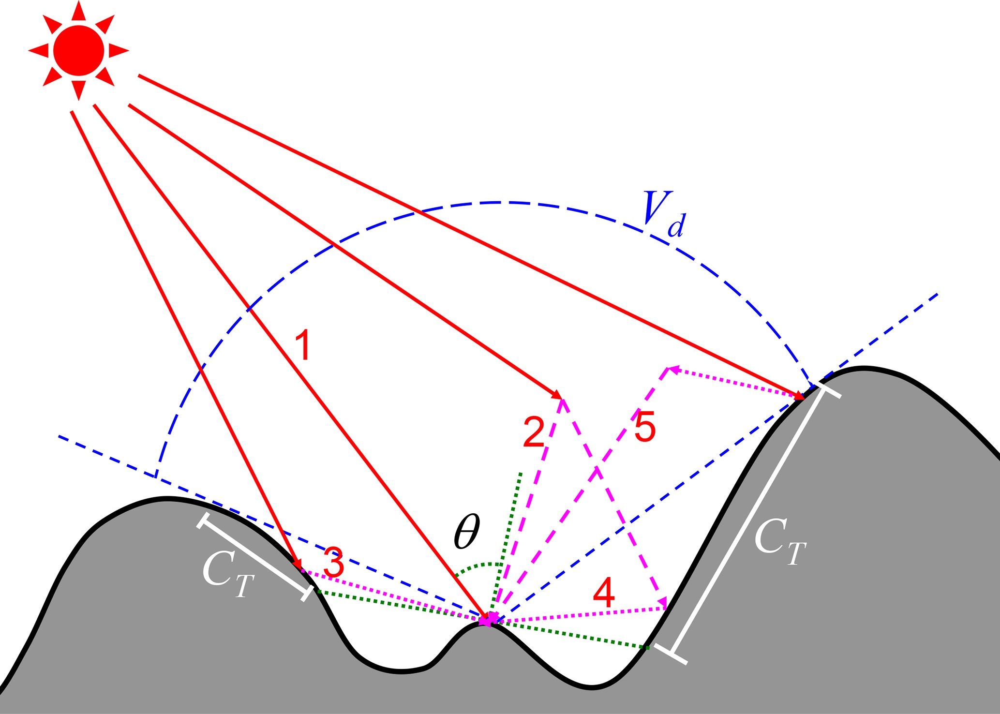

The TOP solar radiation parameterization in ELM accounts for the effects of sub-grid topography on solar radiation flux, including the shadow effects and multi-scattering between adjacent terrain[@hao2021parameterization].

## Overview

The incoming solar radiation for a flat surface is composed of direct radiation ($F_{dir}^{PP}$) from sun, diffuse radiation ($F_{dif}^{PP}$) from sky, and coupled radiation ($F_{couple}^{PP}$) that represents surface reflected radiation that is further reflected or scattered by atmospheric particles. ELM v1.0 and ELM v2.0 assume flat surfaces and accounts for $F_{dir}^{PP}$ and $F_{dif}^{PP}$, while neglecting $F_{couple}^{PP}$. The solar radiation scheme of ELM v1.0 and  ELM v2.0 uses the two-stream approximations[@oleson2013clm45]. In contrast, the incoming solar radiation parametrization of Lee et al. (2011)[@lee2011parameterization] over mountainous regions includes five components (illustrated in Fig. 1): 

1. direct flux ($F_{dir}^{TOP}$) represents photons that are transmitted from the sun to the ground surface without encountering any reflection or scattering, 
2. the direct-reflected flux ($F_{rdir}^{TOP}$) represents photons that are not scattered photons reflected by surrounding terrain, 
3. diffuse flux ($F_{dif}^{TOP}$) represents photons that are scattered by atmospheric particles but are not reflected by the ground surface, 
4. diffuse-reflected flux ($F_{rdif}^{TOP}$) represents scattered photons reflected by surrounding terrain, and 
5. coupled flux ($F_{couple}^{TOP}$) represents remaining photons that are reflected multiple times or scattered by ground surface and atmospheric particles.

<figure markdown>
  
  <figcaption>
  Fig 1.: A schematic diagram of the five components of incoming solar radiation over mountains adapted from Lee et al. (2011)[@lee2011parameterization]. The components of incoming solar radiation included are (1) direct flux, (2) diffuse flux, (3) direct-reflected flux, (4) diffuse-reflected flux, and (5) coupled flux. Local solar zenith angle (θ), sky view factor (Vd), and terrain configuration factor (CT) are also marked.
  </figcaption>
</figure>

$F_{dir}^{TOP}$ is different from $F_{dir}^{PP}$ because of the adjustment of solar illumination geometry and shadowing effects. $F_{dif}^{PP}$ is different from $F_{dif}^{TOP}$ because the sky hemisphere is occluded by adjacent terrain. Lee et al. (2011)[@lee2011parameterization] used the radiation fluxes over flat surfaces (i.e., $F_{dir}^{PP}$ and $F_{dif}^{PP}$) to calculate the radiation fluxes over mountainous terrain based on sub-grid topographic factors. The relative deviation ($f_{dir}$) of direct flux between flat surfaces and mountains under the same atmospheric condition is defined as follows

$$
\label{eqn_fdir}
f_{dir} = \frac{F_{dir}^{TOP} - F_{dir}^{PP}}{F_{dir}^{PP}}
$$

The relative deviation ($f_{rdir}$) of direct-reflected flux over mountains to direct flux over flat surfaces is defined as follows:

$$
\label{eqn_frdir}
f_{rdir} = \frac{F_{rdir}^{TOP}}{F_{dir}^{PP}}
$$

Similarly, the relative deviations ($f_{dif}$ and $f_{rdif}$) of diffuse and diffuse-reflected fluxes are expressed as follows:

$$
\label{eqn_fdif}
f_{dif} = \frac{F_{dif}^{TOP} - F_{dif}^{PP}}{F_{dir}^{PP}}
$$

$$
\label{eqn_frdif}
f_{rdif} = \frac{F_{rdif}^{TOP}}{F_{dif}^{PP}}
$$

## Multiple Linear Regression Model of Lee et al. (2011)

In theory, these four relative deviations (i.e., $f_{dir}$, $f_{rdir}$, $f_{dif}$ and $f_{rdif}$) depend on solar illumination geometry and sub-grid topographic distribution. Based on a series of 3D Monte Carlo photon tracing simulations, Lee et al. (2011)[@lee2011parameterization] built a multiple linear regression parameterization to predict these four relative deviations well. The parameterization of Lee et al. (2011)[@lee2011parameterization] uses four variables that include the standard deviation of elevation ($\sigma_h$) within a grid cell, grid-averaged values of cosine of the local solar incident angle ($\mu$), sky view factor ($\overline{V_d}$), and terrain configuration factor ($\overline{C_T}$). Lee et al. (2011)[@lee2011parameterization] parameterization is given as follows:

$$\begin{bmatrix}
f_{dir} \\
f_{dif} \\
f_{rdir} \\
f_{rdif}
\end{bmatrix}
= \mathbf{A} \cdot 
\begin{bmatrix}
\overline{\mu} \\
\sigma_h \\
\overline{V_d} \\
\overline{C_T} \\
1
\end{bmatrix}
$$

where $\mathbf{A}$ represents the fitted parameter matrix, which was obtained based on the data generated by the 3D Monte Carlo simulations. The sky view factor ($V_d$) represents the portion of visible sky limited by surrounding terrain[@zakvsek2011sky], while the terrain configuration factor ($C_T$), the counterpart of the sky view factor, represents the portion of surrounding terrain which is visible to the ground target[@dozier1990rapid]. For an unobstructed infinite slope with the slope of $\alpha$ and aspect of $\beta$ and a given solar illumination geometry (i.e., solar zenith angle, $SZA$, and solar azimuth angle, $SAA$), the cosine of the local solar incident angle ($\mu$) can be calculated by

$$
\mu = \cos(SZA) \cos(\alpha) + \sin(SZA) \sin(\alpha) \cos(SAA-\beta)
$$

The $SZA$ and $SAA$ are assumed to be constant within a grid cell, but $\alpha$ and $\beta$ vary within a grid cell. The grid cell average solar incident angle, , can be expressed as follows:

$$
\begin{eqnarray}
\overline{\mu} &=& \overline{\cos(SZA) \cos(\alpha)} + \overline{\sin(SZA) \sin(\alpha) \cos(SAA-\beta)} \nonumber \\
&=& \cos(SZA)  \overline{\cos(\alpha)} + 
\sin(SZA) \cos(SAA) +
\overline{\sin(\alpha) \cos(\beta)} + \nonumber \\
& & \sin(SZA) \sin(SAA) +
\overline{\sin(\alpha) \sin(\beta)}
\end{eqnarray}
$$

where overlines represent grid-averaged values. To further improve the regression parameterization, $\mu$, $V_d$, and $C_T$ are normalized by $\cos(\alpha)$. The land surface albedo is adjusted, instead of modifying incoming solar radiation, to maintain the surface energy conservation and the consistency between the surface and the first levels of atmosphere above the surface (Lee et al., 2015). Specifically, to keep the absorbed solar radiation of the ground surface unchanged, Lee et al. (2015) built the relationship between direct ($\alpha_{dir}^{TOP}$) and diffuse ($\alpha_{dif}^{TOP}$) albedo over mountains and those ($\alpha_{dir}^{PP}$ and $\alpha_{dif}^PP$) over flat surfaces as follows:

$$
\begin{eqnarray}
F_{dir}^{PP} (1 - \alpha_{dir}^{TOP}) &=& (F_{dir}^{TOP} + F_{rdir}^{TOP})(1 - \alpha_{dir}^{PP}) \label{eqn_fdir_pp} \\
F_{dif}^{PP} (1 - \alpha_{dif}^{TOP}) &=& (F_{dif}^{TOP} + F_{rdif}^{TOP})(1 - \alpha_{dif}^{PP}) \label{eqn_fdif_pp}
\end{eqnarray}
$$

Substituting Eqns \eqref{eqn_fdir}-\eqref{eqn_frdif} into Eqs \eqref{eqn_fdir_pp}-\eqref{eqn_fdif_pp} leads to

$$
\begin{eqnarray}
\alpha_{dir}^{TOP} &=& 1 - (1 + f_{dir} + f_{rdir}) (1 - \alpha_{dir}^{PP}) \label{eqn_alb_dir_top} \\
\alpha_{dif}^{TOP} &=& 1 - (1 + f_{dif} + f_{rdif}) (1 - \alpha_{dif}^{PP}) \label{eqn_alb_dif_top}
\end{eqnarray}
$$

The parameterizations represented by Eqs. \eqref{eqn_linear_reg}, \eqref{eqn_alb_dir_top}, and \eqref{eqn_alb_dif_top} are implemented in ELM to account for the sub-grid topographic effects on solar radiation fluxes.