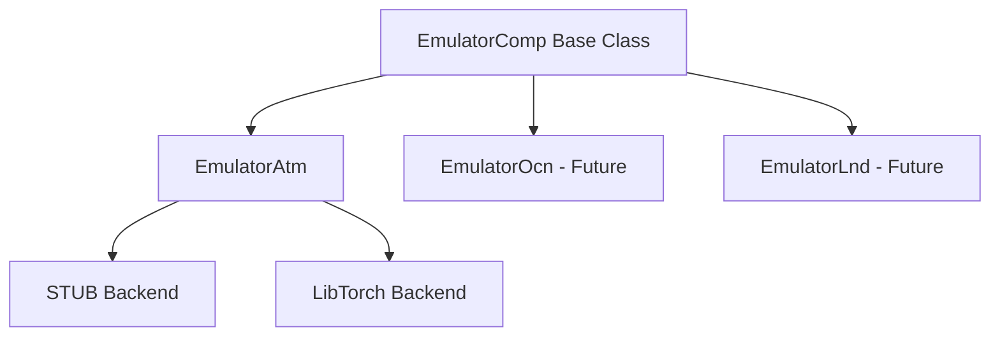

# Emulator Components

The Emulator Components framework provides AI-based replacements for computationally expensive E3SM component models. By leveraging trained neural network emulators, these components enable faster-than-real-time coupled climate simulations while maintaining physical fidelity.

## Overview

The emulator framework is designed with extensibility in mind:

- **Base Framework** (`common/`) — Shared infrastructure for all emulator types
- **Atmosphere Emulator** (`eatm/`) — AI-based atmosphere component using ACE or similar models

## Key Features

| Feature | Description |
|---------|-------------|
| **MCT Coupling** | Full integration with E3SM's Model Coupling Toolkit |
| **Multiple Backends** | STUB (testing), LibTorch (production C++) |
| **Grid Flexibility** | Supports various grid configurations via SCRIP files |
| **MPI Parallel** | Distributed across multiple processors |

## Documentation

- **[Quick Start](user-guide/quickstart.md)** — Get running with EATM
- **[Architecture](tech-guide/architecture.md)** — Technical design and class hierarchy
- **[Inference Backends](tech-guide/inference-backends.md)** — AI model integration options
- **[Standalone Build](developer-guide/standalone-build.md)** — Build without CIME for development

### API Reference

Browse the Doxygen-generated API documentation:

| Resource | Description |
|----------|-------------|
| **[Class List](emulator/annotated.md)** | All classes with descriptions |
| **[Class Hierarchy](emulator/hierarchy.md)** | Inheritance relationships |
| **[Namespace List](emulator/namespaces.md)** | Namespace organization |
| **[Files](emulator/files.md)** | Source file listing |

## Current Status

!!! note
    The Emulator Components framework is under active development. Currently, the **Atmosphere Emulator (EATM)** is the primary supported component.
