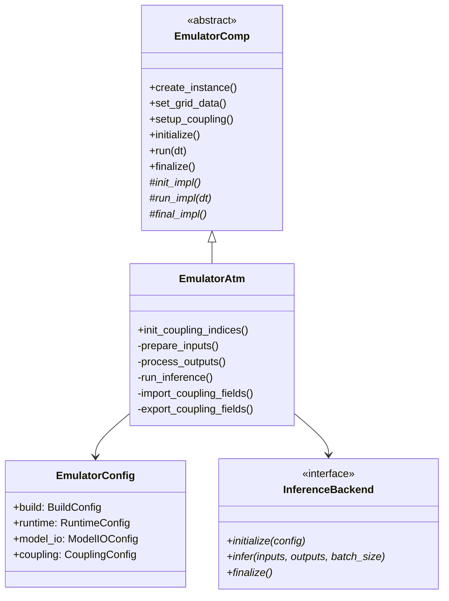

# Architecture

This document describes the technical architecture of the Emulator Components framework.

## Design Philosophy

The framework follows these key principles:

1. **Minimal Fortran** — Thin Fortran wrappers delegate to C++ implementations
2. **Extensibility** — Abstract base class enables new emulator types
3. **Backend Flexibility** — Pluggable inference backends for different
   deployment scenarios
4. **E3SM Integration** — Native MCT coupling support
5. **Portable Configuration** — YAML-based config parseable by Python and C++

## Class Hierarchy



## Directory Structure

```console
emulator_comps/
├── common/
│   └── src/
│       ├── emulator_comp.hpp/cpp    # Base component class
│       ├── emulator_config.hpp/cpp  # YAML configuration parsing
│       ├── emulator_context.hpp     # Singleton context manager
│       ├── emulator_io.hpp/cpp      # PIO-based I/O
│       ├── emulator_logger.hpp/cpp  # Logging utility
│       ├── coupling_fields.hpp/cpp  # Field index registry
│       └── inference/               # Backend implementations
│           ├── inference_backend.hpp     # Abstract interface
│           ├── inference_factory.cpp     # Backend factory
│           ├── stub_backend.hpp/cpp      # No-op testing backend
│           └── libtorch_backend.hpp/cpp  # LibTorch backend
├── eatm/
│   ├── cime_config/                 # CIME integration
│   │   ├── buildnml                 # YAML config generator
│   │   ├── defaults_yaml_eatm       # Default configuration
│   │   └── user_yaml_eatm           # User override template
│   └── src/
│       ├── atm_comp_mct.F90         # Fortran MCT wrapper
│       ├── emulator_atm.hpp/cpp     # Atmosphere emulator
│       ├── emulator_atm_interface.cpp  # C interface
│       ├── emulator_atm_f2c.F90     # Fortran-C bindings
│       └── impl/                    # ATM-specific helpers
│           ├── atm_coupling.hpp/cpp    # Coupling indices
│           ├── atm_field_manager.hpp/cpp  # Field storage
│           └── atm_io.hpp/cpp          # IC/restart I/O
└── docs/                            # Documentation
```

## Fortran-C++ Interoperability

The framework uses a thin Fortran wrapper pattern similar to EAMxx:

```text
┌─────────────────────┐
│   E3SM Driver       │
│   (Fortran MCT)     │
└──────────┬──────────┘
           │ calls
           ▼
┌─────────────────────┐
│  atm_comp_mct.F90   │  Thin Fortran wrapper
│  (atm_init/run/     │  - Receives MCT data structures
│   final_mct)        │  - Calls C interface functions
└──────────┬──────────┘
           │ via iso_c_binding
           ▼
┌─────────────────────┐
│ emulator_atm_       │  C interface layer  
│ interface.cpp       │  - Manages global instance
│                     │  - Type conversions
└──────────┬──────────┘
           │ C++ calls
           ▼
┌─────────────────────┐
│   EmulatorAtm       │  Full C++ implementation
│   (C++ class)       │  - Grid management
│                     │  - Coupling field exchange
│                     │  - AI inference
└─────────────────────┘
```

## Configuration System

EATM uses YAML-based configuration for portability:

1. **defaults_yaml_eatm** — Shipped default values
2. **user_yaml_eatm** — User overrides in case directory  
3. **atm_in** — Merged config in run directory (YAML format)

```yaml
# Example atm_in structure
eatm:
  build:
    grid_name: gauss180x360
    inference_backend: libtorch
  runtime:
    model_path: /path/to/model.pt
    ic_file: /path/to/initial_conditions.nc
    enabled: true
  model_io:
    spatial_mode: true
    input_variables:
      - Ta
      - Qa
      - PRESsfc
    output_variables:
      - prec
      - lwdn
      - swdn
  coupling:
    debug: false
```

## Component Lifecycle

### Initialization (`atm_init_mct`)

1. Create C++ emulator instance via `EmulatorContext`
2. Load YAML configuration (`atm_in`)
3. Read grid from config-specified file
4. Initialize MCT gsMap and domain
5. Setup coupling field pointers
6. Load AI model and initialize inference backend

### Run (`atm_run_mct`)

1. Import fields from coupler (`x2a` → internal fields)
2. Pack input fields into tensor (`prepare_inputs`)
3. Run AI inference via backend
4. Unpack outputs from tensor (`process_outputs`)
5. Export fields to coupler (internal fields → `a2x`)

### Finalization (`atm_final_mct`)

1. Finalize inference backend
2. Deallocate field storage
3. Cleanup I/O subsystem
4. Release context singleton

## Tensor Data Layout

The framework supports two data layouts based on the `spatial_mode` configuration:

### Spatial Mode (CNN models like ACE2)

- Input: `[1, C, H, W]` - single batch with all channels and spatial dims
- `prepare_inputs()` packs from `[H*W, C]` to `[C, H, W]` (flattened)
- `process_outputs()` unpacks from `[C, H, W]` to `[H*W, C]`
- Backend called with `batch_size=1`

### Pointwise Mode (MLP models)

- Input: `[batch_size, C]` - each grid point is a sample
- Data remains in `[H*W, C]` format
- Backend called with `batch_size=H*W`

## Coupling Fields

### Imported Fields (`x2a`)

| Field | Description |
| --------- | ------------------------- |
| `Sx_t` | Surface temperature [K] |
| `So_t` | Ocean temperature [K] |
| `Faxx_sen` | Sensible heat flux [W/m²] |
| `Faxx_lat` | Latent heat flux [W/m²] |
| `Sf_ifrac` | Ice fraction [-] |
| ... | See `atm_coupling.hpp` |

### Exported Fields (`a2x`)

| Field | Description |
| -------------- | ------------------------ |
| `Sa_z` | Bottom level height [m] |
| `Sa_u`, `Sa_v` | Wind components [m/s] |
| `Sa_tbot` | Bottom temperature [K] |
| `Sa_pbot` | Bottom pressure [Pa] |
| `Faxa_lwdn` | Downward longwave [W/m²] |
| `Faxa_rainc/l` | Precipitation [kg/m²/s] |
| ... | See `atm_coupling.hpp` |

## Grid Management

The `EmulatorComp` base class handles:

- Reading SCRIP-format grid files via PIO
- 1D domain decomposition across MPI ranks
- Column ID mapping for MCT gsMap
- Coordinate and area storage

Grid data is set from the YAML configuration (`grid_file` option) or
provided by the driver via `set_grid_data()`.

## Restart System

The emulator supports three types of restart files:

| File Type | Pattern | Purpose |
| --------- | ------- | ------- |
| Model Restart | `atm.r.*.nc` | Full model state |
| History Restart | `atm.rh{N}.*.nc` | Averaging state |
| Restart Pointer | `rpointer.atm` | Index of restart files |

### Restart Workflow

1. `EmulatorOutputManager` tracks restart frequency via `OutputControl`
2. At restart steps, `write_restart()` saves all prognostic fields
3. `rpointer.atm` is updated with the new restart filename
4. For continuation runs, `find_restart_file()` reads `rpointer.atm`

## CIME Integration

### Restart Frequency Sync

CIME controls restart frequency globally via `REST_N` and `REST_OPTION`.
The `buildnml` script reads these at case setup and writes them to `atm_in`:

```python
# In buildnml._get_restart_config()
rest_n = case.get_value("REST_N")
rest_option = case.get_value("REST_OPTION")
```

This ensures EATM matches the global E3SM restart frequency.
If the user manually edits `atm_in`, those changes persist until the next
`buildnml` invocation.

### Configuration Merging

At case setup (`buildnml`), configuration is merged:

1. `defaults_yaml_eatm` — Shipped defaults
2. `user_yaml_eatm` — User overrides from case directory
3. CIME settings — `REST_N`/`REST_OPTION` (override user settings)
4. **Output**: `atm_in` — Merged YAML in run directory

---

## Future Enhancements

!!! note
    The following items are planned but not yet implemented.

### Performance Optimizations

- **Batch Inference**: Accumulate multiple timesteps before inference to amortize
  kernel launch overhead on GPUs. Add `batch_size` config option.

- **Async Inference Pipeline**: Overlap compute and data transfer. Push inputs to
  GPU while previous batch is still computing.

### Inference Backends

- **PYTORCH**: Embed Python interpreter for native PyTorch without tracing.
  Useful for rapid prototyping and models that don't trace well.

- **ONNX**: Use ONNX Runtime for cross-framework inference. Run models from
  PyTorch, TensorFlow, JAX in a unified, optimized runtime.

- **LAPIS**: Kokkos-based inference for GPU memory sharing with E3SM components
  (EAMxx). Avoid data movement between Kokkos and ML tensors.

### Usability

- **Model Metadata**: Embed expected input/output variable names in TorchScript
  model metadata. Auto-validate at load time.

- **Multi-Model Support**: Support ensemble runs or multi-fidelity models
  (cheap model for most timesteps, expensive model for key intervals).

### Data Infrastructure

- **DataView Integration**: Extend `FieldDataProvider` to return `DataView`
  for zero-copy field access. Current implementation in `data_view.hpp`.

- **Memory Layout Specification**: Add explicit row-major/column-major flags
  to `InferenceConfig` for correct tensor reshaping.
