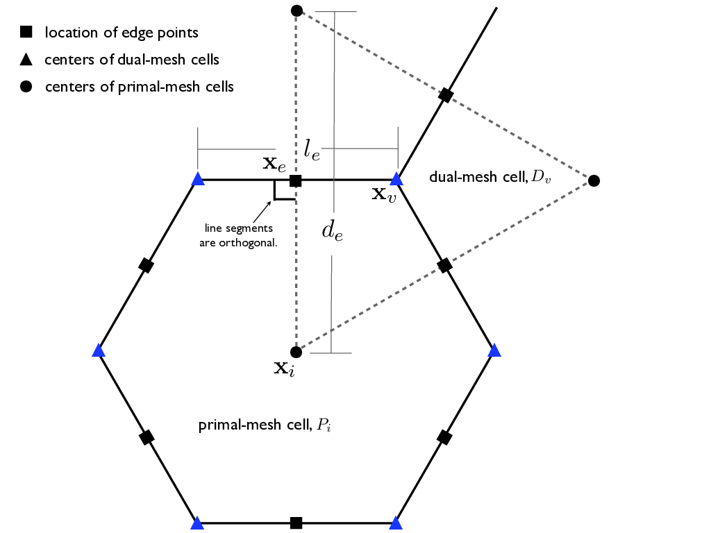

# Omega V0: Shallow Water

**Table of Contents**
1. [Overview](#1-overview)
2. [Requirements](#2-requirements)
3. [Algorithmic Formulation](#3-algorithmic-formulation)
4. [Design](#4-design)
5. [Verification and Testing](#5-verification-and-testing)

## 1 Overview

This design document describes the first version of the Omega ocean model, Omega0. Overall, Omega is an unstructured-mesh ocean model based on TRiSK numerical methods ([Thuburn et al. 2009](https://www.sciencedirect.com/science/article/pii/S0021999109004434)) that is specifically designed for modern exascale computing architectures. The algorithms in Omega will be nearly identical to those in MPAS-Ocean, but it will be written in c++ rather than Fortran in order to take advantage of libraries to run on GPUs, such as Kokkos ([Trott et al. 2022](https://ieeexplore.ieee.org/document/9485033)).

The planned versions of Omega are:

1. **Omega-0: Shallow water equations with identical vertical layers and inactive tracers.** There is no vertical transport or advection. The tracer equation is horizontal advection-diffusion, but tracers do not feed back to dynamics. Pressure gradient is simply gradient of sea surface height. Capability is similar to [Ringler et al. 2010](https://www.sciencedirect.com/science/article/pii/S0021999109006780)
1. **Omega-1: Minimal stand-alone primitive equation eddy-permitting model.** This adds active temperature, salinity, density, and pressure as a function of depth. There is a true pressure gradient. Vertical velocity is from the continuity equation. An equation of state and simple vertical mixing scheme are needed. Capability is same as [Ringler et al. 2013](https://www.sciencedirect.com/science/article/pii/S1463500313000760)
1. **Omega-2: Eddying ocean with advanced parameterizations.** This model will have sufficient capability to run realistic global simulations, similar to E3SM V1 [Petersen et al. 2019](https://agupubs.onlinelibrary.wiley.com/doi/abs/10.1029/2018MS001373).


We will produce separate design documents for the time-stepping scheme and the tracer equations in Omega-0. Some of the requirements stated here are repeated or implied by the Omega framework design documents, but are included for clarity.

## 2 Requirements

### 2.1  Omega-0 will solve the nonlinear shallow water equations, plus inactive tracers

The governing equations for Omega-0 are the shallow water equations, as described in [Ringler et al. 2010](https://www.sciencedirect.com/science/article/pii/S0021999109006780) eqns 2-7, plus the tracer advection-diffusion equation. These equations are derived from conservation of momentum, volume, and tracers in a single layer. The code will solve a multi-layer formulation with independant, redundant layers in order to test performance with a vertical array dimension. The exact formulation is specified section 3.1 below, with variable definitions in section 3.2.


Boundary conditions will include both no-slip and free-slip. The original MPAS-Ocean implementation had no-slip boundaries, implemented by setting vorticity to zero at the boundaries. The free-slip implementation is described by Darren Engwirda in a [github discussion](https://github.com/E3SM-Ocean-Discussion/E3SM/pull/49).

### 2.2  Numerical method will be the TRiSK formulation

The horizontal discretization will be taken from
[Thuburn et al. 2009](https://www.sciencedirect.com/science/article/pii/S0021999109004434) and [Ringler et al. 2010](https://www.sciencedirect.com/science/article/pii/S0021999109006780), as described in the algorithmic formulation in Section 3 below. This is the same base formulation as in MPAS-Ocean. In addition, we will consider small alterations from the original MPAS-Ocean horizontal discretization and include them as options if they are of minimal additional effort. This includes the recent AUST formulation in [Calandrini et al. 2021](https://www.sciencedirect.com/science/article/pii/S146350032100161X) and simple vorticity averaging considered by the Omega team this past year.

### 2.3  Omega-0 will use MPAS format unstructured-mesh domains

We will continue to use the MPAS-format netcdf files for input and output, with the same mesh variable names and dimensions. This will facilitate ease of use and interoperability between MPAS-Ocean and Omega.

Omega mesh information will be stored in a separate mesh file, and not be included with initial condition, restart, or output files. This way there is never redundant mesh data stored in these files.

To do: In the design section below, add list of minimum number of variables that defines the mesh, and the additional variables that can be computed on start-up.

### 2.4  Omega-0 will interface with polaris for preprocessing and postprocessing

A substantial investment has already been made in the polaris tools. Continuing the use of polaris for Omega will speed development and encourage the documentation and long-term reproducibility of test cases.

The test cases relevant to this design document are in Section 5 below.

### 2.5  Omega-0 will run portably on various DOE architectures (CPU and GPU nodes)

Omega will be able to run on all the upcoming DOE architectures and make good use of GPU hardware. This should occur with minimal alterations in the high-level PDE solver code for different platforms.

Options include: writing kernels directly for GPUs in CUDA; adding OpenACC pragmas for the GPUs; or calling libraries such as Kokkos ([Trott et al. 2022](https://ieeexplore.ieee.org/document/9485033)), YAKL ([Norman et al. 2023](https://link.springer.com/10.1007/s10766-022-00739-0)) or [HIP](https://github.com/ROCm-Developer-Tools/HIP) that execute code optimized for specialized architectures on the back-end, while providing a simpler front-end interface for the domain scientist.

### 2.6  Omega-0 will run on multi-node with domain decomposition

This is with MPI and halo communication, as described in framework design documents. Results must be bit-for-bit identical across different number of partitions. This may be demonstrated with the ''QU240 partition test'' in Polaris.

### 2.7  Correct convergence rates of operators and exact solutions

Each operator will be tested individually for the proper convergence rate: divergence, gradient, curl interpolated to cell centers, and tangential velocity are all second order; curl at vertices is first order. The details of the convergence tests are explained in section 5.1 below.

### 2.8  Conservation of volume and tracer

The total volume of the domain should be conserved to machine precision in the absence of surface volume fluxes. Likewise, the total tracer amount should be conserved to machine precision without surface fluxes. A simple test is to initialize an inactive test tracer with a uniform value of 1.0, and it should remain 1.0 throughout the domain.

### 2.9  Performance will be at least as good or better than MPAS-Ocean

Performance will be assessed with the following metrics:

1. Single CPU throughput
1. Parallel CPU scalability to high node counts
1. Single GPU throughput

The first two items will be compared to MPAS-Ocean with the same test configuration. For Omega-0, these may be tested first with the layered shallow water equations (momentum and thickness only) and be compared directly to the results in [Bishnu et al. 2023](https://gmd.copernicus.org/articles/16/5539/2023), using the inertia-gravity wave test case described in Section 6.2 below. After tracer transport capabilities are added, performance may be compared against MPAS-Ocean with test cases using active tracers in addition to momentum and thickness.

For these comparisons, MPAS-Ocean will be set up with the identical terms and functionality as Omega-0. This means that vertical advection, vertical mixing, and all parameterizations will be disabled. Comparisons with these terms will be made with Omega-1 and higher and will be described in future design documents.

### 2.10  Full-node GPU throughput will be comparable or better than full-node CPU throughput

For GPU throughput, comparisons should be made between full-node CPU throughput and full-node GPU throughput. For example, [Perlmutter at NERSC](https://docs.nersc.gov/systems/perlmutter/architecture/) has nodes with 64 and 128 CPU cores (AMD EPYC 7763) and 4 GPUs (NVIDIA A100). We expect the full-node GPU throughput to be at least as good as the full-node CPU throughput, and potentially a factor of four higher. These numbers depend on the performance specifications of the particular hardware.

Like the previous requirement, tests will first be conducted with layered shallow water equations and later with additional tracer advection. For reference, [Bishnu et al. 2023](https://gmd.copernicus.org/articles/16/5539/2023) was able to obtain nearly identical throughput between 64 CPU cores and a single GPU on Perlmutter using a Julia code and a layered shallow water test case.

## 3 Algorithmic Formulation


### 3.1 Governing Equations

#### 3.1.1 Continuous Equations

The algorithms for Omega-0 are given here in full detail, with all variables defined in section 3.2 below.
We begin with the standard shallow water equations, which are derived from conservation of momentum and mass in a single layer with uniform density in a rotating frame. The standard presentation may be found in standard textbooks on Geophysical Fluid Dynamics, such as those by Vallis (2017), Cushman‐Roisin and Beckers (2011), Pedlosky (1987), and Gill (2016). In continuous form, these are

$$
\frac{\partial \boldsymbol{u}}{\partial t} + \left(\boldsymbol{u}\cdot\nabla\right)\boldsymbol{u}  + f \boldsymbol{k}\times\boldsymbol{u}
= -g\nabla(h+b)
\hspace{1cm}
$$

$$
\frac{\partial h}{\partial t} + \nabla \cdot \left(h \boldsymbol{u}\right) = 0,
\hspace{1cm}
$$

Next we replace the non-linear advection term with the right-hand side of the vector identity
$$
\boldsymbol{u} \cdot \nabla \boldsymbol{u} &= (\nabla \times \boldsymbol{u}) \times \boldsymbol{u} + \nabla \frac{|\boldsymbol{u}|^2}{2} \\
&= \{\boldsymbol{k} \cdot (\nabla \times \boldsymbol{u})\} \boldsymbol{k} \times \boldsymbol{u} + \nabla \frac{|\boldsymbol{u}|^2}{2} \\
&= \zeta \boldsymbol{u}^{\perp} + \nabla K.
$$

The governing equations for Omega-0 in continuous form are then
$$
\frac{\partial \boldsymbol{u}}{\partial t} + q\left(h\boldsymbol{u}^{\perp}\right) = -g\nabla(h+b) - \nabla K + \nu_2 \nabla^2 \boldsymbol{u} - \nu_4 \nabla^4 \boldsymbol{u} + \mathcal{D} + \mathcal{F}
\hspace{1cm}   (1)
$$

$$
\frac{\partial h}{\partial t} + \nabla \cdot \left(h \boldsymbol{u}\right) = 0,
\hspace{1cm}   (2)
$$

$$
\frac{\partial h \phi}{\partial t} + \nabla \cdot \left(h \boldsymbol{u} \phi\right) = \kappa_2 h \nabla^2 \phi - \kappa_4 h \nabla^4 \phi.
\hspace{1cm}   (3)
$$
These are typically referred to as the momentum equation (or velocity equation), the thickness equation, and the tracer equation. 

The thickness equation (2) is derived from conservation of mass for a fluid with constant density, which reduces to conservation of volume. The model domain uses fixed horizontal cells with horizontal areas that are constant in time, so the area drops out and only the layer thickness $h$ remains as the prognostic variable.

The additional momentum terms are viscous dissipation (del2 and del4), and drag and forcing are as follows:
$$
\mathcal{D} = -Ra \, \boldsymbol{u}-C_D \frac{\boldsymbol{u}\left|\boldsymbol{u}\right|}{h}
$$

$$
\mathcal{F} = - C_W \frac{(\boldsymbol{u}_W - \boldsymbol{u})\left|\boldsymbol{u}_W - \boldsymbol{u}\right|}{h}
$$
The drag consists of simple Rayleigh drag for spin-up as well as quadratic bottom drag. The forcing is a quadratic wind forcing (see equation 1 in [Lilly et al. 2023](https://agupubs.onlinelibrary.wiley.com/doi/full/10.1029/2022MS003327)).

Here $q$ is the potential vorticity, so that the term
$$
q\left(h\boldsymbol{u}^{\perp}\right) = \frac{\zeta + f}{h}\left(h\boldsymbol{u}^{\perp}\right)
 = \zeta \boldsymbol{u}^{\perp} + f \boldsymbol{u}^{\perp}
$$
is composed of the rotational part of the advection $\zeta \boldsymbol{u}^{\perp}$ and the Coriolis term $f \boldsymbol{u}^{\perp}$. This term is discussed in [Ringler et al. 2010](https://www.sciencedirect.com/science/article/pii/S0021999109006780) sections 2.1 and 2.2.

The Tracer Equation (3) is the conservation equation for a passive tracer (scalar), with only advective and diffusive terms. It is not included in the textbook Shallow Water equations, but is useful for us to test tracer advection in preparation for a primitive equation model in Omega-1. For a tracer which is uniformly one ($\phi=1$), with no viscous terms, the tracer equation reduces to the thickness equation.

The Omega-0 governing equations (1-3) do not include any vertical advection or diffusion. Omega-0 will have a vertical index for performance testing and future expansion, but vertical layers will be simply redundant.

Further details of these derivations are given in [Thuburn et al. 2009](https://www.sciencedirect.com/science/article/pii/S0021999109004434) and [Ringler et al. 2010](https://www.sciencedirect.com/science/article/pii/S0021999109006780) eqns. (2) and (7), and [Bishnu et al. 2024](https://doi.org/10.1029/2022MS003545), Section 2.1.
Additional information on governing equations may be found in chapter 8 of the MPAS User's Guide ([Petersen et al. 2024](https://zenodo.org/records/11098080)).
#### 3.1.2 Discrete Equations

The discretized versions of the governing equations are

$$
\frac{\partial u_e}{\partial t} + \left[ \frac{{\boldsymbol k} \cdot \nabla \times u_e +f_v}{[h_i]_v}\right]_e\left([h_i]_e u_e^{\perp}\right)
= -g\nabla(h_i+b_i) - \nabla K_i + \nu_2 \nabla^2 u_e - \nu_4 \nabla^4 u_e + \mathcal{D}_e + \mathcal{F}_e
\hspace{1cm}   (4)
$$

$$
\frac{\partial h_i}{\partial t} + \nabla \cdot \left([h_i]_e u_e\right) = 0,
\hspace{1cm}   (5)
$$

$$
\frac{\partial h_i \phi_i}{\partial t} + \nabla \cdot \left(u_e [h_i \phi_i]_e \right) = \kappa_2 h_i \nabla^2 \phi_i - \kappa_4 h_i \nabla^4 \phi_i,
\hspace{1cm}   (6)
$$

where subscripts $i$, $e$, and $v$ indicate cell, edge, and vertex locations ($i$ was chosen for cell because $c$ and $e$ look similar).  Here square brackets $[\cdot]_e$ and $[\cdot]_v$ are quantities that are interpolated to edge and vertex locations. The interpolation is typically centered, but may vary by method, particularly for advection schemes. For vector quantities, $u_e$ denotes the normal component at the center of the edge, while $u_e^\perp$ denotes the tangential component. In the discrete system, the normal component $u_e$ points positively from the lower cell index to the higher cell index, while the tangential component $u_e^\perp$ points positively $90^o$ to the left of $u_e$ (for unit vectors, ${\bf n}_e^\perp = {\bf k}\times {\bf n}_e$).

The discretized momentum drag and forcing terms are
$$
\mathcal{D}_e = - Ra \, u_e - C_D \frac{u_e\left|u_e\right|}{[h_i]_e}
$$

$$
\mathcal{F}_e =  C_W \frac{(u_W - u_e)\left|u_W - u_e\right|}{[h_i]_e}
$$

### 3.2 Variable Definitions

Table 1. Definition of variables

| symbol  | name             | units    | location | name in code | notes  |
|---------------------|-----------------------------|----------|-|---------|-------------------------------------------------------|
| $b$                 | height of bottom (pos. up)  | m        | cell     |   |                                                              |
| $C_D$               | bottom drag                 | 1/m      | constant |   |                                                              |
| $C_W$               | wind stress coefficient     | 1/m      | constant |   |                                                              |
| $\mathcal{D} $      | drag                        | m/s^2    | edge     |   |                                                              |
| $f$                 | Coriolis parameter          | 1/s      | vertex   | fVertex  |                                                              |
| $\mathcal{F} $      | forcing                     | m/s^2    | edge     |   |                                                              |
| $g$                 | gravitational acceleration  | m/s^2    | constant |   |                                                              |
| $h$                 | thickness of layer          | m        | cell     | layerThickness  |                                                              |
| ${\boldsymbol k}$   | vertical unit vector        | unitless | none     |   |                                                              |
| $K$                 | kinetic energy              | m^2/s^2  | cell     | KineticEnergyCell  | $K = \left\| {\boldsymbol u} \right\|^2 / 2$                |
| $q$                 | potential vorticity         | 1/m/s    | vertex   |   | $q = \eta/h = \left(\zeta+f\right)/h$                                                 |
| $Ra$                | Rayleigh drag coefficient   | 1/s      | constant |   |                                                              |
| $t$                 | time                        | s        | none     |   |                                                              |
| ${\boldsymbol u}$   | velocity, vector form       | m/s      | edge     |   |                                                              |k
| $u_e$   | velocity, normal to edge      | m/s      | edge     | normalVelocity  |                                                              |k
| $u^\perp_e$   | velocity, tangential to edge      | m/s      | edge     | tangentialVelocity  |                                                              |k
| ${\boldsymbol u}_W$ | wind velocity               | m/s      | edge     |   |                                                              |
| $\zeta$             | relative vorticity          | 1/s      | vertex   |   | $\zeta={\boldsymbol k} \cdot \left( \nabla \times {\boldsymbol u}\right)$ |
| $\eta$              | absolute vorticity          | 1/s      | vertex   |   | $\eta=\zeta + f$ |
| $\kappa_2$          | tracer diffusion            | m^2/s    | cell     |   |                                                              |
| $\kappa_4$          | biharmonic tracer diffusion | m^4/s    | cell     |   |                                                              |
| $\nu_2$             | viscosity                   | m^2/s    | edge     |   |                                                              |
| $\nu_4$             | biharmonic viscosity        | m^4/s    | edge     |   |                                                              |
| $\phi$              | tracer                      | varies   | cell     |   |                                                              |

Note: Table created with [markdown table generator](https://www.tablesgenerator.com/markdown_tables) and original [google sheet](https://docs.google.com/spreadsheets/d/1rz-QXDiwfemq5NpSR1XsvomI7aSKQ1myTNweCY4afcE/edit#gid=0).


Table 2. Definition of geometric elements used to build the discrete system.
| Element | Type | Definition | MPAS mesh name | spherical  |
|---------------------|-----------------------------|----------|----------|--------------------------------------------------------------|
| $x_i$ | point | Location of center of primal mesh cells (cell center) | (xCell, yCell, zCell) | (lonCell, latCell) |
| $x_e$ | point | Location of edge points where velocity is defined | (xEdge, yEdge, zEdge) | (lonEdge, latEdge) |
| $x_v$ | point | Location of center of dual-mesh cells (Vertex)| (xVertex, yVertex, zVertex) | (lonVertex, latVertex) |
| $d_e$ | line | segment distance between neighboring $x_i$ locations | dcEdge | |
| $l_e$ | line | segment distance between neighboring $x_v$ locations | dvEdge | |
| $P_i$ | cell | A cell on the primal mesh | | |
| $D_v$ | cell | A cell on the dual-mesh | | |



Figure 1. Variable positions for MPAS mesh specification.

Table 3. Definition of element groups used to build the discrete system.

| Syntax              | Definition                  | MPAS mesh name | 
|---------------------|-----------------------------|---|
| $e\in EC(i)$ |  Set of edges that define the boundary of $P_i$ | edgesOnCell |
| $e\in EV(v)$ |  Set of edges that define the boundary of $D_v$ | edgesOnVertex |
| $i\in CE(e)$ |  Two primal mesh cells that share edge $e$ | cellsOnEdge |
| $i\in CV(v)$ |  Set of primal mesh cells that form the vertices of dual mesh cell $D_v$ | cellsOnVertex |
| $v\in VE(e)$ |  The two dual-mesh cells that share edge $e$ | verticesOnEdge |
| $v\in VI(i)$ |  The set of dual-mesh cells that form the vertices of primal mesh cell $P_i$ | verticesOnCell |
| $e\in ECP(e)$ |  Edges of cell pair meeting at edge $e$ | edgesOnEdge |
| $e\in EVC(v,i)$ | Edge pair associated with vertex v and mesh cell $i$ | |

### 3.2 Operator Formulation

The TRiSK formulation of the discrete operators are as follows. See [Bishnu et al. 2023](https://gmd.copernicus.org/articles/16/5539/2023) section 4.1 and Figure 1 for a discription and documentation of convergence rates, as well as [Bishnu et al. 2021](https://doi.org/10.5281/zenodo.7439539). All TRiSK spatial operators show second-order convergence on a uniform hexagon grid, except for the curl on vertices, which is first order. The curl interpolated from vertices to cell centers regains second order converence. The rates of convergence are typically less than second order on nonuniform meshes, including spherical meshes.

#### 3.2.1. Divergence
The divergence operator maps a vector field's edge normal component $F_e$ to a cell center ([Ringler et al. 2010](https://www.sciencedirect.com/science/article/pii/S0021999109006780) eqn 21) is

$$
\left( \nabla \cdot {\bf F}\right)_i
\equiv \nabla \cdot F_e
=  \frac{1}{A_i} \sum_{e\in EC(i)} n_{e,i} \, F_e \, l_e,
$$

where $A_i$ is the area of cell $i$. The indicator function $n_{e,i}=1$ when the normal vector ${\bf n}_e$ is an *outward* normal of cell $i$ and $n_{e,i}=-1$ when ${\bf n}_e$ is an *inward* normal of cell $i$.
In the actual formulations below, we substitute the velocity at the edge $F_e = u_e$ for the divergence in the momentum equation, and the thickness-weighted tracer
$F_e = u_e [h_i \phi_i]_e$
 in the tracer advection term.
The notation $e\in EC(i)$ indicates all the edges surrounding cell $i$.
In the TRiSK formulation we assume that the divergence always occurs at the cell center, so the subscript $i$ is dropped and we simply write  $\left( \nabla \cdot {\bf F}\right)_i$ as $\nabla \cdot F_e$.

#### 3.2.2. Gradient

The gradient operator maps a cell-centered scalar to an edge-normal vector component
([Ringler et al. 2010](https://www.sciencedirect.com/science/article/pii/S0021999109006780) eqn 22) is

$$
\left( \nabla h \right)_e
\equiv
\nabla h_i = \frac{1}{d_e} \sum_{i\in CE(e)} -n_{e,i} \, h_i,
$$
where $i\in CE(e)$ identifies the two cells that neighbor an edge. The edge subscript is dropped, so $\nabla h_i$ is understood to occur at an edge.

#### 3.2.3. Curl
The curl operator maps a vector's edge normal component $u_e$ to a scalar field at vertex
([Ringler et al. 2010](https://www.sciencedirect.com/science/article/pii/S0021999109006780) eqn 23) and is

$$
\left( {\bf k} \cdot \left( \nabla \times {\bf F} \right)\right)_v
\equiv
{\bf k} \cdot \left( \nabla \times F_e \right)
= \frac{1}{A_v} \sum_{e\in EV(v)} t_{e,v} \, F_e \, d_e
$$

where $A_v$ is the area of the dual mesh cell $v$, ie the triangle surrounding vertex $v$. Similar to $n_{e,i}$, the indicator function $t_{e,v}$ tracks whether a positive $F_e$ makes a positive or negative contribution to the curl function at vertex $v$. If the vector ${\bf k} \times {\bf n}_e$ is directed toward
${\bf x}_v$, then $t_{e,v}=1$. The summation is over $e\in EV(v)$, which are the edges that terminate at vertex $v$. There are *always* three edges that terminate at each vertex for Voronoi Tessellations, and four edges on each vertex for quadrilateral meshes, unless neighboring cells are missing for land boundaries. Again, the subscript $v$ is dropped and a vertex is assumed for the location of the curl.


#### 3.2.4. Perpendicular vector component

The native component for the prognostic velocity field is normal edge velocity $u_e$. The perpendicular component at the edge is computed diagnostically as
([Ringler et al. 2010](https://www.sciencedirect.com/science/article/pii/S0021999109006780) eqn 24)

$$
F_e^\perp = \frac{1}{d_e} \sum_{e'\in ECP(e)} w_{e,e'} \, l_e \, F_{e'}.
$$

The perpendicular vector is computed from the edge-normal components of all the edges of the two neighboring cells of edge $e$, denoted as $e'\in ECP(e)$. For example, on a mesh with hexagons, there are a total of 10 edges $e'$ on the two cells neighboring edge $e$ (the original edge $e$ is not included).  The perpendicular velocity $u_e^\perp$ is used in the Coriolis force, which appears in the potential vorticity advection term.  The weighting coefficients $w_{e,e'}$ are carefully chosed to conserve potential vorticity, as described in
[Thuburn et al. 2009](https://www.sciencedirect.com/science/article/pii/S0021999109004434)
and
[Ringler et al. 2010](https://www.sciencedirect.com/science/article/pii/S0021999109006780).

#### 3.2.5. Perpendicular Gradient
This maps a vertex scalar to an edge-tangential vector component (check $t_{e,v}$)

$$
[\nabla \omega_v]_e^\perp = \frac{1}{l_e} \sum_{v\in VE(e)} -t_{e,v}\omega_v
$$

#### 3.2.6. Cell to Edge Interpolation
This is simply a mid-point averaging from cell centers to the adjoining edge.

$$
[h_i]_e = \frac{1}{2} \sum_{i\in CE(e)} h_i
$$

#### 3.2.7. Vertex to Edge Interpolation
This is a mid-point averaging from vertices to the middle of the connecting edge.

$$
[\omega_v]_e = \frac{1}{2} \sum_{v\in VE(e)} \omega_v
$$

#### 3.2.8. Cell to Vertex Interpolation
This is an area-weighted average at a vertex from the three surrounding cells. Here ${\tilde A}_v$ is the dual triangle area centered on the vertex, and ${\hat A}_{i,v}$ is the kite area of cell $i$ with the kite point at vertex $v$.

$$
[h_i]_v = \frac{1}{{\hat A}_{i,v}} \sum_{i\in CV(v)} h_i {\tilde A}_v
$$

#### 3.2.9. Vector from Edge to Cell

The prognostic velocity variable on the edge is the edge normal velocity, $u_e$. The tangential velocity $u_e^\perp$ is computed diagnostically from $u_e$. In addition, the full vector may be computed at the cell center from the edge normal velocities $u_e$ of the edges on that cell. That is done in MPAS with radial basis functions, and is explained in this [previous design document](https://github.com/MPAS-Dev/MPAS-Documents/blob/master/shared/rbf_design/rbf.pdf).

### 3.3 Momentum Terms

The computation of each term in (4-6) is now described in detail, along with alternative formulations.

#### 3.3.1. Kinetic energy gradient

The kinetic energy gradient term is the non-rotational part of the nonlinear advection. Fundamentally, it maps the prognostic edge-normal velocity from edges back to an edge scalar quantity. We use the standard gradient formulation from cell center to edge,

$$
\nabla K_i = \frac{1}{d_e} \sum_{i\in CE(e)} -n_{e,i}K_i.
$$

There are several methods to compute the cell-centered kinetic energy. The first uses the edge-normal velocities as in
[Ringler et al. 2010](https://www.sciencedirect.com/science/article/pii/S0021999109006780) equation 63,

$$
K_i = \frac{1}{A_i} \sum_{e\in EC(c)} \frac{{\bar A}_{e}}{4}u_e^2
$$

Another is to compute the kinetic energy at a vertex from the three connected edges,

$$
K_v = \frac{1}{A_v} \sum_{e\in EV(v)} \frac{{\bar A}_{e}}{4}u_e^2
$$

This can be found in the MPAS-Ocean code with the kineticEnergyVertexOnCells variable. The final kinetic energy at the cell center may be chosen to be either $K_i$ in the first equation above, or a linear combination of the two. In MPAS-Ocean, the flag config_include_KE_vertex uses the value

$$
\frac{5}{8} K_i + \frac{3}{8} [K_v]_i
$$

for the final kinetic energy at the cell center. Note that addition of $[K_v]_i$ enlargens the stencil. One could also use $u_e^{\perp}$ and compute the kinetic energy at the edge itself in order to enlarge the stencil, but that method is not used here.
See [Calandrini et al. 2021](https://www.sciencedirect.com/science/article/pii/S146350032100161X) section 2.3 for more information.

#### 3.3.2. Potential vorticity term

The potential vorticity term, $q\left(h\boldsymbol{u}^{\perp}\right)$, includes the rotational part of the advection. It may be computed in two ways,

$$
\text{Option 1:  } \left[ \frac{\omega_v +f_v}{[h_i]_v}\right]_e\left([h_i]_e u_e^{\perp}\right)
$$

$$
\text{Option 2:  }([\omega_v]_e +f_e) u_e^\perp
$$

The first computes the potential vorticity $q_v$ at the vertex and interpolates that quantity to the edge, which is what is done in MPAS-Ocean. One may also cancel the thickness $h$ (ignoring the interpolated locations) and use option 2. Additional interpolation options and results are presented in [Calandrini et al. 2021](https://www.sciencedirect.com/science/article/pii/S146350032100161X)

#### 3.3.3. Sea surface height gradient
The sea surface height (SSH) gradient uses the standard gradient formulation from cell center to edge,

$$
-g\nabla(h_i+b_i) = -g\frac{1}{d_e} \sum_{i\in CE(e)} -n_{e,i}(h_i+b_i).
$$

#### 3.3.4. Del2 momentum dissipation
The Del2, or Laplacian operator, viscous momentum dissipation maps edge-normal velocity back to the edge-normal component of the Laplacian. In TRiSK this is done with the "grad-div plus vorticity curl" formulation. (check grad omega term).

$$
\nu_2 \nabla^2 u_e = \nu_2 \left( \nabla \delta_i + {\bf k} \times \nabla \omega_v\right) = \frac{\nu_2}{d_e} \sum_{i\in CE(e)} -n_{e,i}\delta_i + \frac{\nu_2}{l_e} \sum_{v\in VE(e)} -n_{e,v}\omega_v
$$

#### 3.3.5. Del4 momentum dissipation
The Del4, or biharmonic, momentum dissipation also maps edge-normal velocity back to the edge-normal component of the Laplacian. This is done with two applications of the Del2 operator above.

$$
- \nu_4 \nabla^4 u_e
$$

#### 3.3.6. Rayleigh Drag
Rayleigh drag is simply linear drag, applied to all levels. It is typically only used during the spin-up process to damp large velocities during the initial adjustement. The Rayleigh coefficient $Ra$ is simply a scalar constant.

$$
- Ra \: u_e
$$

#### 3.3.7. Bottom drag
Bottom drag is more relevant to layered models than to shallow water systems, but is included here for completeness. It is a quadratic drag applied to the edge velocity,

$$
- C_D \frac{u_e\left|u_e\right|}{[h_i]_e}.
$$

#### 3.3.8. Wind forcing
Wind forcing has the same form as the bottom drag, but the forcing is the difference between the current velocity and the wind $u_W$, interpolated and projected to the edge normal direction.

$$
- C_W \frac{(u_W - u_e)\left|u_W - u_e\right|}{[h_i]_e}
$$

### 3.4 Thickness and Tracer Terms

#### 3.4.1. Tracer advection

There are many schemes available for tracer advection. Simple schemes include centered advection and upstream. MPAS-Ocean uses Flux Corrected Transport, which is fourth order under normal conditions, and reduces to third order to preserve monotinicity. 

The tracer advection term is
$$
\nabla \cdot \left(u_e [h_i \phi_i]_e \right)
$$

and the stencil for divergence makes this
$$
\nabla \cdot \left( u_e [h_i \phi_i]_e \right)  =  \frac{1}{A_i} \sum_{e\in EC(i)} n_{e,i}u_e [h_i \phi_i]_e l_e
$$
The question is how to interpolate to the edge to obtain $[h_i \phi_i]_e$. Centered advection simply uses the midpoint rule. Upwind takes the value from the upstream cell. Higher order schemes cast a wider stencil to compute the value at this edge.

Note that the thickness advection is identical to the tracer advection when $\phi$ is uniformly one. Thus the same algorithm may be used for both. In fact, this is required for global conservation of tracers, so that the volume flux and tracer flux across each edge are consistent.

More details of the tracer advection scheme will be given in a future design document.

#### 3.4.2. Del2 tracer diffusion
Tracer diffusion is applied with a Laplacian operator on the cell-centered tracer phi, and the product of the operator is also at the cell center. The Laplacian may be written as the divergence of the gradient,

$$
\kappa_2 h_i \nabla^2 \phi_i 
=
\kappa_2 h_i \nabla \cdot \left( \nabla \phi_i \right).
$$

and the stencils in Section 3.2 are used. Here $\kappa_2$ is the del2 diffusion coefficient, and the operator is thickness-weighted by $h_i$. The position of a gradient is assumed to be at an edge, and a divergence at the cell center. This could be written explicitly as

$$
\kappa_2 h_i \left( \nabla^2 \phi_i \right)_i
=
\kappa_2 h_i \left( \nabla \cdot \left( \nabla \phi_i \right)_e \right)_i.
$$

#### 3.4.3. Del4 tracer diffusion
The del4 tracer diffusion is simply the Laplacian operator applied twice,

$$
- \kappa_4 h_i \nabla^4 \phi_i
=
- \kappa_4 h_i \nabla^2 \left( \nabla^2 \phi_i \right).
$$
The del2 operator using the divergence of the gradient in the last section is used, with the simple stencils from Section 3.2.

## 4 Design

Add design details in a following PR.
<!-- To do in later PR: Add all design details.

1. Index ordering will be: (time, tracer, horizontal index, vertical index) Note this is c-style indexing, with last index being fastest, i.e. contiguous in memory.
2. Time stepping will be multi-level, with an arbitrary number of levels for multistage methods. -->

<!-- You can include code blocks like this: -->
<!--  -->
<!-- ```c++ -->
<!-- // int var = value; -->
<!-- ``` -->
<!--  -->
<!-- ### 4.1 Data types and parameters -->
<!--  -->
<!-- #### 4.1.1 Parameters -->
<!--  -->
<!-- to do: List and define any configuration parameters or public constants. -->
<!--  -->
<!-- #### 4.1.2 Class/structs/data types -->
<!--  -->
<!-- to do: Describe any public data types and/or the class definition -->
<!--  -->
<!-- ### 4.2 Methods -->
<!--  -->
<!-- to do: List and describe all public methods and their interfaces (actual code for  -->
<!-- interface that would be in header file). Describe typical use cases. -->

## 5 Verification and Testing

### 5.1 Convergence of individual terms

The following terms can be tested with sine waves on periodic domains on a cartesian regular-hexagon mesh, as described in [Bishnu et al. 2024](https://doi.org/10.1029/2022MS003545) and [Bishnu et al. 2021](https://doi.org/10.5281/zenodo.7439539).

1. Divergence operator at cell centers (2nd order)
1. Gradient operator normal to edges (2nd order)
1. Curl operator at vertices, i.e. vorticity from a vector field (1st order)
1. Curl operator interpolated to cell centers (2nd order)
1. Tangential velocity at edges, computed from normal velocity (2nd order)

Requirements for tests are:

- compares order of convergence against an expected threshold

These tests can be conducted at the earliest stages of dycore development, in tandem with the implementation of each operator. In the longer term, these tests will be subsumed by the inertia gravity wave, which tests the order of convergence of all these operators together.

Operator convergence tests may additionally be conducted on the sphere using spherical harmonics for the analytic solution. This was conducted on MPAS-Ocean by Hyun Kang in 2023.

### 5.2 Inertia Gravity Wave: linearized shallow water, no tracers

The inertia gravity wave test provides an exact solution in time for the linearized shallow water equations (momentum and thickness). It tests the time stepping scheme along with the linearized advection terms, the SSH gradient. It does not test diffusive terms or bottom drag. It is conducted on a doubly periodic cartesian mesh, so does not test boundary conditions. The numerical solution should converge to the analytic solution at 2nd order, as shown in [Bishnu et al. 2024](https://doi.org/10.1029/2022MS003545), Section 2.6, Figures 11 and 15. Also see the inertia gravity test case in Polaris.

Requirements for tests are:

- expected order of convergence
- conservation of total volume
- automation and reproducibility in polaris

This test should be conducted as soon as momentum and thickness equations and time-stepping is in place. It does not require any tracer infrastructure.

### 5.3 Manufactured Solution: full nonlinear shallow water, no tracers

The manufactured solution test provides an exact solution in time for the full nonlinear shallow water equations (momentum and thickness). It tests the time stepping scheme along with the the full advection terms and the SSH gradient.  It is conducted on a doubly periodic cartesian mesh, so does not test boundary conditions. Error should converge at 2nd order, as shown in [Bishnu et al. 2024](https://doi.org/10.1029/2022MS003545), Section 2.10 and Figures 13 and 19. Also see the manufactured solution test case in Polaris.

Requirements for tests are:

- expected order of convergence
- conservation of total volume
- automation and reproducibility in polaris

This test should be conducted as soon as momentum and thickness equations and time-stepping is in place. It does not require any tracer infrastructure.

### 5.4 Tracer transport on a sphere

A test suite will be used to test horizontal transport schemes on the sphere comprised of test case 1 from [Williamson et al. (1992)](https://www.sciencedirect.com/science/article/pii/S0021999105800166) and several tests from [Lauritzen et al. (2012)](https://www.geosci-model-dev.net/5/887/2012/).
They test the tracer advection and tracer time stepping. Velocity and thickness are predefined fields and remain fixed, so this does not exercise those equations.

Requirements for tests are:

- compares order of convergence against an expected threshold
- conservation of total tracer amount
- produces visualization that allows the user to evaluate whether numerical mixing resembles real mixing (preserves functional relationships between tracers)
- tracer min and max values should remain bounded by initial bounds.
- automation and reproducibility in polaris

### 5.5 Performance testing

Tests can be conducted with inertia-gravity wave tests but with full non-linear terms and 100 identical layers. Domain will be cartesian resolutions from 64x64 up to 512x512. See performance test results using MPAS-Ocean on Perlmutter, using this setup, in [Bishnu et al. 2023](https://gmd.copernicus.org/articles/16/5539/2023). Additionally, we could test spherical cases with a Williamson test case or similar.

Requirements for tests are:

- Single CPU performance should be as good or better than single CPU MPAS-Ocean.
- GPU tests on single node should be better than single node CPU tests.
- Scaling on CPUs multi-node, up to 4096 cores or higher, should be close to perfect scaling for 512x512 mesh, and as good or better than MPAS-Ocean.
- Scaling on GPUs for multi-node should be close to perfect scaling for 512x512 mesh.
- automation and reproducibility in polaris

### 5.6 Shallow water tests on spherical domains and with realistic coastlines

Global cases will facilitate the testing of shallow water dynamics on the sphere and of boundary conditions with realistic coastlines, which are not included in any of the previous tests. This includes testing conservation of volume and tracers in global domains.

Potential test cases include:

1. Surface gravity wave: The speed of the surface gravity wave can be compared to the theoretical expectation, as shown in [Pal et al. 2023](https://gmd.copernicus.org/articles/16/1297/2023) Appendix A. This could use an aquaplanet domain (flat bottom, no coastlines) to measure the gravity wave speed, and a realistic domain to test boundary conditions and variable-depth bathymetry.
1. Stommel double gyre:  This may be compared to an exact solution in the Cartesian case, as in [Pal et al. 2023](https://gmd.copernicus.org/articles/16/1297/2023) Appendix B, or qualitative comparisons for the spherical case using either idealized boundaries or an isolated Atlantic Basin domain.

Tests of realistic global circulation cannot be done with the shallow water equations of Omega-0, but will be part of Omega-1 development with the layered primitive equation model.

### 5.7 Further tests for Omega-0

Potential additional test cases include the following. These are useful to explore and validate model behavior, but are optional, depending on the time available.

1. [Williamson et al. 1992](https://www.sciencedirect.com/science/article/pii/S0021999105800166) as test case 2 or 3, global steady state solutions.
1. Global case with unstable jet [Galewsky et al. 2003](https://doi.org/10.3402/tellusa.v56i5.14436)

## References

Cushman‐Roisin, B., & Beckers, J.‐M. (2011). Introduction to geophysical fluid dynamics: Physical and numerical aspects. Academic press.

Gill, A. E. (2016). Atmosphere—Ocean dynamics. Elsevier.

Pedlosky, J. (1987). Geophysical fluid dynamics (Vol. 710). Springer.

Vallis, G. K. (2017). Atmospheric and oceanic fluid dynamics. Cambridge University Press.
