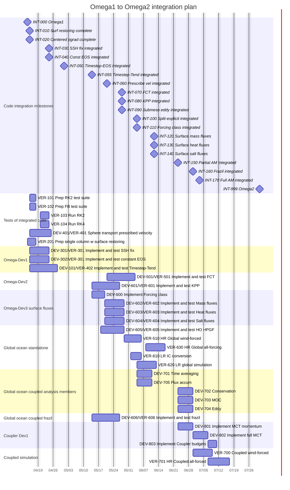
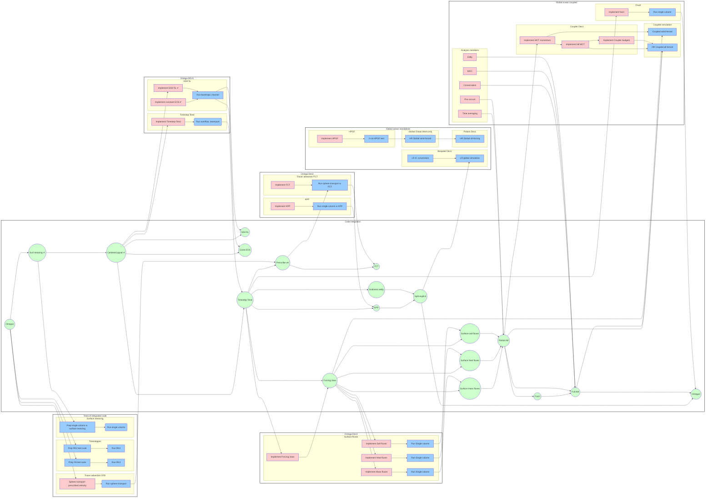

# OMEGA doc/design directory

This directory contains requirement and design documents for the
Ocean Model for E3SM Global Applications (OMEGA) source code.  A
file called OmegaDesignTemplate.rst is provided as a template
for the information required in such a design document.

