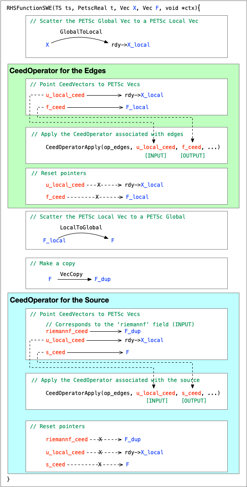

# RDycore SWE physics with CEED

Here we describe the RDycore's implemetation of 2D shallow water equation (SWE) that uses [libCEED](https://github.com/CEED/libCEED). The combination of PETSc and libCEED provides RDDycore algorithimic and hardware protability.

- RDycore uses PETSc's `TS` solvers that provide support for multiple time-integrators such as forward euler, RK4, etc., which can be selected at run time (e.g. `--ts_type euler`, `--ts_type rk4`, etc). 
- Using libCEED allows RDycore to compute the [RHSFunction](https://petsc.org/main/manualpages/TS/TSSetRHSFunction/) for PETSc's explicit `TS` methods on CPU or GPU, which can also be selected at runtime via
     - For CPUs: `-ceed /cpu/self`
     - For NVIDIA GPUs: `-ceed /gpu/cuda -dm_vec_type cuda`
     - For AMD GPUs: `-ceed /gpu/hip -dm_vec_type hip`

## Example Mesh

Let's consider an example 3x2 mesh that consists of

- 6 cells: `c00` to `c05`
- 17 edges: `e00` to `e16`
    - Internal edges: `e04`, `e05`, `e07`, `e08`, `e09`, `e11`, and `e12`
    - Boundary edges: `e00`, `e01`, `e02`, `e03`, `e06`, `e10`, `e13`, `e14`, `e15`, and `e16`
- 12 vertices: `v00` to `v11`

```text
v08---e14---v09---e15---v10---e16---v11
 |           |           |           |
 |           |           |           |
e10   c03   e11   c04   e12   c05   e13
 |           |           |           |
 |           |           |           |
v04---e07---v05---e08---v06---e09---v07
 |           |           |           |
 |           |           |           |
e03   c00   e04   c01   e05   c02   e06
 |           |           |           |
 |           |           |           |
v00---e00---v01---e01---v02---e02---v03

```

A PETSc Vec (`X`) with stride `3`, with components corresponding to the following prognostic variables:
The block size of `X` is `3` corresponding to the following prognostic variables:

- Height (`h`),
- Momentum in x-dir (`hu`), and
- Momentum in y-dir (`hv`).
The size of `X` will `6 * 3` where `6` corresponds to number of cells in the mesh. The layout of `X` will be as follows:

```text
X = [[h0 hu0 hv0] [h1 hu1 hv1] ... [h5 hu5 hv5]]
```

## SWE physics with libCEED

The libCEED version of RDycore's explicit time-integrator of the SWE solver has two [`CeedOperator`s](https://libceed.org/en/latest/api/CeedOperator/):

1. `rdy->ceed_rhs.op_edges` : This operator computes fluxes across edges, and includes "sub-operators" that handle internal edges and boundary edges separately.

2. `rdy->ceed_rhs.src`: This operator computes source terms such as water added by rainfall and terms associated with bed slope and friction.

### `CeedOperator` for Internal Edges

RDycore uses first-order finite volume discretization to compute the flux across the edges, which requires values on the left and the right of the edge.

| Internal Edge | Left Cell | Right cell |
| ------------- | --------- | ---------- |
| e04           | c00       | c01        |
| e05           | c01       | c02        |
| e07           | c00       | c03        |
| e08           | c01       | c04        |
| e09           | c02       | c05        |
| e11           | c03       | c04        |
| e12           | c04       | c05        |

The steps involved in creating the `CeedOperator` associated with the internal edges are as follows:

- First, create a [`CeedQFunction`](https://libceed.org/en/latest/api/CeedQFunction/), `qf`, and add input and output fields.
The input fields include geometric attributes associated with the edges and the prognostic variables to the left left and right of the edges.
The output fields include contribution of fluxes to the cells left and right of the edge and a diagnostic variable that saves fluxes through the edge.
The pointer to the user-defined function is specified at the time of creation.

| Field name       | Size | In/Out | Notes                                                                   |
| ---------------- | ---- | ------ | ----------------------------------------------------------------------- |
| `geom`           |  `4` | In     | Geometric attrbutes [sn, cn, L_edge/Area_left, L_edge/right]            |
| `q_left`         |  `3` | In     | State left of the edge [h_left, hu_left, hv_left]                       |
| `q_right`        |  `3` | In     | State right of the edge [h_right, hu_right, hv_right]                   |
| `cell_left`      |  `3` | Out    | Flux contribution to the left cell [f_h f_hu f_hv] * L_edge/Area_left   |
| `cell_right`     |  `3` | Out    | Flux contribution to the right cell [f_h f_hu f_hv] * L_edge/Area_right |
| `flux`           |  `3` | Out    | Flux through the edge [f_h f_hu f_hv]                                   |
| `courant_number` |  `2` | Out    | Courant number for the left and right cell                              |

- Second, create [`CeedElemRestriction`](https://libceed.org/en/latest/api/CeedElemRestriction/) for all the input and output fields of previously created `CeedQFunction`.
A `CeedElemRistriction` tells libCEED the indices of a [`CeedVector`](https://libceed.org/en/latest/api/CeedVector) from/to which the values are to extracted/written
for an input/output field. The `CeedElemRestriction` for the fields and the example mesh is given below.

| Variable name    | Size of offset    | Size of CeedVector   | Created via                        | Notes |
| ---------------- | ----------------- | -------------------- | ---------------------------------- | ----- |
| `restrict_geom`  |  `nOwnedInEdges`  | `4 * nOwnedInEdges`  | `CeedElemRestrictionCreateStrided` |  offset = [ 0,  4,  8, 12, 16, 20, 24] |
| `q_restrict_l`   |  `nOwnedInEdges`  | `3 * nCells`         | `CeedElemRestrictionCreate`        |  offset = [ 0,  3,  0,  3,  6,  9, 12] |
| `q_restrict_r`   |  `nOwnedInEdges`  | `3 * nCells`         | `CeedElemRestrictionCreate`        |  offset = [ 3,  6,  9, 12, 15, 12, 15] |
| `c_restrict_l`   |  `nOwnedInEdges`  | `3 * nCells`         | `CeedElemRestrictionCreate`        |  offset = [ 0,  3,  0,  3,  6,  9, 12] |
| `c_restrict_r`   |  `nOwnedInEdges`  | `3 * nCells`         | `CeedElemRestrictionCreate`        |  offset = [ 3,  6,  9, 12, 15, 12, 15] |
| `restrict_flux`  |  `nOwnedInEdges`  | `3 * nOwnedInEdges`  | `CeedElemRestrictionCreateStrided` |  offset = [ 0,  3,  6,  9, 12, 15, 18] |
| `restrict_cnum`  |  `nOwnedInEdges`  | `2 * nOwnedInEdges`  | `CeedElemRestrictionCreateStrided` |  offset = [ 0,  2,  4,  6,  8, 10, 12] |

where `nOwnedInEdges` is the number of owned internal edges and `nCells` is the total number of cells ( = owned + ghost).

- Third,  create the `CeedOperator` using the previously created `CeedQFunction` and all `CeedElementRestriction`.
The multiple fields are added via [`CeedOperatorSetField`](https://libceed.org/en/latest/api/CeedOperatorSetField).

| Field name       | CeedElemRestriction | CeedVector           | Notes |
| ---------------- | ------------------- | -------------------- | ----- |
| `geom`           |  `restrict_geom`    | `geom`               | `geom` has values `geom[:][0:3] = [sn cn L/A_l L/A_r]` |
| `q_left`         |  `q_restrict_l`     | `CEED_VECTOR_ACTIVE` |  |
| `q_right`        |  `q_restrict_r`     | `CEED_VECTOR_ACTIVE` |  |
| `cell_left`      |  `c_restrict_l`     | `CEED_VECTOR_ACTIVE` |  |
| `cell_right`     |  `c_restrict_r`     | `CEED_VECTOR_ACTIVE` |  |
| `flux`           |  `restrict_flux`    | `flux`               | `flux` is initalized to `0.0` |
| `courant_number` |  `restrict_cnum`    | `cnum`               | `cnum` is initalized to `0.0` |

### `CeedOperator` for Boundary Edges

The values right of the edge are provided if a Dirichlet boundary condition is applied on that edge
For a reflective boundary condition, the value on the left of the edge is used as the value on right of the edge.
Based on the mesh shown above, the boundary edges are listed in the table below.

| Boundary Edge | Left Cell | (Optional) Dirichlet Right cell |
| ---- | ---- | ---- |
| e00  | c00  | d00  |
| e01  | c01  | d01  |
| e02  | c02  | d02  |
| e03  | c00  | d03  |
| e06  | c02  | d04  |
| e10  | c03  | d05  |
| e13  | c05  | d06  |
| e14  | c03  | d07  |
| e15  | c04  | d08  |
| e16  | c05  | d09  |

The fields for the boundary condition `CeedQFunction` are listed below. It should be noted that the `geom` field for a boundary edge has one geometric attribute fewer than the `geom` field for an intenral edge because the value `L_edge/A_right` is not needed for a boundary edge. Similarly, the `cell_right` field is omitted for a boundary edge.

| Field name       | Size | In/Out | Notes                                                                      |
| ---------------- | ---- | ------ | -------------------------------------------------------------------------- |
| `geom`           |  `3` | In     | Geometric attrbutes [sn, cn, L_edge/Area_left]                             |
| `q_left`         |  `3` | In     | State left of the edge [h_left, hu_left, hv_left]                          |
| `q_dirichlet`    |  `3` | In     | (Optional) Dirichlet boundary state right of the edge [h_bc, hu_bc, hv_bc] |
| `cell_left`      |  `3` | Out    | Flux contribution to the left cell [f_h f_hu f_hv] * L_edge/Area_left      |
| `flux`           |  `3` | Out    | Flux through the edge [f_h f_hu f_hv]                                      |
| `courant_number` |  `1` | Out    | Courant number for the left cell                                           |

The `CeedElemRestriction` for the boundary fields are listed below.

| Variable name        | Size of offset    | Size of CeedVector   | Created via                        | Notes                                         |
| -------------------- | ----------------- | ---------------------| ---------------------------------- | --------------------------------------------- |
| `restrict_geom`      |  `nOwnedBndEdges` | `3 * nOwnedBndEdges` | `CeedElemRestrictionCreateStrided` |  [ 0,  3,  6,  9, 12, 15, 18, 21, 24, 27, 30] |
| `q_restrict_l`       |  `nOwnedBndEdges` | `3 * nCells`         | `CeedElemRestrictionCreate`        |  [ 0,  3,  6,  0,  6,  9,  9, 15,  9, 12, 15] |
| `restrict_dirichlet` |  `nOwnedBndEdges` | `3 * nOwnedBndEdges` | `CeedElemRestrictionCreate`        |  [ 3,  6,  9, 12, 15, 12, 15]                 |
| `c_restrict_l`       |  `nOwnedBndEdges` | `3 * nCells`         | `CeedElemRestrictionCreate`        |  [ 0,  3,  0,  3,  6,  9, 12]                 |
| `restrict_flux`      |  `nOwnedBndEdges` | `3 * nOwnedBndEdges` | `CeedElemRestrictionCreateStrided` |  [ 0,  3,  6,  9, 12, 15, 18]                 |
| `restrict_cnum`      |  `nOwnedBndEdges` | `1 * nOwnedBndEdges` | `CeedElemRestrictionCreateStrided` |  [ 0,  1,  2,  3,  4,  5,  6]                 |

where `nOwnedBndEdges` is the number of owned boundary edges and `nCells` is the total number of cells ( = owned + ghost).
The fields, `CeedElemRestriction`, and `CeedVector` that are used to create the boundary `CeedOperator` are summarized below.

| Field name       | CeedElemRestriction   | CeedVector           | Notes                                            |
| ---------------- | --------------------- | -------------------- | ------------------------------------------------ |
| `geom`           |  `restrict_geom`      | `geom`               | `geom` has values `geom[:][0:2] = [sn cn L/A_l]` |
| `q_left`         |  `q_restrict_l`       | `CEED_VECTOR_ACTIVE` |  |
| `q_dirichlet`    |  `restrict_dirichlet` | `CEED_VECTOR_ACTIVE` |  |
| `cell_left`      |  `c_restrict_l`       | `CEED_VECTOR_ACTIVE` |  |
| `flux`           |  `restrict_flux`      | `flux`               | `flux` is initalized to `0.0` |
| `courant_number` |  `restrict_cnum`      | `cnum`               | `cnum` is initalized to `0.0` |

### `CeedOperator` for Source/Sink

The fields for the source/sink `CeedQFunction` are listed below.

| Field name    | Size | In/Out | Notes                                                |
| ------------- | ---- | ------ | ---------------------------------------------------- |
| `geom`        |  `2` | In     | Geometric attrbutes [dz/dx, dz/y]                    |
| `swe_src`     |  `3` | In     | Source/sink value for the three prognostic variables |
| `mannings_n`  |  `1` | In     | Mannings roughness coefficient                       |
| `riemannf`    |  `3` | In     | Sum of fluxes in/out of a cell                       |
| `q`           |  `3` | In     | The prognostic variables [h, hu, hv]                 |
| `cell`        |  `3` | Out    | The RHS value of the ODE for the TS solver           |

The `CeedElemRestriction` for the source/sink fields are listed below.

| Variable name         | Size of offset | Size of CeedVector | Created via                        | Notes                              |
| --------------------- | -------------- | -----------------  | ---------------------------------- | ---------------------------------- |
| `restrict_geom`       |  `nOwnedCells` | `2 * nOwnedCells`  | `CeedElemRestrictionCreateStrided` |  offset = [ 0,  3,  6,  9, 12, 15] |
| `restrict_swe`        |  `nOwnedCells` | `3 * nOwnedCells`  | `CeedElemRestrictionCreateStrided` |  offset = [ 0,  3,  6,  9, 12, 15] |
| `restrict_mannings_n` |  `nOwnedCells` | `1 * nOwnedCells`  | `CeedElemRestrictionCreateStrided` |  offset = [ 0,  3,  6,  9, 12, 15] |
| `restrict_riemannf`   |  `nOwnedCells` | `3 * nOwnedCells`  | `CeedElemRestrictionCreateStrided` |  offset = [ 0,  3,  6,  9, 12, 15] |
| `restrict_q`          |  `nOwnedCells` | `3 * nCells`       | `CeedElemRestrictionCreate`        |  offset = [ 0,  3,  6,  9, 12, 15] |
| `restrict_c`          |  `nOwnedCells` | `3 * nOwnedCells`  | `CeedElemRestrictionCreate`        |  offset = [ 0,  3,  6,  9, 12, 15] |

where `nOwnedCells` is the number of owned cells and `nCells` is the total (= owned + ghost) cells.
The fields, `CeedElemRestriction`, and `CeedVector` that are used to create the source/sink `CeedOperator` are summarized below.

| Field name   | CeedElemRestriction    | CeedVector           | Notes                                                                                  |
| ------------ | ---------------------- | -------------------- | -------------------------------------------------------------------------------------- |
| `geom`       |  `restrict_geom`       | `geom`               | `geom` has values `geom[:][0:2] = [dz/dx dz/dy]`                                       |
| `swe_src`    |  `restrict_swe`        | `swe_src`            | `swe_src` has values for the source/sink term                                          |
| `mannings_n` |  `restrict_mannings_n` | `mannings_n`         | `mannings_n` has values corresponding to Mannings coefficient                          |
| `riemannf`   |  `restrict_riemannf`   | `riemannf`           | `riemannf` has the sum of Riemann fluxes in a cell through internal and boundary edges |
| `q`          |  `restrict_q`          | `CEED_VECTOR_ACTIVE` |  |
| `cell`       |  `restrict_c`          | `CEED_VECTOR_ACTIVE` |  |

### Schematic Representation of RHSFunction with libCEED

