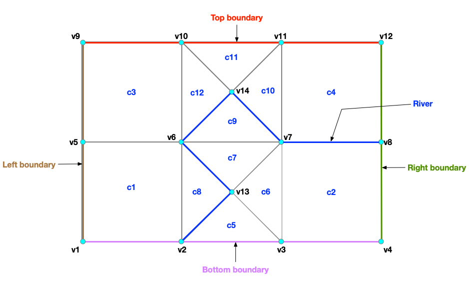
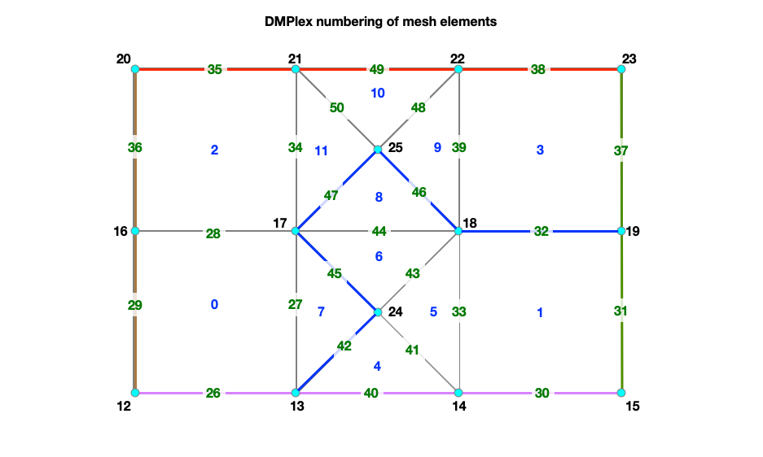
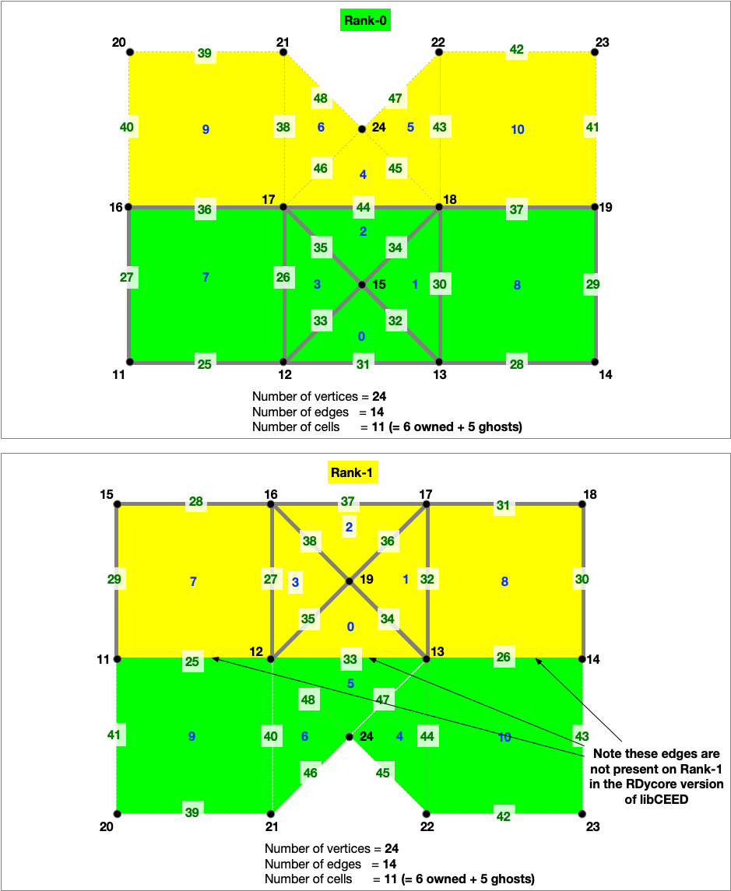

# Mesh

Here we describe the two mesh formats that are used in RDycore. The two mesh
formats that we use are:

1. Exodus II
2. PETSc's DMPlex-specific, HDF5-based mesh format (version 3.0.0)

RDycore has been tested for meshes that include triangular, quadrilateral, or
both triangular and quadrilateral cells. Each cell consists of edges
(3 for triangles and 4 for quadrilaterals) with vertices at the edges' endpoints.
The cell vertices have three-dimensional coordinates that incorporate topographic information.

## Exodus II Mesh Format

The Exodus II mesh format (`.exo`) uses 1-based indices. Exodus files are 
written in the netCDF file format.

### Triangular elements

```text
     Triangular
        cell
         v3
         / \
        /   \
      e5     e4
     /   c1   \
    /          \
  v1 --- e3 --- v2
```

- The triangular cell `c1` consists of the three vertices `v1`, `v2`, and `v3`
- The elem_type of `c1` is `TRI3`
- It has five edges sidesets. The first two edge sidesets form a plane and the remaining
  three edge sidesets are lines as follows:
  - `e1`: an oriented plane formed by `v1`, `v2`, `v3` (not shown above)
  - `e2`: an oriented plane formed by `v1`, `v3`, `v2` (not shown above)
  - `e3`: a directed line from `v1` to `v2`
  - `e4`: a directed line from `v2` to `v3`
  - `e5`: a directed line from `v3` to `v1`

### Quadrilateral elements

```text
    Quadrilateral
        cell
  v4 --- e5 --- v3
  |             |
  |             | 
  e6     c1     e4
  |             | 
  |             | 
  v1 --- e3 --- v2
```

- The `elem_type` of the quadrilateral cell, `c1`, is `SHELL4`
- It comprises of four vertices (i.e. `v1`, `v2`, `v3`, `v4`)
- It has six edges sidesets. The first two edge sidesets form a plane and the remaining
  four edge sidesets are lines as follows:
  - `e1`: an oriented plane formed by `v1`, `v2`, `v3`, `v4` (not shown above)
  - `e2`: an oriented plane formed by `v1`, `v4`, `v3`, `v2` (not shown above)
  - `e3`: Line from `v1` to `v2`
  - `e4`: a directed line from `v2` to `v3`
  - `e5`: a directed line from `v3` to `v4`
  - `e6`: a directed line from `v4` to `v1`

### Example mesh with mixed element types



An example of mesh that comprises of:

- 12 cells with 4 quadrilaterals and 8 triangles
- 14 vertices
- Five edge sidesets
  1. Right boundary
  2. Left boundary
  3. Top boundary
  4. Bottom boundary
  5. River

The `.exo` mesh file uses NetCDF. Cells of different types (e.g. quadrilaterals and triangles) must be saved as two different data fields
in the `.exo` file (e.g `connect1` for quadrilateral and `connect2` for triangles.

```text
 # quadrilateral cells
 connect1 =
  1, 2, 6, 5,
  3, 4, 8, 7,
  5, 6, 10, 9,
  7, 8, 12, 11 ;

# triangular cells
 connect2 =
  2, 3, 13,
  3, 7, 13,
  7, 6, 13,
  6, 2, 13,
  6, 7, 14,
  7, 11, 14,
  11, 10, 14,
  10, 6, 14 ;  
```

Each edge sideset is defined via two data fields:

- `elem_ss<ID>`: Corresponds to the cell (or element) ID
- `side_ss<ID>`: Correponds to the edge sideset

The five edge sidesets for the above mesh are defined as

```text
 # right boundary
 elem_ss1 = 2, 4 ;
 side_ss1 = 4, 4 ;

 # left boundary
 elem_ss2 = 1, 3 ;
 side_ss2 = 6, 6 ;

 # top boundary
 elem_ss3 = 3, 11, 4 ;
 side_ss3 = 5, 3, 5 ;

 # bottom boundary
 elem_ss4 = 1, 5, 2 ;
 side_ss4 = 3, 3, 3 ;

 # river
 elem_ss5 = 4, 9, 9, 8, 8 ;
 side_ss5 = 3, 4, 5, 5, 4 ;
```

## DMPlex HDF5 v3.0.0

Before understanding the DMPlex's HDF5 storage version v3.0.0
(i.e. `-dm_plex_view_hdf5_storage_version 3.0.0`), it is important to understand
how DMPlex number mesh elements.

### DMPlex mesh numbering for a serial run

DMPlex uses 0-based numbering. The mesh elements are numbered in the following order:

1. Cells
2. Vertices
3. Edges. 

For the mesh shown in the figure, DMPlex assigns IDs for cells, vertices, and edges thus:

- Cell ID: `0`-`11`
- Vertex ID: `12` to `25`
- Edge ID: `26` to `50`



```text
#
# ncells    = Number of cells
#           = nquad (number of quadrilaterals) + ntri (number of trinagles)
#           = 4 + 8 = 12
#
# nvertices = Number of vertices = 14
#
# nedges    = Number of unique edges
#           = nedges_internal (number of internal edges) + nedges_bnd (number of boundary edges)
#           = 15 + 10 = 25
#
# ntotal    = ncells + nvertices + nedges
#           = 12 + 14 + 25 = 51

├── topologies (G)
    ├── Parallel Mesh (G) Attributes: (1) coordinateDMName (STRING), (2) coordinatesName (STRING)
        ├── dms (G)
        |   ├── coordinateDM (G)
        |       |
        |       ├── order (D, INTEGER, size = ntotal)
        |       |
        |       ├── section (G) Attributes: (1) hasConstraints (INTEGER) (2) includesConstraint (INTEGER), (3) numFields (INTEGER)
        |       |   |
        |       |   ├── atlasDof (D, INTEGER, size = ntotal) [zeros(0:ncells,1); 3*ones(nvertices,1);   zeros(nedges,1)]
        |       |   |
        |       |   ├── atlasOff (D, INTEGER, size = ntotal) [zeros(0:ncells,1); [0:3:(nvertices-1)*3]; ones(nedges,1)*nvertices*3]
        |       |   |
        |       |   ├── field0 (G) Attributes: (1) fieldComponents (INTEGER) (2) fieldName (STRING) (3) hasConstraints (INTEGER) (4) includesConstraint (INTEGER)
        |       |       |
        |       |       ├── atlasDof   (D, INTEGER, size = ntotal) [zeros(0:ncells,1); 3*ones(nvertices,1);   zeros(nedges,1)]
        |       |       ├── atlasOff   (D, INTEGER, size = ntotal) [zeros(0:ncells,1); [0:3:(nvertices-1)*3]; ones(nedges,1)*nvertices*3]
        |       |       |
        |       |       ├── component0 (G) Attribute (1) componentName (STRING)
        |       |       ├── component1 (G) Attribute (1) componentName (STRING)
        |       |       ├── component2 (G) Attribute (1) componentName (STRING)
        |       |
        |       ├── vecs (G)
        |          ├── coordinates (G) Attribute (1) blockSize
        |             |
        |             ├── coordinates (D, FLOAT, size = 3 * nvertices) Note: Each vertex has 3 coordinates in x,y,z
        |
        ├── labels
        |   ├── Cell Sets (G)
        |   |  ├── 1 (G)
        |   |     ├── indicies (D, INTEGER, size = ncells) [0:ncells-1]
        |   |
        |   ├── Face Sets (G, OPTIONAL)
        |   |  ├── 1 (G)
        |   |  |  ├── indicies (D, INTEGER) (e.g. [31 37] for right boundary)
        |   |  |
        |   |  ├── 2 (G)
        |   |     ├── indicies (D, INTEGER) (e.g. [28 36] for left boundary)
        |   |  |
        |   |  ├── 3 (G)
        |   |     ├── indicies (D, INTEGER) (e.g. [35 38 49] for top boundary)
        |   |  |
        |   |  ├── 4 (G)
        |   |     ├── indicies (D, INTEGER) (e.g. [26 30 40] for bottom boundary)
        |   |  |
        |   |  ├── 5 (G)
        |   |     ├── indicies (D, INTEGER) (e.g. [32 42 45 46 47] for river)
        |   |
        |   ├── boundary_edges (G)
        |   |  ├── 1 (G)
        |   |     ├── indicies (D, INTEGER, size = nedges_bnd)
        |   |
        |   ├── celltype (G)
        |      ├── 0 (G)
        |      |  ├── indicies (D, INTEGER, size = num_verrtices) [ncells:ncells+nvertices-1]
        |      |
        |      ├── 1 (G)
        |      |  ├── indicies (D, INTEGER, size = num_edges)     [ncells+nvertices:ncells+nvertices+nedges-1]
        |      |
        |      ├── 3 (G, OPTIONAL, TRIANGULAR)
        |      |  ├── indicies (D, INTEGER, size = num_tri)       [nquads:nquads+ntri-1]
        |      |
        |      ├── 4 (G, OPTIONAL, QUADRILATERALS)
        |         ├── indicies (D, INTEGER, size = num_quads)     [0:nquads]
        |
        ├── topology (G) Attributes: (1) cell_dim (INTEGER) (2) depth (INTEGER)
            |
            ├── permutation (D, INTEGER, size = 3)
            |
            ├── strata (G)
               ├── 0 (G)
               |   ├── cone_sizes  (D, INTEGER, size = num_vertices)
               |   ├── cones       (D, INTEGER)
               |   ├── orientation (D, INTEGER)
               |
               ├── 1 (G)
               |   ├── cone_sizes  (D, INTEGER, size = num_edges)
               |   ├── cones       (D, INTEGER, size = 2 * num_edges)
               |   ├── orientation (D, INTEGER, size = 2 * num_edges)
               |
               ├── 2 (G)
                   ├── cone_sizes  (D, INTEGER, size = ncells)
                   ├── cones       (D, INTEGER, size = 4 * nquads + 3 * ntri)
                   ├── orientation (D, INTEGER, size = 4 * nquads + 3 * ntri)

```

## Domain Decomposition

Below is the decomposition of the example mesh with mixed element types across two MPI ranks.



The physics in RDycore is currently implmented in two versions:

1. A PETSc only implementation without support for libCEED
2. An implementation with support for libCEED

In the libCEED version of RDycore, the edges between an owned and ghost cell are only present on the
rank with a lower ID.