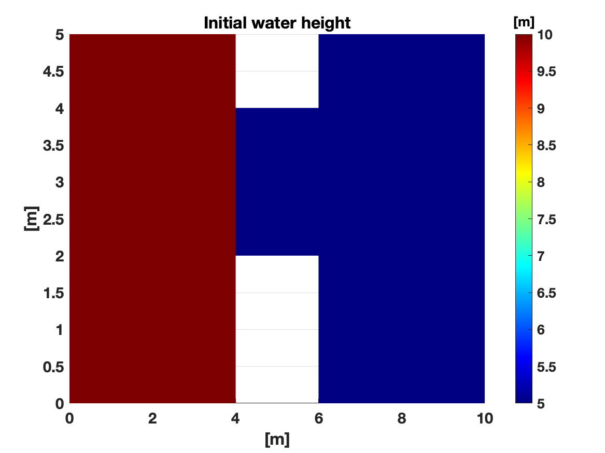

# Overview

This is an idealized partial dam break case with an initial water height
of 10 m and 5 m to the left and right of the dam, respcitively, as shown
below. The initial velocities in x- and y-direction are zero within the
domain.



The input YAML file ([`inputdeck_5120x2560.yaml`](inputdeck_5120x2560.yaml)) corresponds to a mesh with
`dx = dy = 0.002` m and has 11,534,336 grid cells. Reflective boundary
condition is assumed for all boundaries of the mesh. The problem is setup
to take 100 timesteps. The mesh is in DMPlex's HDF5 v3.0.0 format.
It is assumed that the user has access the RDycore's project directories
on the DOE supercomputers, which contains the mesh and pre-installed PETSc.
The supported DOE supercomputers for this case are:

  1. Perlmutter (CPU-nodes and GPU-nodes)
  2. Frontier
  
The project directories on these supported machines additionally contain
 meshes for the idealized dam break problem at few additional resolutions:

1. `DamBreak_grid2560x1280.v3.0.0.h5`: 2,883,584 grid cells
2. `DamBreak_grid10240x5120.v3.0.0.h5`: 46,137,344 grid cells
3. `DamBreak_grid20480x10240.v3.0.0.h5`: 184,549,376 grid cells

## Script 

`setup_batch_for_dam_break.sh` Will create symbolic link to the mesh
file locally, compile RDycore (if needed), and create a batch script
for DOE supercomputers that can be submitted via `sbatch`. 


```bash
 ./setup_batch_for_dam_break.sh -h
Usage: ./setup_batch_for_dam_break.sh

   -h, --help                        Display this message
   --rdycore-dir                     Path to RDycore directory
   --mach <pm-cpu|pm-gpu|frontier>   Supported machine name
   --frontier-node-type <cpu|gpu>    To run on Frontier CPUs or GPUs
   -N --node  <N>                    Number of nodes (default = 1)
   --project <project-id>            Project ID that will charged for the job
```

- For Perlmutter:
  - `--mach pm-cpu` Run RDycore on CPU nodes
  - `--mach pm-gpu` Run RDycore GPU nodes using CUDA
- For Frontier (`--mach frontier`):
  - `--frontier-node-type cpu`: Run RDycore on CPUs
  - `--frontier-node-type gpu`: Run RDycore on GPUs using HIP

## Example for Perlmutter CPU nodes

```bash
./setup_batch_for_dam_break.sh --mach pm-cpu --project m4267 -N 2 \
--rdycore-dir /global/cfs/projectdirs/m4267/gbisht/rdycore
```

## Example for Perlmutter GPU nodes

```bash
./setup_batch_for_dam_break.sh --mach pm-gpu --project m4267_g -N 1 \
--rdycore-dir /global/cfs/projectdirs/m4267/gbisht/rdycore
```

## Example for Frontier using CPUs


```bash
./setup_batch_for_dam_break.sh --mach frontier --frontier-node-type cpu -N 1 \
--project cli192 \
--rdycore-dir /lustre/orion/cli192/proj-shared/gb9/rdycore/rdycore 
```

## Example for Frontier using GPUs


```bash
./setup_batch_for_dam_break.sh --mach frontier --frontier-node-type gpu -N 1 \
--project cli192 \
--rdycore-dir /lustre/orion/cli192/proj-shared/gb9/rdycore/rdycore 
```

