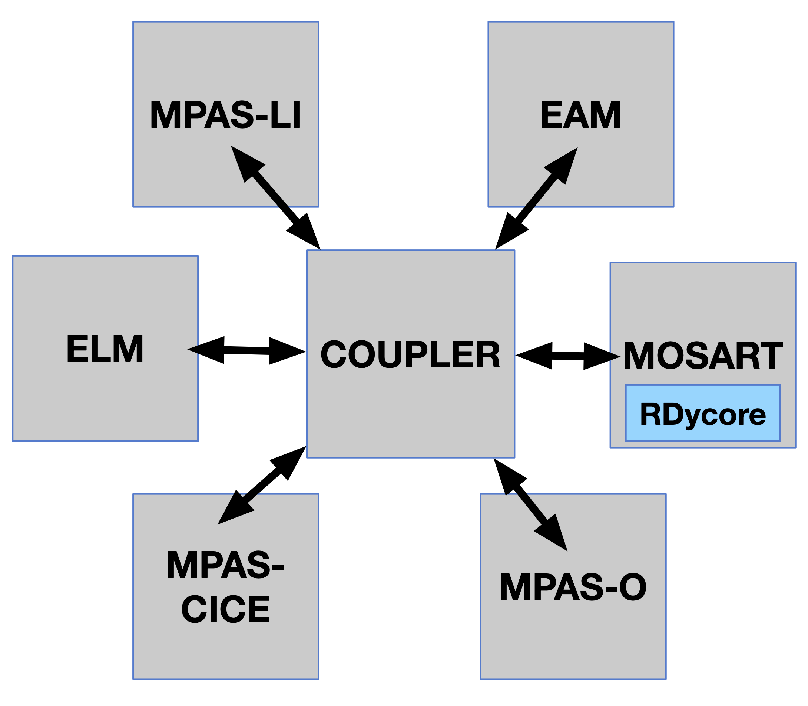

# E3SM-RDycore

The coupled E3SM-RDycore is developed within a fork of the E3SM repository under the RDycore's Github account at [https://github.com/rdycore/e3sm](https://github.com/rdycore/e3sm). 
The coupled model is developed in a branch within the forked repository and the current branch is named `rdycore/mosart-rdycore/d4ca7d0606-2024-10-02`. 
The `d4ca7d0606` corresponds to the Git hash of the commit on the E3SM master branch from which the current E3SM-RDycore development branch started and `2024-10-02` corresponds to the date of that starting commit.

```text
# From E3SM repo
>git show d4ca7d0606
commit d4ca7d0606930f53f30eb7ff7dbb92ec83b83b84 (tag: v3.0.1, e3sm/next, e3sm/master, e3sm/HEAD, master)
Merge: f1e03b784b 55f473dcde
Author: Robert Jacob <jacob@anl.gov>
Date:   Wed Oct 2 16:21:12 2024 -0500

    Merge branch 'rljacob/doc/updateforv301' (PR #6658)

    Update README, CITATION.cff and LICENSE for v3.0.1

    [BFB]
```

The E3SM-RDycore development branch is occasionally rebased on E3SM's master. After a rebase, the E3SM-RDycore development branch is named such that the new name correctly represents the starting commit hash and the commit date. The RDycore has been added in E3SM as a submodule at
`externals/rdycore`. In the current model coupling, RDycore is part of the MOSART as shown below.



The following E3SM-RDycore case is supported:
1. [Hurricane Havey flooding](harvey-flooding/e3sm_harvey.md)
