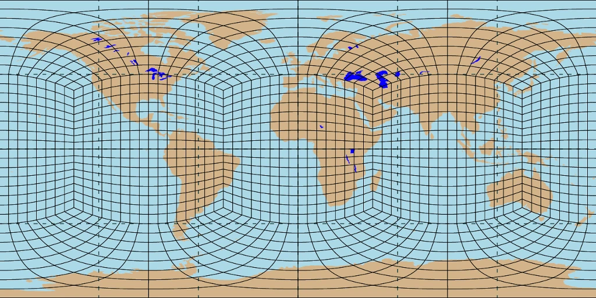

# Generate a RRM Grid File with SQuadGen

[Back to Adding Support for New Grids](../adding-grid-support-step-by-step-guide.md)

<!-- disable linter checks for inline html to allow collapsable code sections -->
<!-- markdownlint-disable MD033 --> <!-- no-inline-html -->

There are three ways to create a regionally refined grid file for E3SM using [SQuadGen](https://github.com/ClimateGlobalChange/squadgen), which are outlined below.

## Using a PNG Image File

The most common is to create a grayscale `.png` image file with the correct aspect ratio that defines one or more refinement areas.

The input PNG is a grayscale representation of a regular latitude-longitude grid (i.e. equiangular projection) with the level of shading determining the level of refinement: white for the coarse grid and black where maximum refinement is desired.  Shades of gray can be used to impose intermediate levels of refinement.  To determine the refinement region on the cubed-sphere mesh, each volume on the cubed-sphere grid is sampled from the PNG image to determine the desired level of refinement on that grid.  The transition region is then built around each refinement region using "paving" tiles, with optional smoothing of edges.

Once the PNG file is created it can be used to generate the new exodus file. The example below creates a 3x refinement based on the ne30 grid that, which it typically used for production runs.

```shell
./SQuadGen --refine_file ${GRIDNAME}.png --resolution 30 --refine_level 3 --refine_type LOWCONN --smooth_type SPRING --smooth_dist 3 --smooth_iter 20 --output ${DATA_PATH}/${GRIDNAME}.g
```

### Creating the PNG file with an image editor

It is often useful to start with a background image that already has the correct aspect ratio and is centered on 0 degrees longitude. The following PNG image (with base grid ne16) can be used as a template for drawing your refinement region so that grid lines are parallel to cubed-sphere arcs. This PNG file can be set as a background image in an editor like Photoshop or GIMP.



The refined region is then drawn on top of this image in a separate layer.  You can set the transparency between layers at, i.e. 50% with the grayscale image in front of the template.  When you are ready to save the image, you can change the transparency to 0% and export the image as a PNG.

If a different "base grid" image is desired with more or less detail, this can be generated with:

```shell
./SQuadGen --resolution <ne> --output base_grid.g
```

where `ne` is your desired base grid resolution.  The grid image can then be plotted with the `gridplot.ncl` script that is included with SQuadGen. Alternatively, [PyNGL](https://www.pyngl.ucar.edu/) is a python replacement for NCL that also has good support for plotting unstructured meshes (despite being in "maintenance mode").

### Creating the PNG file with a python script

The previous method of using an image editor can be somewhat cumbersome and inaccurate. Scripted generation of the refinement region is possible with python.

In the first example below a SCRIP format grid file is used so that individual elements can be shaded, but this method was intended for the cell shading capability of PyNGL. The SCRIP file used in these examples can be generated with 3 simple TempestRemap commands:

```shell
NE=30
GenerateCSMesh --alt --res ${NE} --file ${GRID_FILE_PATH}/ne${NE}.g
GenerateVolumetricMesh --in ${GRID_FILE_PATH}/ne${NE}.g --out ${GRID_FILE_PATH}/ne${NE}pg2.g --np 2 --uniform
ConvertMeshToSCRIP --in ${GRID_FILE_PATH}/ne${NE}pg2.g --out ${GRID_FILE_PATH}/ne${NE}pg2_scrip.nc
```

For other plotting libraries it may be preferrable to use an equiangular SCRIP grid file, which can be generated with a simple NCO command. Here is an example of a 1 degree grid:

```shell
ncremap -G ttl=Equi-Angular grid 1x1 degree, dimensions 180x360, cell edges on Poles/Equator and Prime Meridian/Date Line#latlon=180,360#lat_typ=uni#lon_typ=grn_wst -g /Users/zender/data/grids/cmip6_180x360_scrip.nc
```

Below is some example python code to generate a "feathered" refined region around a given central point. The resulting numpy array can then be plotted with your preferred plotting library (ex. matplotlib, pyngl)

<details>
  <summary>generate_RRM_png_feathered.py</summary>
    ```python
    import os, ngl, numpy as np, xarray as xr
    target_lat, target_lon = 39.7392, 360-104.9903 # Denver, CO
    #-------------------------------------------------------------------------------
    scrip_ds = xr.open_dataset(os.getenv('HOME')+'/E3SM/data_grid/ne30pg2_scrip.nc')
    ncol = len(scrip_ds['grid_area'])
    deg_to_rad,rad_to_deg = np.pi/180., 180./np.pi
    #-------------------------------------------------------------------------------
    # method for calculating the length of great circle arcs
    def calc_great_circle_distance(lat1,lat2,lon1,lon2):
      ''' input should be in degrees '''
      dlon = lon2 - lon1
      cos_dist = np.sin(lat1*deg_to_rad)*np.sin(lat2*deg_to_rad) + \
                 np.cos(lat1*deg_to_rad)*np.cos(lat2*deg_to_rad)*np.cos(dlon*deg_to_rad)
      # print( str(cos_dist.min()) +"   "+ str(cos_dist.max()) )
      cos_dist = np.where(cos_dist> 1.0, 1.0,cos_dist)
      cos_dist = np.where(cos_dist<-1.0,-1.0,cos_dist)
      dist = np.arccos( cos_dist )
      return dist
    #-------------------------------------------------------------------------------
    # method for defining a feathered refinement region
    def define_refinement( ncol, dmin, dmax,
                          target_lat, target_lon,
                          center_lat, center_lon,
                          refine_level):
      # loop through all points and calculate distance to center
      # NOTE - distance units are in radians (max value = pi)
      for n in range(ncol):
        d = calc_great_circle_distance(target_lat, center_lat[n] ,target_lon, center_lon[n])
        if d<=dmin:            refine_level[n] = 1
        if d>dmin and d<=dmax: refine_level[n] = ( dmax - d ) / ( dmax - dmin )
        if d>dmax:             refine_level[n] = 0
      return refine_level
    #-------------------------------------------------------------------------------
    # define refinement regions - distance thesholds in radians
    min_threshold =  1*deg_to_rad
    max_threshold = 10*deg_to_rad
    refine_level = np.zeros(ncol)
    # define continuous refinement based on distance
    define_refinement( ncol, min_threshold, max_threshold,
                     target_lat, target_lon,
                     scrip_ds['grid_center_lat'].values,
                     scrip_ds['grid_center_lon'].values,
                     refine_level )
    #-------------------------------------------------------------------------------
    # create PNG image using PyNGL
    wkres = ngl.Resources()
    npix = 4096; wkres.wkWidth,wkres.wkHeight=npix,npix
    wkres.wkForegroundColor = [1.,1.,1.]
    wkres.wkBackgroundColor = [1.,1.,1.]
    wks = ngl.open_wks('png',fig_file,wkres)
    # Create custom colormap
    num_clr = 50
    fill_clr = np.zeros((num_clr,3))
    for n in range(num_clr): fill_clr[n,:] = float(n) / float(num_clr)
    # define plot resources
    res = ngl.Resources()
    res.nglDraw               = False
    res.nglFrame              = False
    res.tmXTOn                = False
    res.tmXBOn                = False
    res.tmYLOn                = False
    res.tmYROn                = False
    res.cnFillOn              = True
    res.cnLinesOn             = False
    res.cnLineLabelsOn        = False
    res.cnInfoLabelOn         = False
    res.mpGridAndLimbOn       = False
    res.mpPerimOn             = False
    res.mpOutlineBoundarySets = 'NoBoundaries'
    res.lbLabelBarOn          = False
    res.cnFillPalette         = fill_clr
    res.tfPolyDrawOrder = 'PreDraw'
    res.sfXArray      = scrip_ds['grid_center_lon'].values
    res.sfYArray      = scrip_ds['grid_center_lat'].values
    #-------------------------------------------------------------------------------
    # Use Raster fill mode instead of cell fill
    res.cnFillMode          = 'RasterFill'
    plot = ngl.contour_map(wks,refine_level,res)
    #-------------------------------------------------------------------------------
    # use pre-draw polygon to fill in white areas near poles
    #-------------------------------------------------------------------------------
    gsres             = ngl.Resources()
    gsres.gsFillColor = 'black'
    gsres.gsEdgesOn   = False
    py = [ -89.9,  89.9, 89.9,-89.9, -89.9]
    px = [ 360. , 360. ,  0. ,  0. , 360. ]
    ngl.polygon(wks, plot, px, py, gsres)
    #-------------------------------------------------------------------------------
    ngl.draw(plot)
    ngl.frame(wks)
    ngl.end()
    #-------------------------------------------------------------------------------
    # crop white space from png file
    if os.path.isfile(f'{fig_file}.png') :
      cmd = f'convert -trim +repage {fig_file}.png {fig_file}.png'
      os.system(cmd)
      os.system(cmd) # second call helps remove gray lines at edge
      # if npix = 4096:
    else:
      raise FileNotFoundError(f'\n{fig_file}.png does not exist?!\n')
    #-------------------------------------------------------------------------------
    # apply gaussian blur
    from PIL import Image, ImageFilter
    image = Image.open(f'{fig_file}.png')
    for n in range(nsmooth): image = image.filter(ImageFilter.GaussianBlur(radius=6))
    image = image.save(f'{fig_file}.png')
    #-------------------------------------------------------------------------------
    print(); print(f'  {fig_file}.png'); print()
    #-------------------------------------------------------------------------------
    ```
</details>

The next example creates a refinement region based on land fraction.

<details>
  <summary>generate_RRM_png_landfrac.py</summary>
    ```python
    import os, ngl, numpy as np, xarray as xr
    refine_level = 1
    nsmooth      = 4
    land_data_file = 'inputdata/atm/cam/topo/USGS-gtopo30_0.9x1.25_remap_c051027.nc'
    ds = xr.open_dataset(land_data_file)
    lat = ds['lat']
    lon = ds['lon']
    landfrac = ds['LANDFRAC']
    nlat,nlon = len(lat),len(lon)
    #-------------------------------------------------------------------------------
    # switch to center data on prime meridian
    lon_tmp = np.zeros(nlon)
    lon_tmp[:int(nlon/2)] = lon[-int(nlon/2):].values - 360.
    lon_tmp[int(nlon/2):] = lon[ :int(nlon/2)].values
    lon = xr.DataArray(lon_tmp,dims={'lon':lon})
    landfrac_tmp = np.zeros(landfrac.shape)
    landfrac_tmp[:,:int(nlon/2)] = landfrac[:,-int(nlon/2):].values
    landfrac_tmp[:,int(nlon/2):] = landfrac[:, :int(nlon/2)].values
    landfrac = xr.DataArray(landfrac_tmp,dims={'lat':lat,'lon':lon})
    #-------------------------------------------------------------------------------
    # mask out anarctica
    for j in range(nlat):
      if lat[j]<-60: landfrac[j,:] = 0.0
    #-------------------------------------------------------------------------------
    # Apply 2D smoothing to feather edges at coastlines
    if nsmooth>0:
      for s in range(nsmooth):
        tmp = np.copy(landfrac)
        for j in range(1,nlat-2):
          for i in range(nlon):
            im1 = nlon-1 if i==0      else i-1
            ip1 = 0      if i==nlon-1 else i+1
            smooth_y  = ( 0.25*tmp[j-1,i  ] + 0.5*tmp[j,i] + 0.25*tmp[j+1,i  ] )
            smooth_x  = ( 0.25*tmp[j  ,im1] + 0.5*tmp[j,i] + 0.25*tmp[j  ,ip1] )
            smooth_d1 = ( 0.25*tmp[j-1,im1] + 0.5*tmp[j,i] + 0.25*tmp[j+1,ip1] )
            smooth_d2 = ( 0.25*tmp[j-1,ip1] + 0.5*tmp[j,i] + 0.25*tmp[j+1,im1] )
            landfrac[j,i] = ( smooth_y + smooth_x + smooth_d1 + smooth_d2 ) / 4.
      for j in range(nlat):
        for i in range(nlon):
          if landfrac[j,i]<0.8: landfrac[j,i] = 0.0
    #-------------------------------------------------------------------------------
    # Generate image of refined region using MPL
    fig = plt.figure(figsize=(36/4,18/4))
    ax = fig.add_subplot(1,1,1)
    cs = ax.contourf(lon, lat, landfrac, levels=[0.0,0.5,1.0],colors=['#000000','#FFFFFF','#FFFFFF'])
    ax.xaxis.set_major_locator(plt.NullLocator())
    ax.yaxis.set_major_locator(plt.NullLocator())
    fig.tight_layout()
    plt.axis('off')
    plt.savefig(refine_png_file,pad_inches=0,bbox_inches='tight')
    print(f'\nrefine_png_file: {refine_png_file}\n')
    #-------------------------------------------------------------------------------
    # more smoothing via gaussian blur from the pillow package
    from PIL import Image, ImageFilter
    image = Image.open(f'{refine_png_file}')
    for n in range(nsmooth): image = image.filter(ImageFilter.GaussianBlur(radius=3))
    image = image.save(f'{refine_png_file}')
    #-------------------------------------------------------------------------------
    ```
</details>

## Using a Refinement Map

If `--loadcsrefinementmap` is specified the refinement map will be reloaded from a previously generated refine_map.dat file.  This option allows for manual editing of the cubed-sphere refine map.

## Using Rectangular Patches

SQuadGen can now be used with the `--refine_rect` argument to define rectangular patches on the fly without the need for an image file. This argument takes the latitude and longitude corner locations that define the quadralateral, as well as the desirec refinement level:

```shell
--refine_rect "<lon0>,<lat0>,<lon1>,<lat1>,<refinement level>"
```

## A Note on testing RRM Quality

RRM "quality" can be measured with the “Max Dinv-based element distortion” metric.  This will be printed in the log file for standalone HOMME or EAM simulations and can be obtained from the log files during the topography generation process.  

This metric measures how distorted the elements become in the mesh transition region.  It is the ratio of the two singular values of the 2x2 derivative matrix of the element map to the unit square, representing the ration of the largest length scale to the smallest length scale.  

A grid of perfect quadrilaterals will have a value of 1.0.  The equal-angle cubed-sphere grid has a value of 1.7.   A high quality regionally refined grid will have a value less than 4.  With a high quality grid, usually one can run with the timesteps used in a uniform grid with matching fine resolution.  RRM grids with a value > 4 may require smaller timesteps for stability.   Very large values indicate a problem with the grid and it should be redesigned.
