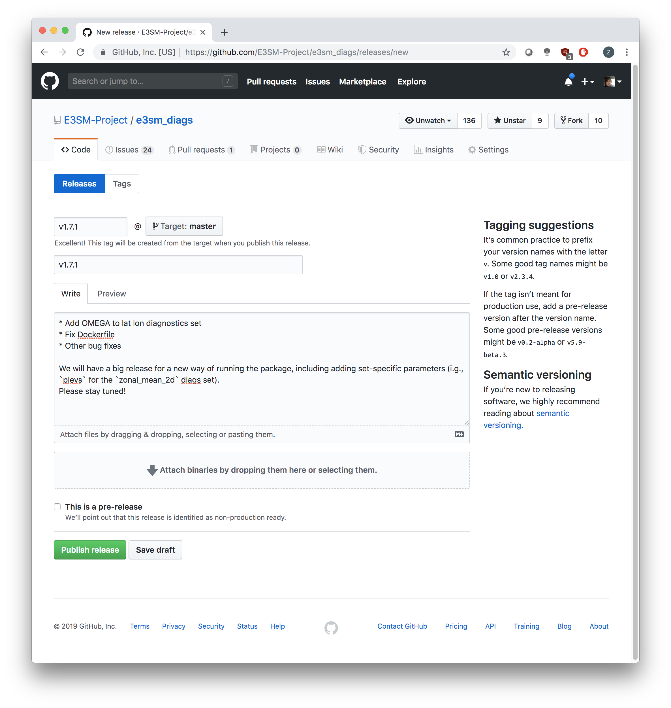

.. _prepare-release:

How to Prepare a Release
========================

In this guide, we'll cover:

* preparing the code for a release
* releasing the code on Github
* updating the sha256
* releasing the software on Anaconda
* creating a new version of the documentation
* building and releasing the Docker image

Preparing The Code For Release
------------------------------

These steps entail modifying files before a release is made.

1. Pull the lastest code from whatever branch you want to release from.
It's usually ``master``.

    ::

        git fetch <upstream-origin> master
        git checkout -b <branch-name> <upstream-origin>/master

2. Edit the ``version`` argument in ``setup.py`` to the new version.
Don't prefix this with a "v".

    .. code-block:: python

        setup(
            name="e3sm_diags",
            version="1.1.0",  # Change this line.
            author="Chengzhu (Jill) Zhang, Zeshawn Shaheen",
            author_email="zhang40@llnl.gov, shaheen2@llnl.gov",
            description="E3SM Diagnostics",
            scripts=["acme_diags/acme_diags_driver.py"],
            packages=find_packages(exclude=["*.test", "*.test.*", "test.*", "test"]),
            data_files=data_files,
            entry_points={
                'console_scripts': [
                    'e3sm_diags=acme_diags.acme_diags_driver:main',
                    'acme_diags=acme_diags.acme_diags_driver:main'
            ]}
        )

3. Edit the ``version`` label in the ``Dockerfile`` as well.

    ::

        label version="1.1.0"  # Change this line.

4. Edit ``__version__`` in ``acme_diags/__init__.py``.
We use ``__version__`` when generating the webpages.

    ::

        __version__ = 'v1.1.0'

5. Change the ``version`` and ``git_rev`` tag in ``conda/meta.yaml``.
``version`` is what the version of the software will be on Anaconda and
``git_rev`` is the tag that we'll setup on GitHub in the next section.

    .. note::
        When running ``conda build``, ``conda`` will download the code tagged by ``git_rev``.
        Even though ``meta.yaml`` is in your local clone of the repo, running ``conda build``
        from here **does not** build the package based on your local code.

    ::

        package:
            name: e3sm_diags
            version: 1.1.0

        source:
            git_url: git://github.com/E3SM-Project/e3sm_diags
            git_rev: v1.1.0

6. Now in ``conda/e3sm_diags_env.yml``, change the version of ``e3sm_diags`` under the
``dependencies`` tag to whatever version is in the previous step.

We don't need to edit anything in ``conda/e3sm_diags_env_dev.yml`` because there is no version
of ``e3sm_diags`` installed in the environment for that yml file.

    ::

        dependencies:
        - e3sm_diags=1.1.0

7. Commit and push your changes.

    ::

        git commit -am 'Changes before release.'
        git push <fork-origin> <branch-name>

8. Create a pull request to the main repo and merge it.

.. _github-release:

Creating A Release On GitHub
----------------------------

1. Go to the Releases on the GitHub repo of the project
`here <https://github.com/E3SM-Project/e3sm_diags/releases>`_.
and draft a new release.

2. ``Tag version`` and ``Release title`` should both be the version, including the "v".
(They should match ``git_rev`` in step 5 of the previous section).
``Target`` should be ``master``. Use ``Describe this release`` to write what features
the release adds. You can scroll through
`E3SM Diags commits <https://github.com/E3SM-Project/e3sm_diags/commits/master>`_ to see
what features have been added recently.

Note that you can also change the branch which you want to release from,
this is specified after the tag (@ Target: ``master``).

The title of a release is often the same as the tag, but you can set it to whatever you want.

Remember to write a description.

    An example of a completed page to release the code

3. Click "Publish release".

Updating The sha256
--------------------

1. Download "Source code (.tar.gz)" from the `GitHub releases page <https://github.com/E3SM-Project/e3sm_diags/releases>`_.

2. Run ``shasum -a 256`` on this file. For example:

    ::

        shasum -a 256 e3sm_diags-1.1.0.tar.gz

3. On your machine, pull the latest version of the code.
This will have the ``conda/meta.yaml`` we edited in the first section.

    ::

        git fetch <upstream-origin> master
        git checkout -b <branch-name> <upstream-origin>/master

4. Change ``sha256`` in ``conda/meta.yaml`` to the result of step 2.

5. Commit and push your changes.
    ::

        git commit -am 'Edit sha256 for v1.1.0'
        git push <fork-origin> <branch-name>

6. Create a pull request to the main repo and merge it.

Releasing The Software On Anaconda
----------------------------------

1. Be sure to have already completed :ref:`Creating A Release On GitHub <github-release>`.
This triggers the CI/CD workflow that handles Anaconda releases.

2. Wait until the CI/CD build is successful. You can view all workflows at
`All Workflows <https://github.com/E3SM-Project/e3sm_diags/actions>`_.

3. Check the https://anaconda.org/e3sm/e3sm_diags page to view the newly updated package.

4. Notify the maintainers of the unified E3SM environment about the new release on the
`E3SM Confluence site <https://acme-climate.atlassian.net/wiki/spaces/WORKFLOW/pages/129732419/E3SM+Unified+Anaconda+Environment>`_.
Be sure to only update the ``e3sm_diags`` version number in the correct version(s) of
the E3SM Unified environment. This is almost certainly one of the versions listed under
“Next versions”. If you are uncertain of which to update, leave a comment on the page
asking.

Creating a New Version of the Documentation
-------------------------------------------

1. Be sure to have already completed :ref:`Creating A Release On GitHub <github-release>`.
This triggers the CI/CD workflow that handles publishing documentation versions.

2. Wait until the CI/CD build is successful. You can view all workflows at
`All Workflows <https://github.com/E3SM-Project/e3sm_diags/actions>`_.

3. Changes will be available on the
`e3sm_diags documentation page <https://e3sm-project.github.io/e3sm_diags/>`_.

How To Build and Release The Docker Image
-----------------------------------------

A Docker image of ``e3sm_diags`` needs to be created and released as well.
This Docker image can be ran as a container via Docker, Shifter, or Singularity.

We'll build the image, test it, and then release it.

Prerequisites
^^^^^^^^^^^^^

1. Please make a Docker ID if you haven't done so already.
This is needed to release and upload the image.

2. Also make sure that you have access to the `e3sm Dockerhub <https://hub.docker.com/u/e3sm>`_ ,
and specifically the e3sm_diags repo there. If you don't, you'll see an error when you run
``docker push`` later on in this guide.
Email Jill Zhang (zhang40@llnl.gov) or Rob Jacob (jacob@anl.gov) for access.

Building
^^^^^^^^

3. Set an environmental variable, ``E3SM_DIAGS_VERSION``, to the version that you're releasing.

    ::

        export E3SM_DIAGS_VERSION=v1.5.0

A Temporary Diversion
"""""""""""""""""""""

4. When installing the software, a user needs to do ``pip install --user .``
instead of the traditional ``python setup.py install``.
It's the way Anaconda recommends creating packages.
This is *currently* causing issues when building the Docker image.
Due to this, open ``setup.py`` and change the ``INSTALL_PATH`` to be ``os.path.join(sys.prefix, 'share/e3sm_diags/')``.

    .. code-block:: python

        # INSTALL_PATH = 'share/e3sm_diags/'
        INSTALL_PATH = os.path.join(sys.prefix, 'share/e3sm_diags/')

5. Open the ``Dockerfile`` and change any instance of ``pip install --user .`` to ``python setup.py install``.

    ::

        RUN conda env update -n base --file conda/e3sm_diags_env_dev.yml && \
                conda clean --all -y && \
                source activate base && \
                # pip install --user . && \
                python setup.py install && \
                rm -r build/

Back to Building the Image
""""""""""""""""""""""""""

6. Go to the root of the project, where the ``Dockerfile`` is located and run the command below.
This builds the image and adds two tags, one titled ``latest`` and one based on the version you're releasing.
By prefixing the tag with ``e3sm/``, it'll upload it to the
`e3sm Dockerhub <https://hub.docker.com/u/e3sm>`_,
which we'll do in forthcoming steps.

When Docker builds an image, it sends all of the data in the current working directory as the build context.
So if the current directory has a lot of data (like sample runs, large nc files, etc),
remove them before continuing.
Check the size of the current directory with ``du -sh .``.

    ::

        docker build . -t e3sm/e3sm_diags:latest -t e3sm/e3sm_diags:$E3SM_DIAGS_VERSION

7. View the Docker images you have. You should see the images you've made, based on the tags.

    ::

        docker images

You should see something like this:

    ::

        REPOSITORY               TAG                 IMAGE ID            CREATED             SIZE
        e3sm/e3sm_diags          latest              bc7f93375025        6 minutes ago       3.57GB
        e3sm/e3sm_diags          v1.5.0              bc7f93375025        6 minutes ago       3.57GB
        continuumio/miniconda    4.5.4               16e4fbac86ce        7 weeks ago         544MB
        hello-world              latest              e38bc07ac18e        5 months ago        1.85kB

Testing
"""""""

8. Go to the folder with the system tests.

    ::

        cd tests/system/

9. ``wget`` or ``curl`` the script to run the image.
When you actually run an image, it's called a **container**.

    ::

        wget https://raw.githubusercontent.com/E3SM-Project/e3sm_diags/master/acme_diags/container/e3sm_diags_container.py

        # Or use this:
        curl -O https://raw.githubusercontent.com/E3SM-Project/e3sm_diags/master/acme_diags/container/e3sm_diags_container.py

10. Run the tests. Check the terminal and
results after each run to ensure that everything was created without errors.

    ::

        python e3sm_diags_container.py --docker -p all_sets.py -d all_sets.cfg

11. If you do find an error, it could be with the script ``e3sm_diags_container.py`` or with ``e3sm_diags`` itself.
Please fix this. You might need to delete the release, or release a bug-fix version.

Releasing
"""""""""

12. Push both of the images, one with the ``latest`` tag and the other with the version you're releasing.

::

    docker push e3sm/e3sm_diags:latest
    docker push e3sm/e3sm_diags:$E3SM_DIAGS_VERSION

13. Congratulations, you're done! You can go home/nap for the day, I won't tell.

Optional: Cleanup
"""""""""""""""""

* These images can take up a fair amount of space on your machine, since each is around 4GB.
  Here are some ways to manage them.

  * View all of the images you have with ``docker images``.
    You can remove an image by the image id.
    The ``--force`` option is also supported.

    ::

        docker rmi <image_id>

  * Run the command below once in a while to remove unused data.
    This includes any intermediate or broken images/container.

    ::

        docker system prune
