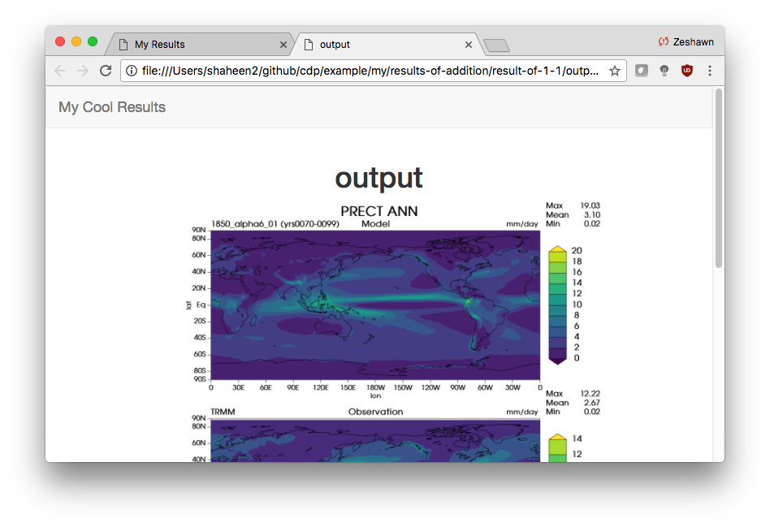
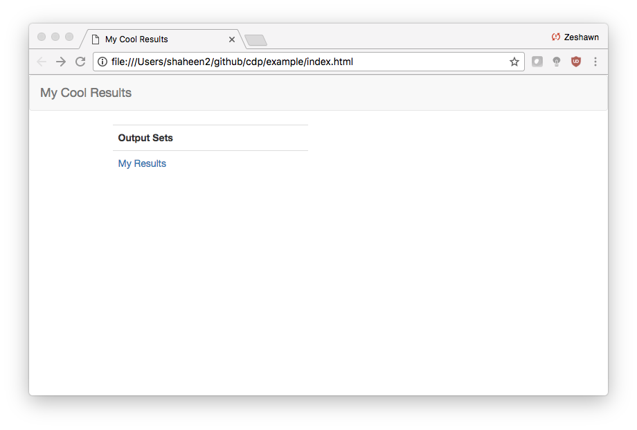
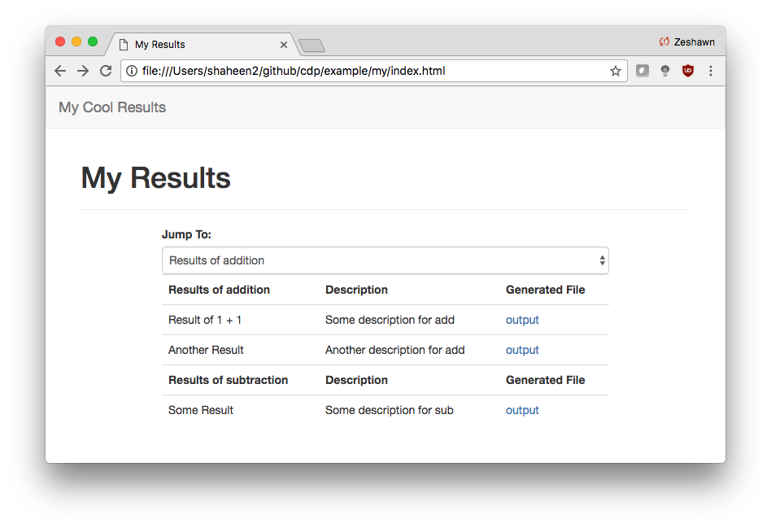

How to use the CDP Output Viewer
================================

In this guide, we will cover:

- The basic framework of the `ESGF Output Viewer <https://github.com/ESGF/output_viewer>`__, consisting of indices, pages, groups, rows, and columns.
- The process of using the `CDP Output Viewer <https://github.com/CDAT/cdp/blob/master/cdp/cdp_viewer.py>`__ (``cdp_viewer``), including explanations and examples related to the relevant functions.

  - CDP Output Viewer is based on the ESGF Output Viewer

The Output Viewer Framework
---------------------------

The Output Viewer is a framework that allows for the visualization of
files. These files include output images from diagnostics,
scripts used to run diagnostics, etc. It also provides a way to create
an HTML file to easily view the results.

Below is an example of a webpage created with the Output Viewer:

   Figure 1: An example of a webpage generated by the Output Viewer.

The Output Viewer framework consists of five base components that are required for a working viewer: `indices, pages,
groups, rows, and columns.`

1. Indices
~~~~~~~~~~

An index is what you see when you first go on the HTML page created from the Output Viewer.

An index is consists of one or more pages.
The index name is what appears on the top left hand corner.

   Figure 2: The index is the first page one sees. All of the links below ‘Output Sets’ are individual pages.

2. Pages
~~~~~~~~

Pages are where the user can view the output. A page consists of at least one group.

   Figure 3: A page with two groups: 'Results of addition' and 'Results of subtraction'.

The *Jump To* form item is used to jump between groups for really long pages.

3. Groups
~~~~~~~~~

A group consists of one or more rows.

In Figure 3 above, we see that the page has two groups.

4. Rows
~~~~~~~

A row consists of one or more columns. Each row must have at least one column, which represents the name.

The first group in Figure 3 has two rows, while the second group has a single row. All rows in the figure have three columns.

5. Columns
~~~~~~~~~~

Columns are the most granular component of the viewer.

You can add columns that are strings or files, like the Description and Generated File columns respectively.

Summary
~~~~~~~

To create a viewer with the Output Viewer:

- Have at least one index
- An index must have at least one page
- A page must have at least one group
- A group must have at least one row
- A row must have at least one column

Using CDP Output Viewer (``cdp_viewer``)
----------------------------------------

``cdp_viewer`` is a wrapper of the Output Viewer to simplify the API for creating a working viewer.

If `cdp_viewer` is too abstract/limited, you can instead use the Output Viewer to create your own viewer.
Please be aware that there is no official documentation for the Output Viewer, so you will need refer to the `codebase <https://github.com/ESGF/output_viewer>`__ directly.

The code below was used to create the figures above.

.. note::
    If you plan on running this example code, you’ll need a file titled ``output.png`` in your current directory.

.. code:: python

    from cdp.cdp_viewer import OutputViewer

    viewer = OutputViewer(index_name='My Cool Results')
    viewer.add_page("My Results", ['Description', 'Generated File'])

    viewer.add_group('Results of addition')
    viewer.add_row('Result of 1 + 1')
    viewer.add_col('Some description for add')
    viewer.add_col('output.png', is_file=True)
    viewer.add_row('Another Result')
    viewer.add_col('Another description for add')
    viewer.add_col('output.png', is_file=True)

    viewer.add_group('Results of subtraction')
    viewer.add_row('Some Result')
    viewer.add_col('Some description for sub')
    viewer.add_col('output.png', is_file=True)

    viewer.generate_viewer()

.. parsed-literal::

    Viewer HTML generated at /Users/shaheen2/github/cdp/jupyter/index.html. Would you like to open in a browser? y/[n]: y

Functions of ``cdp_viewer``
~~~~~~~~~~~~~~~~~~~~~~~~~~~

The ``cdp_viewer`` five functions:

- ``add_page(name, columns)`` - Add a page to the viewer's index

  - ``name`` (``str``) - the page's title
  - ``columns`` (``List[str]``) - list of strings for each column that will appear on the page. These columns will be the same for every group/row on the page

- ``add_group(group_name)`` - Add a group to the page that was added via ``add_page()``

  - ``group_name`` (``str``) - name of the group

- ``add_row(name)`` - Add a row to the group that was added via ``add_group()``

  - ``name`` (``str``) - name of the row

- ``add_col(col, is_file=False, **kwargs)`` - Add a col to the current row, which was added via ``add_row()``

  - ``col`` (``str``) - col value
  - ``is_file`` (``bool``) - if ``True``, then an ``OutputFile`` will be created with ``**kwargs``
  - ``**kwargs`` - See the `Output Viewer API <https://github.com/ESGF/output_viewer/blob/master/output_viewer/index.py#L133/>`_ for more details about the ``kwargs`` values that can be passed in

- ``generate_viewer()`` - Generate the webpage and notify the user if they want to view it

  - Note that the functions must be called in the order shown in the example
  - For example, calling ``add_group()`` will add a group to the last page that was called via ``add_page()``
